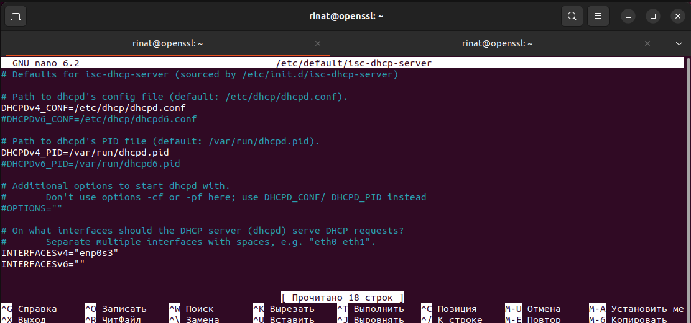
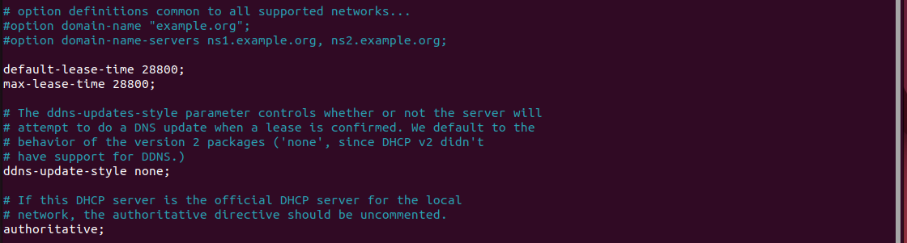
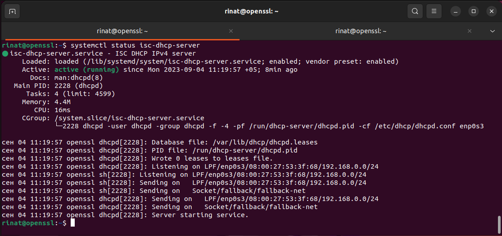
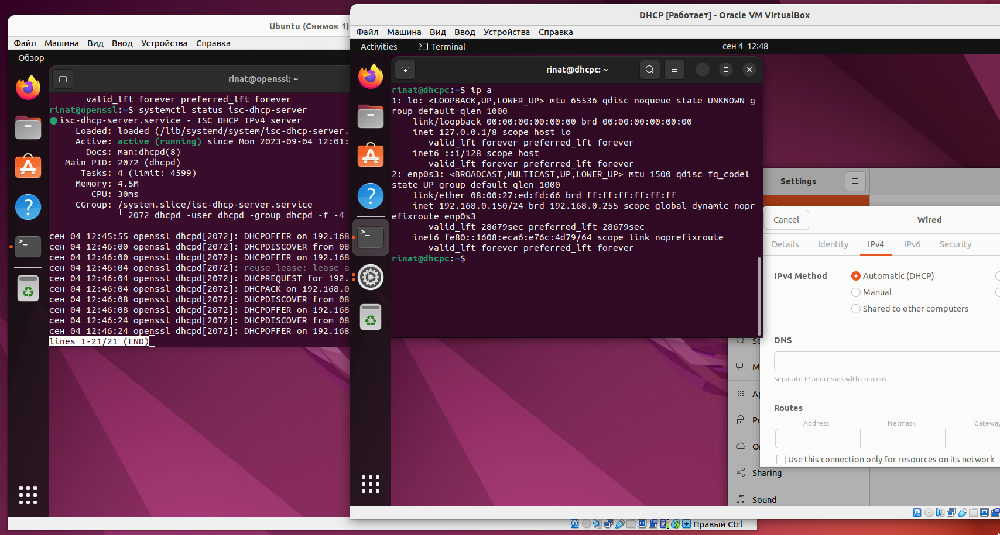
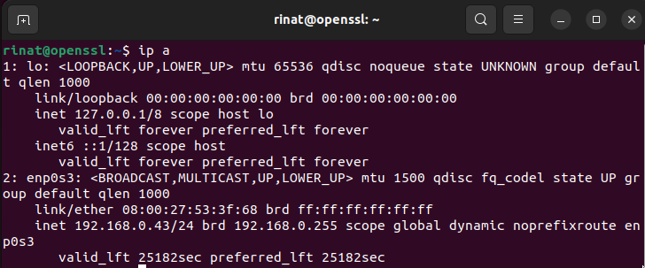
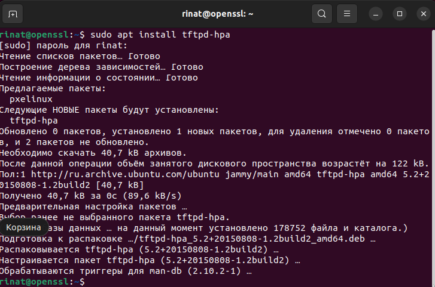
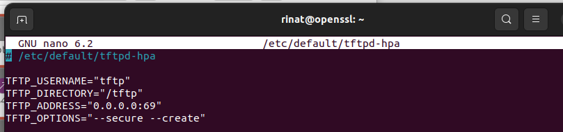
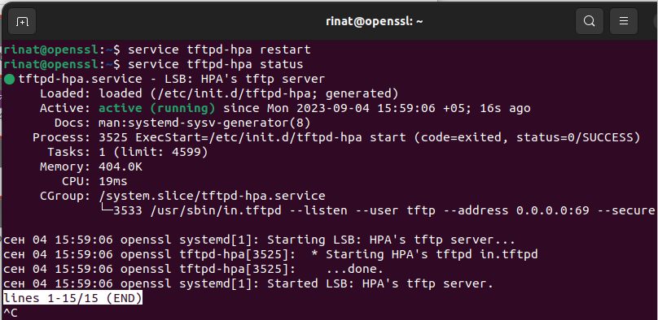
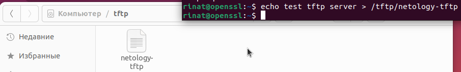
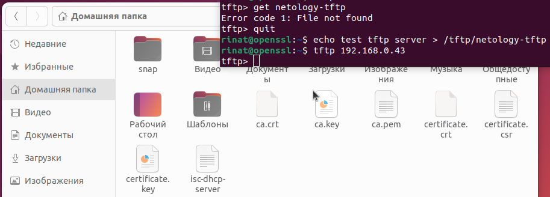

# Задание 1
#### Описание задания
Перед вами стоит задача настроить DHCP-сервер в Linux.

#### Требование к результату
Вы должны отправить файл с выполненным заданием.
К выполненной задаче добавьте скриншоты настройки и работающего DHCP-сервера.
Для выполнения заданий вы можете использовать дистрибутив на ваш выбор (Deb-дистрибутив или CentOs).
#### Процесс выполнения
Запустите программу VirtualBox
В программе VirtualBox загрузите операционную систему Ubuntu, если она у вас не установлена в качестве основной системы.
Установите DHCP-сервер: sudo apt-get install isc-dhcp-server -y
Настройте DHCP-сервер так, чтобы клиенту выдавался ip-адрес, ip-адрес dns-сервера и максимальное время аренды адреса было 8 часов.
Запустите службу DHCP: sudo systemctl start isc-dhcp-server.service

# Решение 1
1) Установка
```
sudo apt install isc-dhcp-server -y
```
2) Настройка DHCP
```
sudo nano /etc/default/isc-dhcp-server
```

```
sudo nano /etc/dhcp/dhcpd.conf
```



Проверка:
```
systemctl status isc-dhcp-server
```

Получение IP через настроенный dhcp сервер


# Задание 2
#### Описание задания
Перед вами стоит задача создать и настроить PXE-сервер.

#### Требование к результату
Вы должны отправить файлы с выполненным заданием
К выполненной задаче добавьте скриншоты с конфигурацией PXE-сервера и его работоспособность.
Для выполнения заданий вы можете использовать дистрибутив на ваш выбор (Deb-дистрибутив или CentOs).
#### Процесс выполнения
Запустите программу VirtualBox
В программе VirtualBox загрузите операционную систему Ubuntu, если она у вас не установлена в качестве основной системы.
Установите TFTP-сервер: sudo apt-get install tftpd-hpa
Создайте директорию для TFTP-сервера.
В файле “tftp-hpa” TFTP-сервера укажите выделенный ip-адрес или адрес loopback-интерфейса.
Также в дополнительных опциях TFTP-сервера разрешите создавать новые файлы.
Перезагрузите TFTP-сервер: service tftp-hpa restart
Создайте в директории TFTP-сервера какой-нибудь файл
Проверьте работоспособность PXE-сервера, либо загрузив с него файл по сети, либо подключившись TFTP-клиентом.
Выполните скриншоты и ответ внесите в комментарии к решению задания.

# Решение 2

Вывод команды 
```
ip a
```


Установите TFTP-сервер: 
```
sudo apt-get install tftpd-hpa
```


Создаем директорию fttp
```
mkdir -p /tftp
```


назначим на нее права доступа
```
chmod -R 777 /tftp/
chown -R nobody:nogroup /tftp/
```


Создаем копию файла конфигурации tftp и отредактируем его. Перезапускаем tftp сервер.


Проверяем статус tftp

Создадим файл в директории tftp сервера
```
echo test tftp server > /tftp/netology-tftp
```


Подключаемся tftp клиентом к tftp серверу
```
tftp 192.168.0.43
```


Скачаем файл netology-tftp в домашнюю папку
```
get netology-tftp
```

