# Задание 1

#### Описание задания

Перед вами стоит задача создать и настроить кэширующий DNS-сервер.

#### Требование к результату

Вы должны отправить файл с выполненным заданием.
К выполненной задаче добавьте скриншоты настройки DNS-сервера.
Для выполнения заданий вы можете использовать дистрибутив на ваш выбор (Deb-дистрибутив или CentOs).
В ответе пришлите скриншот, на котором в выводе команды dnstop будут отображены внешние DNS-сервера, на которые были отправлены рекурсивные запросы для преобразования адреса netology.ru

#### Процесс выполнения

• Запустите программу VirtualBox

• В программе VirtualBox загрузите операционную систему Ubuntu, если она у вас не установлена в качестве основной системы.

• Установите DNS-сервер: sudo apt install bind9

• Проверьте его работу любым запросом на localhost-адрес. И добавьте в файервол разрешающее правило.

• Настройте кэширующий DNS сервер BIND.

• Сделайте так, чтобы можно было отправить запрос на преобразование адреса netology.ru.

• С помощью утилиты dnstop посмотрите какие входящие и исходящие запросы обрабатывались DNS-сервером.

# Решение 1

• Вывод команды ip a на DNS сервере

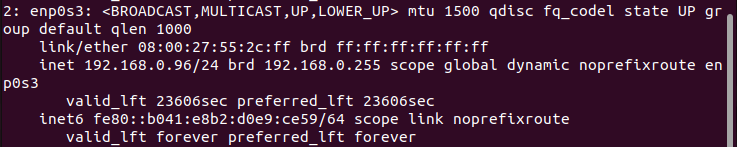

• Установка DNS-сервера: 

```
sudo apt install bind9
```

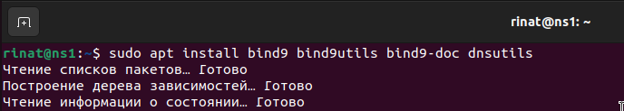

• Проверка работы запросом на localhost.

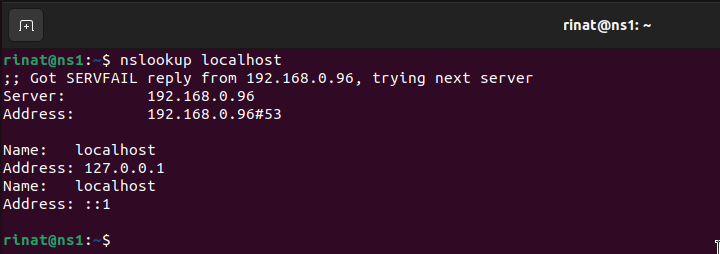

• Добавление в файервол разрешающее правило для DNS.

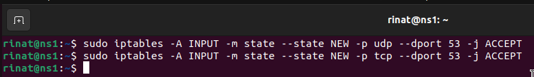

• Настроим кэширующий DNS сервер BIND и перенаправление запросов на другой сервер DNS если наш DNS его не знает.

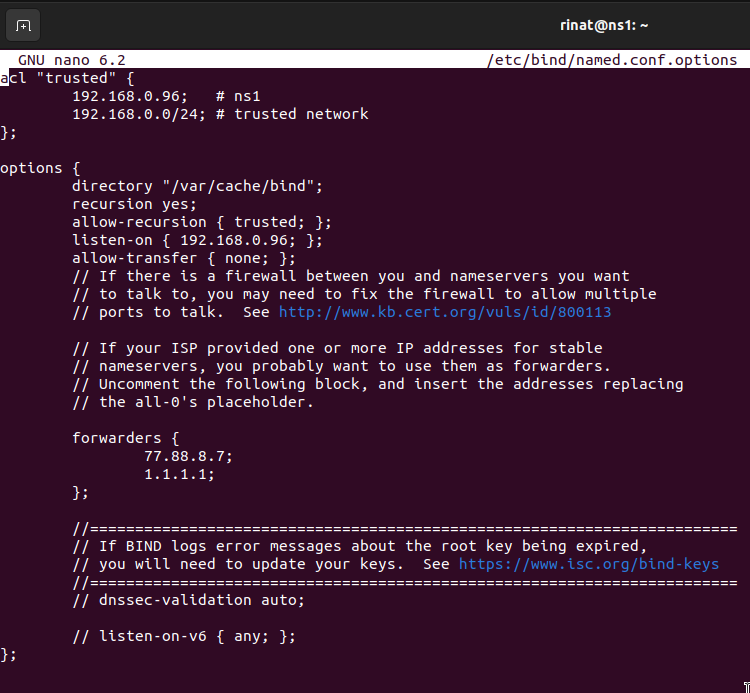

Проверка статуса bind

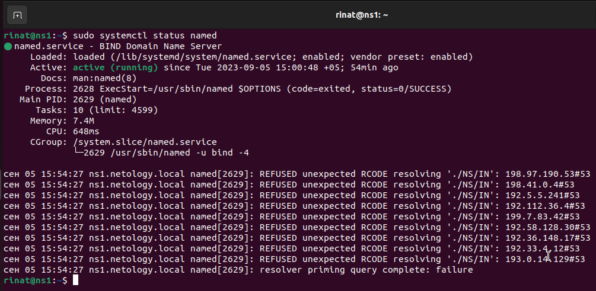

• Сделайте так, чтобы можно было отправить запрос на преобразование адреса netology.ru.

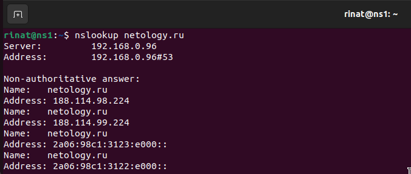

С помощью утилиты dnstop посмотрите какие входящие и исходящие запросы обрабатывались DNS-сервером.

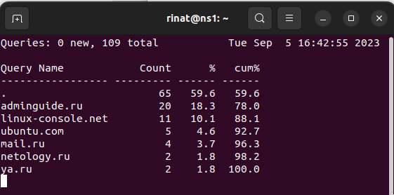

Destination list

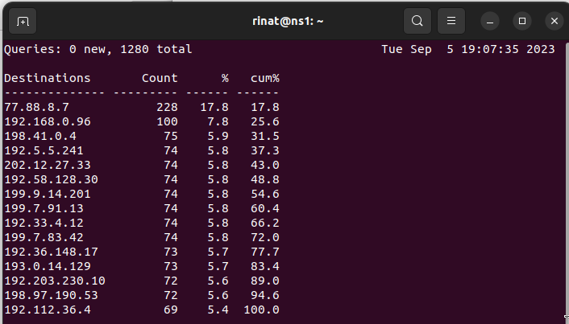

Source лист

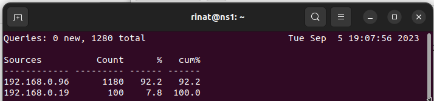

Rcod и процент ошибок (0%)

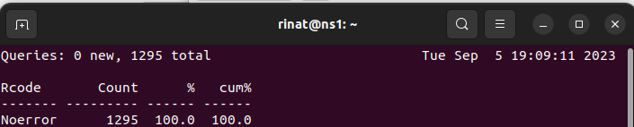

# Задание 2

#### Описание задания

Перед вами стоит задача настроить для второй виртуальной машины A-запись и чтобы все обращения по доменному имени проходили через первую виртуальную машину.

#### Требование к результату

Вы должны отправить скриншоты с выполненным заданием
К выполненной задаче добавьте скриншоты с полученными DNS запросами.
Для выполнения заданий вы можете использовать дистрибутив на ваш выбор (Deb-дистрибутив или CentOs).

#### Процесс выполнения

• Запустите программу VirtualBox

• В программе VirtualBox загрузите вторую виртуальную машину с операционной системой Ubuntu.

• В настройках DNS-сервера укажите сеть второй виртуальной машины, которую будет обслуживать DNS-сервер. И создайте для второй виртуальной машины A-запись.

• Выполните перезапуск DNS службы.

• Сделайте скриншот результата запроса по доменному имени ко второй виртуальной машине.

• Со второй машины выполните обращение к любому ресурсу в Интернете так, чтобы запрос проходил через наш DNS-сервер на первой виртуальной машине. Сделайте скриншот.

# Решение 2

• В настройках DNS-сервера укажите сеть второй виртуальной машины, которую будет обслуживать DNS-сервер.

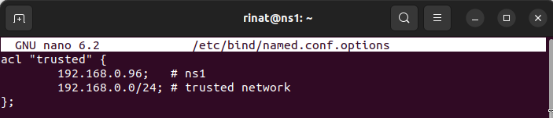

192.168.0.0/24

• И создайте для второй виртуальной машины A-запись (dnsclient).

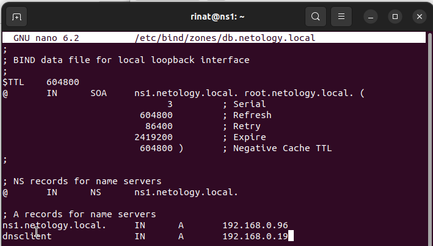

• Выполните перезапуск DNS службы.

```
sudo systemctl restart named
```

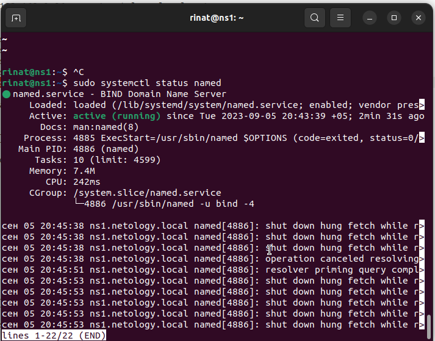

• Сделайте скриншот результата запроса по доменному имени ко второй виртуальной машине.

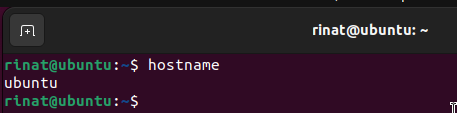

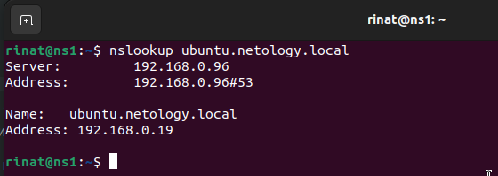

• Со второй машины выполните обращение к любому ресурсу в Интернете так, чтобы запрос проходил через наш DNS-сервер на первой виртуальной машине. Сделайте скриншот.

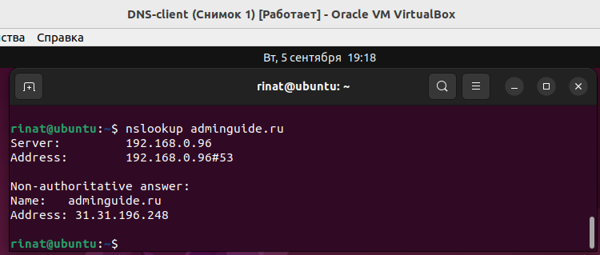

#### Алгоритм для Ubuntu 22.04

```
sudo hostnamectl set-hostname ns1.netology.local
sudo nano /etc/hosts
```

```
127.0.0.1       localhost
127.0.1.1       ns1
192.168.0.96    ns1.netology.local ns1
```

```
sudo apt install bind9 bind9utils bind9-doc dnsutils
sudo nano /etc/default/named - OPTIONS="-u bind -4"
sudo systemctl restart named
sudo systemctl status named
sudo nano /etc/bind/named.conf.options
```

```
acl "trusted" {
        192.168.0.96;   # ns1
        192.168.0.0/24; # trusted network
};

options {
        directory "/var/cache/bind";
        recursion yes;
        allow-recursion { trusted; };
        listen-on { 192.168.0.96; };
        allow-transfer { none; };
        forwarders {
                8.8.8.8;
        };

        dnssec-validation auto;

        // listen-on-v6 { any; };
};
```

```
sudo nano /etc/bind/named.conf.local
```

```
zone "netology.local" {
        type master;
        file "/etc/bind/zones/db.netology.local";
        allow-transfer { any; };
        allow-update { any; };
};

zone "0.168.192.in-addr.arpa" {
        type master;
        file "/etc/bind/zones/db.192.168.0";
        allow-transfer { any; };
        allow-update { any; };
};
```

```
sudo mkdir -p /etc/bind/zones/
sudo cp /etc/bind/db.local /etc/bind/zones/db.netology.local
sudo nano /etc/bind/zones/db.netology.local
```

```
;
; BIND data file for local loopback interface
;
$TTL    604800
@       IN      SOA     ns1.netology.local. root.netology.local. (
                              3         ; Serial
                         604800         ; Refresh
                          86400         ; Retry
                        2419200         ; Expire
                         604800 )       ; Negative Cache TTL
;

; NS records for name servers
        IN      NS      ns1.netology.local.

; A records for name servers
ns1.netology.local.     IN      A       192.168.0.96
```

```
sudo cp /etc/bind/db.127 /etc/bind/zones/db.192.168.0
sudo nano /etc/bind/zones/db.192.168.0
```

```
;
; BIND reverse data file for local loopback interface
;
$TTL    604800
@       IN      SOA     ns1.netology.local. admin.netology.local. (
                              4         ; Serial
                         604800         ; Refresh
                          86400         ; Retry
                        2419200         ; Expire
                         604800 )       ; Negative Cache TTL
;

; name servers - NS records
        IN      NS      ns1.netology.local.
; PTR Records
96      IN      PTR     ns1.netology.local.     ; 192.168.0.96
```

```
sudo named-checkconf
sudo named-checkzone netology.local /etc/bind/zones/db.netology.local
sudo named-checkzone 0.168.192.in-addr.arpa /etc/bind/zones/db.192.168.0
sudo systemctl restart named
```