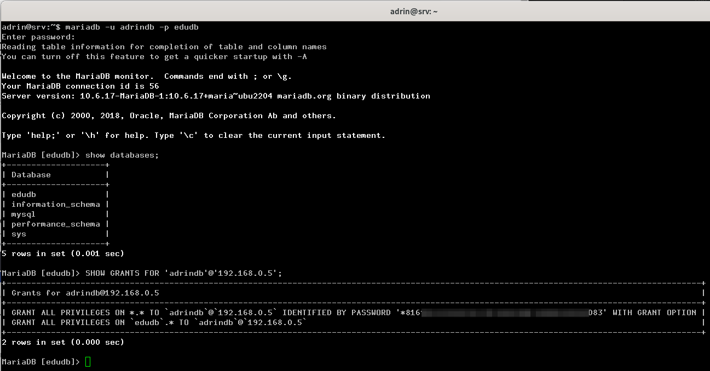
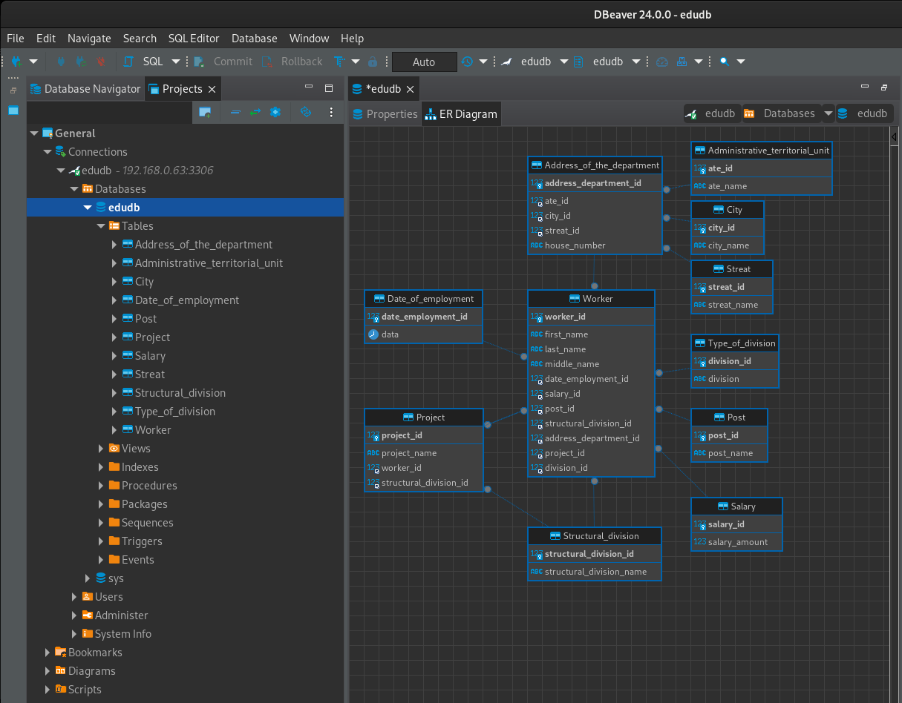

# Домашнее задание к занятию "`Базы данных`" - `Шафиков Ринат`

### Легенда

Заказчик передал вам файл в формате Excel, в котором сформирован отчёт.

На основе этого отчёта нужно выполнить следующие задания.

### Задание 1

Опишите не менее семи таблиц, из которых состоит база данных:
- какие данные хранятся в этих таблицах;
- какой тип данных у столбцов в этих таблицах, если данные хранятся в PostgreSQL.
Приведите решение к следующему виду:

Сотрудники (
идентификатор int, auto_increment, serial,
фамилия varchar(50),
...
идентификатор структурного подразделения, внешний ключ, integer).

### Решение 1

#### Данные хранящиеся в таблице:

- ФИО сотрудника	varchar
- Оклад	DECIMAL/NUMERIC
- Должность	varchar
- Тип подразделения	varchar
- Структурное подразделение	varchar
- Дата найма	date
- Адрес филиала	varchar
- Проект на который назначен varchar

#### PostgreSQL:

- Оклад	DECIMAL/NUMERIC
- Должность	TEXT
- Тип подразделения	TEXT
- Структурное подразделение	TEXT
- Дата найма	date
- Адрес филиала	TEXT
- Проект на который назначен TEXT

#### Таблица 1 Сотрудники

Сотрудники (
  идентификатор, первичный ключ, тип INT, обязателен для заполнения, AUTO_INCREMENT (значение столбца будет автоматически увеличиваться при добавлении новой строки) 
  фамилия, тип VARCHAR(строка переменной длины, максимальная длинна 50 символов), обязательна для заполнения
  имя, тип VARCHAR(максимальная длинна 50 символов), обязательна для заполнения
  фамилия, тип VARCHAR(максимальная длинна 50 символов), обязательна для заполнения
  идентификатор даты приема на работу, внешний ключ, int (целое число)
  идентификатор оклада, внешний ключ, int (целое число)
  идентификатор должности, внешний ключ, int (целое число)
  идентификатор структурного подразделения, внешний ключ, int (целое число)
  идентификатор адреса структурного подразделения, внешний ключ, int (целое число)
  идентификатор типа подразделения, внешний ключ, int (целое число)
)

```
CREATE TABLE `Worker` (
  `worker_id` int(11) NOT NULL AUTO_INCREMENT,
  `first_name` varchar(50) NOT NULL,
  `last_name` varchar(50) NOT NULL,
  `middle_name` varchar(50) NOT NULL,
  `date_employment_id` int(11) NOT NULL,
  `salary_id` int(11) NOT NULL,
  `post_id` int(11) NOT NULL,
  `structural_division_id` int(11) NOT NULL,
  `address_department_id` int(11) NOT NULL,
  `project_id` int(11) NOT NULL,
  `division_id` int(11) NOT NULL,
  PRIMARY KEY (`worker_id`),
  KEY `Worker_Date_of_employment_FK` (`date_employment_id`),
  KEY `Worker_Salary_FK` (`salary_id`),
  KEY `Worker_Post_FK` (`post_id`),
  KEY `Worker_Structural_division_FK` (`structural_division_id`),
  KEY `Worker_Address_of_the_department_FK` (`address_department_id`),
  KEY `Worker_Project_FK` (`project_id`),
  KEY `Worker_Type_of_division_FK` (`division_id`),
  CONSTRAINT `Worker_Address_of_the_department_FK` FOREIGN KEY (`address_department_id`) REFERENCES `Address_of_the_department` (`address_department_id`),
  CONSTRAINT `Worker_Date_of_employment_FK` FOREIGN KEY (`date_employment_id`) REFERENCES `Date_of_employment` (`date_employment_id`),
  CONSTRAINT `Worker_Post_FK` FOREIGN KEY (`post_id`) REFERENCES `Post` (`post_id`),
  CONSTRAINT `Worker_Project_FK` FOREIGN KEY (`project_id`) REFERENCES `Project` (`project_id`),
  CONSTRAINT `Worker_Salary_FK` FOREIGN KEY (`salary_id`) REFERENCES `Salary` (`salary_id`),
  CONSTRAINT `Worker_Structural_division_FK` FOREIGN KEY (`structural_division_id`) REFERENCES `Structural_division` (`structural_division_id`),
  CONSTRAINT `Worker_Type_of_division_FK` FOREIGN KEY (`division_id`) REFERENCES `Type_of_division` (`division_id`)
) ENGINE=InnoDB DEFAULT CHARSET=utf8mb4 COLLATE=utf8mb4_general_ci;
```

#### Таблица 2 Оклад

Оклад (
  идентификатор, первичный ключ, тип INT, обязателен для заполнения
  оклад, тип decimal(дробное число, хранящееся в виде строки), обязательна для заполнения
 )

```
CREATE TABLE `Salary` (
  `salary_id` int(11) NOT NULL AUTO_INCREMENT,
  `salary_amount` decimal(10,0) NOT NULL,
  PRIMARY KEY (`salary_id`)
) ENGINE=InnoDB DEFAULT CHARSET=utf8mb4 COLLATE=utf8mb4_general_ci;
```

#### Таблица 3 Дата найма

Дата найма (
  идентификатор, первичный ключ, тип INT, обязателен для заполнения
  дата, тип data ( хранит значения даты в виде ГГГГ-ММ-ДД.), обязательна для заполнения
)

```
CREATE TABLE `Date_of_employment` (
  `date_employment_id` int(11) NOT NULL AUTO_INCREMENT,
  `data` date NOT NULL,
  PRIMARY KEY (`date_employment_id`)
) ENGINE=InnoDB DEFAULT CHARSET=utf8mb4 COLLATE=utf8mb4_general_ci;
```

#### Таблица 4 Должность

Должность (
  идентификатор должности, первичный ключ, тип INT, обязателен для заполнения
  назване должности, тип VARCHAR(строка переменной длины, максимальная длинна 100 символов), обязательна для заполнения
)

```
CREATE TABLE `Post` (
  `post_id` int(11) NOT NULL AUTO_INCREMENT,
  `post_name` varchar(100) NOT NULL,
  PRIMARY KEY (`post_id`)
) ENGINE=InnoDB DEFAULT CHARSET=utf8mb4 COLLATE=utf8mb4_general_ci;
```

#### Таблица 5 Тип подразделения

Тип подразделения (
  идентификатор типа подразделения, первичный ключ, тип INT, обязателен для заполнения
  назване типа подразделения, тип VARCHAR(строка переменной длины, максимальная длинна 100 символов), обязательна для заполнения
)

```
CREATE TABLE `Type_of_division` (
  `division_id` int(11) NOT NULL AUTO_INCREMENT,
  `division` varchar(100) NOT NULL,
  PRIMARY KEY (`division_id`)
) ENGINE=InnoDB DEFAULT CHARSET=utf8mb4 COLLATE=utf8mb4_general_ci;
```

#### Таблица 6 Структурное подразделение

Структурное подразделение (
  идентификатор структурного подразделения, первичный ключ, тип INT, обязателен для заполнения
  назване структурного подразделения, тип VARCHAR(строка переменной длины, максимальная длинна 100 символов), обязательна для заполнения
)

```
CREATE TABLE `Structural_division` (
  `structural_division_id` int(11) NOT NULL AUTO_INCREMENT,
  `structural_division_name` varchar(100) NOT NULL,
  PRIMARY KEY (`structural_division_id`)
) ENGINE=InnoDB DEFAULT CHARSET=utf8mb4 COLLATE=utf8mb4_general_ci;
```

#### Таблица 7 Административно территориальная единица

Административно территориальная единица (
  идентификатор административно территориально единицы, первичный ключ, тип INT, обязателен для заполнения, AUTO_INCREMENT (значение столбца будет автоматически увеличиваться при добавлении новой строки) 
  назване административно территориальной единицы, тип VARCHAR(строка переменной длины, максимальная длинна 100 символов), обязательна для заполнения
)

```
CREATE TABLE `Administrative_territorial_unit` (
  `ate_id` int(11) NOT NULL AUTO_INCREMENT,
  `ate_name` varchar(100) NOT NULL,
  PRIMARY KEY (`ate_id`)
) ENGINE=InnoDB DEFAULT CHARSET=utf8mb4 COLLATE=utf8mb4_general_ci;
```
#### Таблица 8 Город

Город (
  идентификатор города, первичный ключ, тип INT, обязателен для заполнения, AUTO_INCREMENT (значение столбца будет автоматически увеличиваться при добавлении новой строки) 
  назване города, тип VARCHAR(строка переменной длины, максимальная длинна 100 символов), обязательна для заполнения
)

```
CREATE TABLE `City` (
  `city_id` int(11) NOT NULL,
  `city_name` varchar(100) NOT NULL,
  PRIMARY KEY (`city_id`)
) ENGINE=InnoDB DEFAULT CHARSET=utf8mb4 COLLATE=utf8mb4_general_ci;
```
#### Таблица 9 Улица

Улица (
  идентификатор названия улицы, первичный ключ, тип INT, обязателен для заполнения, AUTO_INCREMENT (значение столбца будет автоматически увеличиваться при добавлении новой строки) 
  назване улицы, тип VARCHAR(строка переменной длины, максимальная длинна 100 символов), обязательна для заполнения
)

```
CREATE TABLE `Streat` (
  `streat_id` int(11) NOT NULL AUTO_INCREMENT,
  `streat_name` varchar(100) NOT NULL,
  PRIMARY KEY (`streat_id`)
) ENGINE=InnoDB DEFAULT CHARSET=utf8mb4 COLLATE=utf8mb4_general_ci;
```
#### Таблица 9 Адрес подразделения

Адрес подразделения (
  идентификатор адреса подразделения, первичный ключ, тип INT, обязателен для заполнения, AUTO_INCREMENT (значение столбца будет автоматически увеличиваться при добавлении новой строки) 
  идентификатор административно территориальной единицы, внешний ключ, int (целое число)
  идентификатор названия города, внешний ключ, int (целое число)
  идентификатор названия улицы, внешний ключ, int (целое число)
  идентификатор номера дома, varchar(10) (так как может содержать буквы - д. 2 корпус 1 и т.п.)
)

```
CREATE TABLE `Address_of_the_department` (
  `address_department_id` int(11) NOT NULL,
  `ate_id` int(11) NOT NULL,
  `city_id` int(11) NOT NULL,
  `streat_id` int(11) NOT NULL,
  `house_number` varchar(10) NOT NULL,
  PRIMARY KEY (`address_department_id`),
  KEY `Address_of_the_department_Administrative_territorial_unit_FK` (`ate_id`),
  KEY `Address_of_the_department_City_FK` (`city_id`),
  KEY `Address_of_the_department_Streat_FK` (`streat_id`),
  CONSTRAINT `Address_of_the_department_Administrative_territorial_unit_FK` FOREIGN KEY (`ate_id`) REFERENCES `Administrative_territorial_unit` (`ate_id`),
  CONSTRAINT `Address_of_the_department_City_FK` FOREIGN KEY (`city_id`) REFERENCES `City` (`city_id`),
  CONSTRAINT `Address_of_the_department_Streat_FK` FOREIGN KEY (`streat_id`) REFERENCES `Streat` (`streat_id`)
) ENGINE=InnoDB DEFAULT CHARSET=utf8mb4 COLLATE=utf8mb4_general_ci;
```

#### Таблица 10 Проект

Проект (
  идентификатор проекта, первичный ключ, тип INT, обязателен для заполнения, AUTO_INCREMENT (значение столбца будет автоматически увеличиваться при добавлении новой строки) 
  назване проекта, тип VARCHAR(строка переменной длины, максимальная длинна 100 символов), обязательна для заполнения
  идентификатор работника,  внешний ключ, int (целое число)
  идентификатор структурного подразделения, внешний ключ, int (целое число)
  )

```
CREATE TABLE `Project` (
  `project_id` int(11) NOT NULL AUTO_INCREMENT,
  `project_name` varchar(100) NOT NULL,
  `worker_id` int(11) NOT NULL,
  `structural_division_id` int(11) NOT NULL,
  PRIMARY KEY (`project_id`),
  KEY `Project_Worker_FK` (`worker_id`),
  KEY `Project_Structural_division_FK` (`structural_division_id`),
  CONSTRAINT `Project_Structural_division_FK` FOREIGN KEY (`structural_division_id`) REFERENCES `Structural_division` (`structural_division_id`),
  CONSTRAINT `Project_Worker_FK` FOREIGN KEY (`worker_id`) REFERENCES `Worker` (`worker_id`)
) ENGINE=InnoDB DEFAULT CHARSET=utf8mb4 COLLATE=utf8mb4_general_ci;
```




---

### Задание 2

Перечислите, какие, на ваш взгляд, в этой денормализованной таблице встречаются функциональные зависимости и какие правила вывода нужно применить, чтобы нормализовать данные.

### Решение 2

Зависимость ключей (в отношении “Сотрудники”, ключ “Идентификатор сотрудника” функционально зависит от всех остальных атрибутов (имя, должность и т.д.))

Сотрудник - Проект

Сотрудник - Должность

Сотрудник - Оклад

Сотрудник - Тип подразделения

Сотрудник - Дата найма

Проект - Адресс 

Оклад зависит от Должности, Должность зависит от Отдела, т.е. Оклад зависит от Должности и Отдела одновременно - правило произведения

Сотрудник зависит от Должности и от Проекта, Проект зависит от Заказчика т.е. Сотрудник зависит от Должности и Заказчика - правое сокращение

Оклад и Должность зависят от Структурного подразделения, а Должность зависит от Проекта, т.е. Оклад зависит от Структурного подразделения и Проекта - левое сокращение.

---
