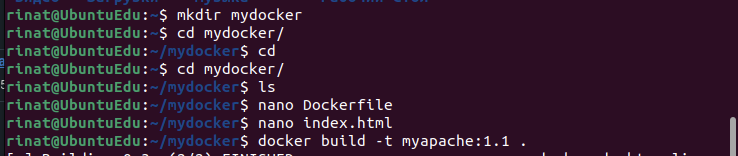

# Задание 1
1. Установите Docker.
2. Запустите образ hello-world.
3. Удалите образ hello-world.

# Решение 1

Установка Docker (по инструкции с сайта https://docs.docker.com/)
1.1 Add Docker's official GPG key:

```
sudo apt-get update
sudo apt-get install ca-certificates curl gnupg
sudo install -m 0755 -d /etc/apt/keyrings
curl -fsSL https://download.docker.com/linux/ubuntu/gpg | sudo gpg --dearmor -o /etc/apt/keyrings/docker.gpg
sudo chmod a+r /etc/apt/keyrings/docker.gpg
```

1.2 Add the repository to Apt sources:

```
echo \
  "deb [arch="$(dpkg --print-architecture)" signed-by=/etc/apt/keyrings/docker.gpg] https://download.docker.com/linux/ubuntu \
  "$(. /etc/os-release && echo "$VERSION_CODENAME")" stable" | \
  sudo tee /etc/apt/sources.list.d/docker.list > /dev/null
sudo apt-get update
```

1.3 Загружаем deb-пакет docker: docker-desktop-4.24.2-amd64.deb
1.4 Устанавливаем скачанный пакет

```
sudo apt update
sudo apt install ./docker-desktop-4.24.2-amd64.deb
```


Вывод команды docker version


```
docker run hello-world
```


Удаление контейнера Hello-world


# Задание 2

1. Найдите в Docker Hub образ Apache и запустите его на 80 порту вашей ВМ.
2. Откройте страницу http://localhost и убедитесь, что видите приветственную страницу Apache.

# Решение 2


# Задание 3

1. Создайте свой Docker образ с Apache2 и подмените стандартную страницу index.html на страницу, содержащую ваши ФИО.
2. Запустите ваш образ, откройте страницу http://localhost и убедитесь, что страница изменилась.

# Решение 3




