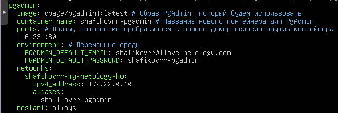
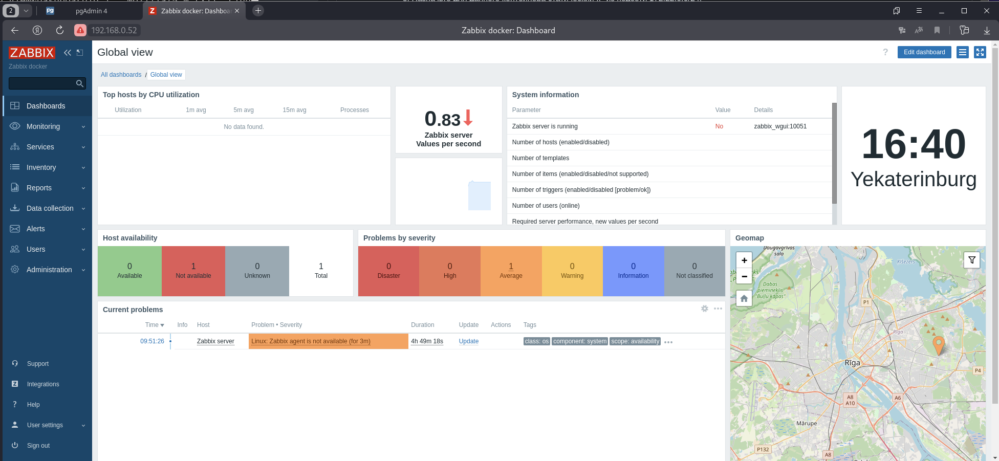

# Задание 1


Напишите ответ в свободной форме, не больше одного абзаца текста.
Установите Docker Compose и опишите, для чего он нужен и как может улучшить вашу жизнь.

# Решение 1

Полуавтоматическое развертывание компонентов какой либо системы

# Задание 2

Создать файл docker-compose.yaml и внесите туда первычные данные
- version;
- services;
- networks.
При выполнении задания используйте подсеть 172.22.0.0. Ваша подсеть должна называться: <ваша фамилия и инициалы>-my-netology-hw.

# Решение 2
Установим docker-compose: 
```
sudo apt install docker-compose
```


```
version: "3"
services:

networks:
  shafikovrr-my-netology-hw:
    driver: bridge
    ipam:
      config:
        - subnet: 172.22.0.0/24
```

# Задание 3

Выполните действия и приложите текст конфига текущего сервиса:
1. Установите PostgreSQL с именем контейнера <ваша фамилия и инициалы>-netology-db.
2. Предсоздайте БД <ваша фамилия и инициалы>-db.
3. Задайте пароль PostgreSQL, как <ваша фамилия и инициалы>12!3!!
4. Назначьте для данного контейнера статический IP из подсети 172.22.0.0/24.

# Решение 3


```
sudo docker-compose up
```


Проверка:
```
netstat -nlp | grep 5432
telnet localhost 5432
```


```
sudo docker ps
```


```
sudo docker exec -it shafikovrr-netology-db bash
```


# Задание 4

Выполните действия:
1. Установите PgAdmin с именем контейнера <ваши фамилия и инициалы>-pgadmin
2. Задайте логин администратора pgAdmin <ваша фамилия и инициалы>@ilove-netology.coshafikovrr@ilove-netology.comm и пароль на выбор.
3. Назначте для данного контейнера статический IP из подсети 172.22.0.0/24
4. Прокинте на 80 порт контейнера порт 61231

В качестве решения приложения:
• текст конфига текущего сервиса;
• скриншот админки pgAdmin.

# Решение 4

текст конфига текущего сервиса



вывод команды: 

```
sudo docker ps
```


Подключение ранее созданной базы данных shafikovrr-netology-db
Быстрые ссылки-добавить новый сервер


Результат подключения


# Задание 5

Выполните действия и приложите текст конфига текущего сервиса:
1. Установите Zabbix Server с именем контейнера <ваши фамилия и инициалы>-zabbix-netology.
2. Настройте его подключение к вашему СУБД.
3. Назначьте для данного контейнера статический IP из подсети 172.22.0.0/24.

# Решение 5


IP адрес сервера изменен, так как работа начата сначала на другой ВМ (несовместимость версий zabbix и postgresql - выбрана версия  img/image: postgres:15.4, что отражено в конечном файле yaml - ubuntu server 23.10)


# Задание 6

Выполните действия и приложите текст конфига текущего сервиса:

1. Установите Zabbix Frontend с именем контейнера <ваши фамилия и инициалы>-netology-zabbix-frontend.
2. Настройте его подключение к вашему СУБД.
3. Назначьте для данного контейнера статический IP из подсети 172.22.0.0/24.

# Решение 6


# Задание 7

#### Выполните действия.

Настройте линки, чтобы контейнеры запускались только в момент, когда запущены контейнеры, от которых они зависят.
В качестве решения приложите:
• текст конфига целиком;
• скриншот команды docker ps;
• скриншот авторизации в админке Zabbix.

# Решение 7

Вывод команды: 
```
sudo docker ps
```


Конфигурационный файл yaml
```
version: "3"
services:
  netology-db:
    img/image: postgres:15.4 #Образ, который мы будем использовать
    container_name: shafikovrr-netology-db # Имя нашего конейнера
    ports: # Порты, которые мы пробрасываем с нашего докер сервера внутрь контейнера
    - 5432:5432
    volumes: # Папка, которую мы пробрасываем с докер сервера внутрь контейнера
    - /opt/postgres:/var/lib/postgresql/data/pgdata
    environment: # Переменные среды
      POSTGRES_PASSWORD: shafikovrr12!3!! # Задаем пароль от пользователя postgres
      POSTGRES_DB: shafikovrr-db # БД, которая сраазу же будет создана
      PGDATA: /var/lib/postgresql/data/pgdata # Папка внутри контейнера, где будет распологать>
    networks:
      shafikovrr-my-netology-hw:
        ipv4_address: 172.22.0.5 # Задаем статический IP
        aliases:
        - shafikovrr-db
    restart: always # Режим перезагрузки контейнера (контейнер будет всегда перезагружаться пр>
  pgadmin:
    img/image: dpage/pgadmin4:latest # Образ PgAdmin, который будем использовать
    container_name: shafikovrr-pgadmin # Название нового контейнера для PgAdmin
    ports: # Порты, которые мы пробрасываем с нашего докер сервера внутрь контейнера
    - 61231:80
    environment: # Переменные среды
      PGADMIN_DEFAULT_EMAIL: shafikovrr@ilove-netology.com
      PGADMIN_DEFAULT_PASSWORD: shafikovrr-pgadmin
    networks:
      shafikovrr-my-netology-hw:
        ipv4_address: 172.22.0.10
        aliases:
        - shafikovrr-pgadmin
    restart: always
  zabbix-server:
    img/image: zabbix/zabbix-server-pgsql
    links:
      - netology-db
    container_name: shafikovrr-zabbix-netology
    environment:
      DB_SERVER_HOST: 'shafikovrr-netology-db'
      POSTGRES_USER: postgres
      POSTGRES_PASSWORD: shafikovrr12!3!!
    ports:
    - 10051:10051
    networks:
      shafikovrr-my-netology-hw:
        ipv4_address: 172.22.0.15
    restart: always
  zabbix-wgui:
    img/image: zabbix/zabbix-web-nginx-pgsql
    links:
      - netology-db
      - zabbix-server
    container_name: shafikovrr-netology-zabbix-frontend
    environment:
      DB_SERVER_HOST: 'shafikovrr-netology-db'
      POSTGRES_USER: postgres
      POSTGRES_PASSWORD: shafikovrr12!3!!
      ZBX_SERVER_HOST: "zabbix_wgui"
      PHP_TZ: "Europe/Moscow"
    ports:
      - 80:8080
      - 443:8443
    networks:
      shafikovrr-my-netology-hw:
        ipv4_address: 172.22.0.20
    restart: always
networks:
  shafikovrr-my-netology-hw:
    driver: bridge
    ipam:
      config:
        - subnet: 172.22.0.0/24
```
Скриншот авторизации в админке Zabbix



# Задание 8

Выполните действия:

1. Убейте все контейнеры и потом удалите их.
2. Приложите скриншот консоли с проделанными действиями.

# Решение 8

Вывод команды (образы) 
```
sudo docker img/image ls
```


Результат выполнения команды (остановка контейнеров) Ctrl+C


Удаление контейнеров

Вывод команд: 
— узнаем ID
```
sudo docker ps
```
— удаляем контейнеры
```
sudo docker rm 652af3f43ac7 4a84cbe86457 597142709ad5 db4e2f0c1ac9 
```


Удаление образов
Список существующих образов: 
```
sudo docker img/image ls
```
Удаление образов по ID: 
```
sudo docker rmi f70baa3facc1 024a09736462 040b02116639 81c91c6cdecf 
```


Список существующих образов после удаления: 
```
sudo docker img/image ls
```


# Задание 9*
Запустите свой сценарий на чистом железе без предзагруженных образов.
Ответьте на вопросы в свободной форме:
1. Сколько ушло времени на то, чтобы развернуть на чистом железе написанный вами сценарий?
2. Чем вы занимались в процессе создания сценария так, как это видите вы?
3. Что бы вы улучшили в сценарии развёртывания?

# Решение 9

1. Сколько ушло времени на то, чтобы развернуть на чистом железе написанный вами сценарий?

	4 минуты (установка docker, docker-compose, копирование файла yaml и запуск на развертывание инраструктуры)

2. Чем вы занимались в процессе создания сценария так, как это видите вы?

	Созданием архитектуры инфраструктурного объекта, состоящего из нескольких взаимозависимых  (взаимосвязанных) узлов.

3. Что бы вы улучшили в сценарии развёртывания?

	Создание приложения с возможностью выбора совместимых компонентов (из обновляемой базы данных по продуктам) с необходимыми свойствами и функционалом, настройка компонентов. Автоматическая установка необходимых программ и генерация yaml файла — автоматическое развертывание.