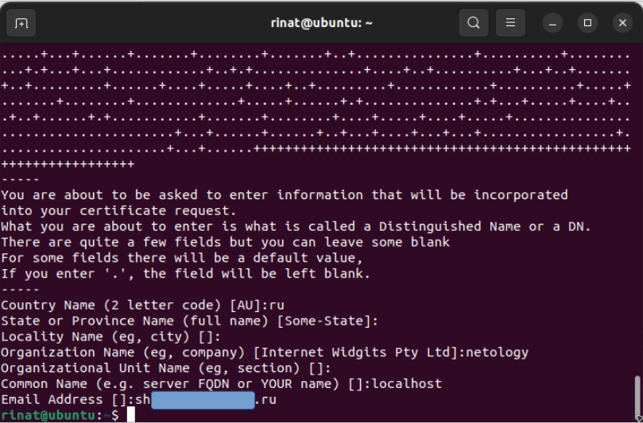
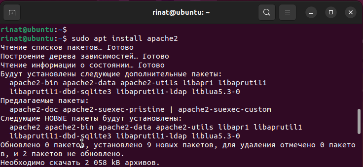
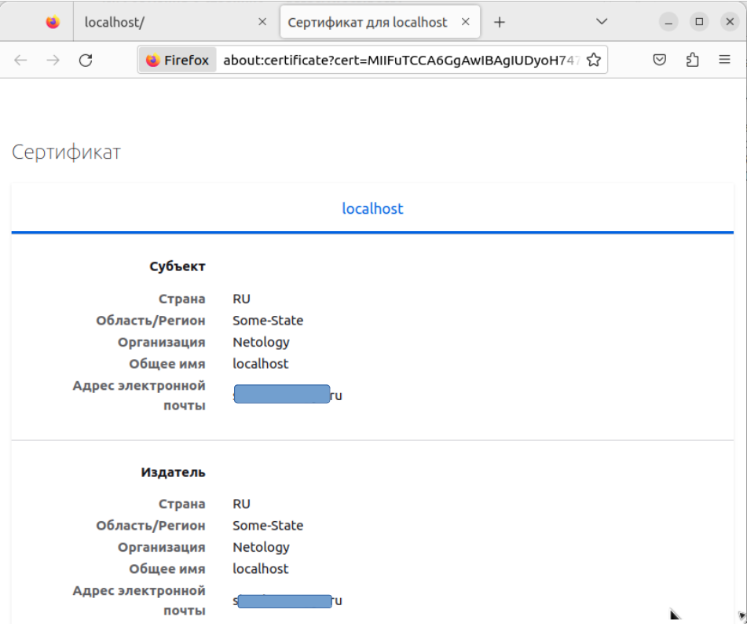

# Задание 1

#### Описание задания

Перед вами стоит задача создать и настроить Nginx веб-сервер.

#### Требование к результату

• Вы должны отправить скриншот с выполненным заданием.

• К выполненной задаче добавьте скриншот выполненной переадресации.

• В ответе пришлите скриншоты работающей страницы https://localhost и страницы с 301 ответом.

#### Процесс выполнения

1. Запустите программу VirtualBox
2. В программе VirtualBox загрузите операционную систему Ubuntu, если она у вас не установлена в качестве основной системы.
3. Установите Nginx:

```
sudo apt-get install nginx
```

4. Сгенерируйте сертификат для него указав localhost в качестве CN

```
sudo openssl req -x509 -nodes -newkey rsa:4096 -keyout /etc/nginx/cert.key -out /etc/nginx/cert.pem -days 365
```

5. Замените блок http { } в файле /etc/nginx/nginx.conf на:
```
http {
    gzip on;
    server {
        listen 80 default_server;
        root   /var/www/public;
        listen  443 ssl http2 default_server;
        server_name  localhost;
        ssl_certificate  /etc/nginx/cert.pem;
        ssl_certificate_key /etc/nginx/cert.key;
        ssl_protocols   TLSv1 TLSv1.1 TLSv1.2;
        ssl_ciphers   HIGH:!aNULL:!MD5;
        location / {
            index index.html;
        }
    }
}
```

6. Создайте файл /var/www/public/index.html c содержимым.

```
<h1>It works</h1>
```

7. Зайдите на страницу в браузере, пропустив сообщение о неработающем сертификате.
8. Пришлите скриншот работающей страницы https://localhost.
9. Измените конфигурацию сервера добавив переадресацию c Вашего сервера на сайт netology.ru.

```
location / {
  return 301 https://netology.ru;
}
```

10. Используя curl, сделайте запрос к своему серверу.

# Решение 1

1) Установим Nginx:

```
sudo apt update
sudo apt-get install nginx
```


2) Сгенерируем сертификат для nginx указав localhost в качестве CN

```
sudo openssl req -x509 -nodes -newkey rsa:4096 -keyout /etc/nginx/cert.key -out /etc/nginx/cert.pem -days 365
```




3) Заменим блок http { } в файле /etc/nginx/nginx.conf

```
sudo cp /etc/nginx/nginx.conf /etc/nginx/nginx.conf.bak
sudo nano /etc/nginx/nginx.conf
```


Проверка конфигурационного файла nginx.conf


Перезапускаем nginx


4) Создайте файл /var/www/public/index.html c содержимым.

```
<h1>It works</h1>
```


Зайдем на страницу https://localhost в браузере, пропустив сообщение о неработающем cертификате.


Изменим конфигурацию сервера добавив переадресацию c нашего сервера на сайт netology.ru.

```
location / {
  return 301 https://netology.ru;
}
```


Установим curl

```
sudo apt install curl
```

Используя curl, сделайте запрос к своему серверу.
Ругается на самоподписанный сертификат


При выполнении команды

```
curl -v -k https://localhost
```

выводит следующую информацию


Адрес https://localhost в браузере перенаправляет на https://netology.ru

# Задание 2

#### Описание задания

Перед вами стоит задача создать и настроить Apache2 веб-сервер.

##### Требование к результату

• Вы должны отправить скриншоты с выполненным заданием

• К выполненной задаче добавьте результат получившейся конфигурации.

##### Процесс выполнения

1. Запустите программу VirtualBox
2. В программе VirtualBox загрузите вторую виртуальную машину с операционной системой Ubuntu.
3. Используя документацию https://httpd.apache.org/docs/current/, установите apache2 веб-сервер.
4. Выполните аналогичные действия как и задании 1, добившись аналогичной работы сервера.

#### Правила приема работы

1. В личном кабинете отправлена ссылка на ваш Google документ, в котором прописан код каждого скрипта и скриншоты, демонстрирующие корректную работу скрипта
2. В документе настроены права доступа “Просматривать могут все в Интернете, у кого есть ссылка”
3. Название документа содержит название лекции и ваши фамилию и имя

#### Общие критерии оценки

Задание считается выполненным при соблюдении следующих условий:
1. Выполнено оба задания
2. К заданию прикреплены скриншоты конфигураций и выполненных запросов по итогам каждого задания.

# Решение 2

1) Установим Apache2:

```
sudo apt update
sudo apt install apache2
```



2) Сгенерируем сертификат для nginx указав localhost в качестве CN

```
sudo openssl req -x509 -nodes -newkey rsa:4096 -keyout /etc/apache2/apache2.key -out /etc/apache2/apache2.pem -days 365
```


3) Проверяем работоспособность apache2 по адресу localhost


5) Отредактируем конфигурацию apache2

```
sudo cp /etc/apache2/sites-available/default-ssl.conf /etc/apache2/sites-available/default-ssl.conf.bak
sudo nano /etc/apache2/sites-available/default-ssl.conf
```


Установка модуля ssl

```
sudo a2enmod ssl
sudo a2ensite default-ssl
sudo service apache2 restart
```


Проверка конфигурационного файла

```
sudo apache2ctl configtest
```


Перезапускаем apache2


6) Создаем файл index.html в /var/www/html c содержимым

```
<h1>It works</h1>
```


Зайдем на страницу https://localhost в браузере, пропустив сообщение о неработающем сертификате.


Данные сертификата



Изменим конфигурацию сервера добавив переадресацию c нашего сервера на сайт netology.ru.

```
Redirect permanent / https://netology.ru/
```


Установим curl

```
sudo apt install curl
```

Используя curl, сделайте запрос к своему серверу.


При выполнении команды 

```
curl -v -k https://localhost
```

выводит следующую информацию


Адрес https://localhost в браузере перенаправляет на https://netology.ru


