# Задание 1
#### ВАЖНО
Задание является сквозным и составлено на основе практической задачи из домашней работы [“L3-сеть”].

Описание задания
Перед вами стоит задача настроить IPv6-адреса на устройствах в локальной сети.

#### Требование к результату
    1. Вы должны отправить файл .pkt с выполненным заданием
    2. К выполненной задаче добавьте скриншоты с доступностью устройств между собой и ответы на вопросы.
#### Процесс выполнения
    1. Запустите программу Cisco Packet Tracer
    2. В программе Cisco Packet Tracer загрузите предыдущую практическую работу.
    3. На маршрутизаторе локальной сети (где три коммутатора в кольце), настройте выдачу IPv6-адресов по DHCP.
    4. Все устройства должны получить IPv6-адреса.
    5. Проверьте доступность каждого типа устройств с маршрутизатора куда они подключены, командой ping.
# Решение 1
1) На маршрутизаторе локальной сети (где три коммутатора в кольце), настроим выдачу IPv6-адресов по DHCP.
#### Настройка маршрутизатора
```
Router>en
Router#conf t
Router(config)#interface gigabitEthernet 0/0/1
Router(config-if)#ipv6 enable
Router(config-if)#ipv6 add 2001:db8:acad:a::1/64
Router(config-if)#no shutdown
Router(config-if)#exit
Router(config)#ipv6 unicast-routing 
Router(config)#interface GigabitEthernet 0/0/1.10
Router(config-subif)#ipv6 address 2001:db8:acad:10::1/64
Router(config-subif)#exit
Router(config)#interface GigabitEthernet 0/0/1.20
Router(config-subif)#ipv6 address 2001:db8:acad:20::1/64
Router(config-subif)#exit
Router(config)#interface GigabitEthernet 0/0/1.30
Router(config-subif)#ipv6 address 2001:db8:acad:30::1/64
Router(config-subif)#exit
Router(config)#end
Router#wr mem
```

#### Настройка свича 1-3

```
Switch#conf t
Switch(config)#sdm PREfer DUal-ipv4-and-ipv6 default 
Switch(config)#end
Switch#wr mem 
Switch#reload
```

2) Все устройства должны получить IPv6-адреса.

#### Laptop0 в VLAN10

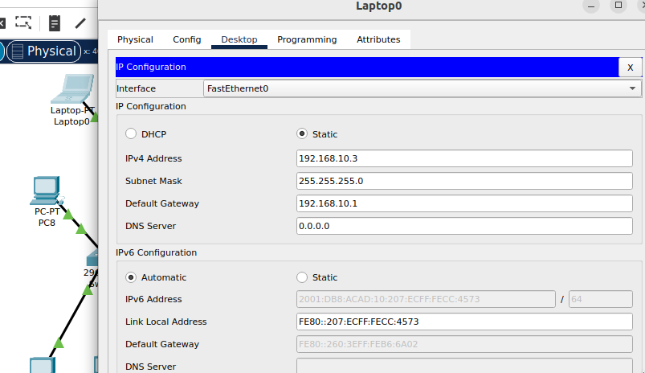

#### PC1 в VLAN20

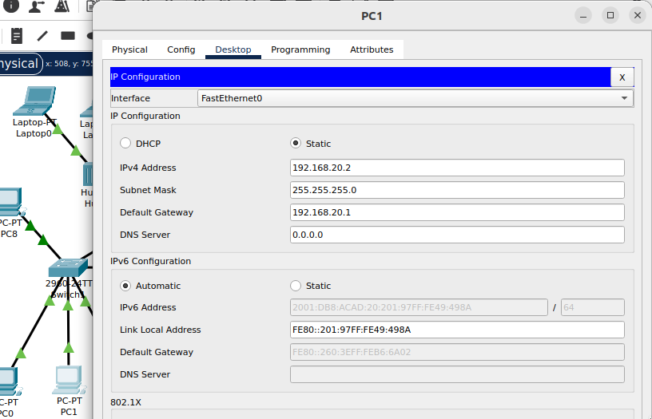

#### PC5 в VLAN30

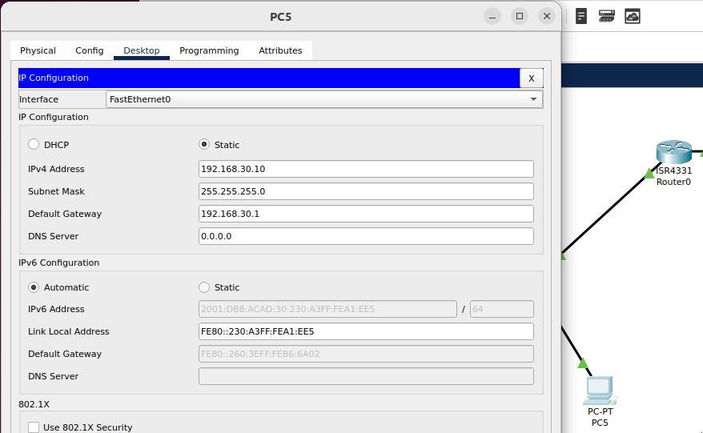

3) Проверим доступность каждого типа устройств с маршрутизатора куда они подключены, командой ping

#### PC0

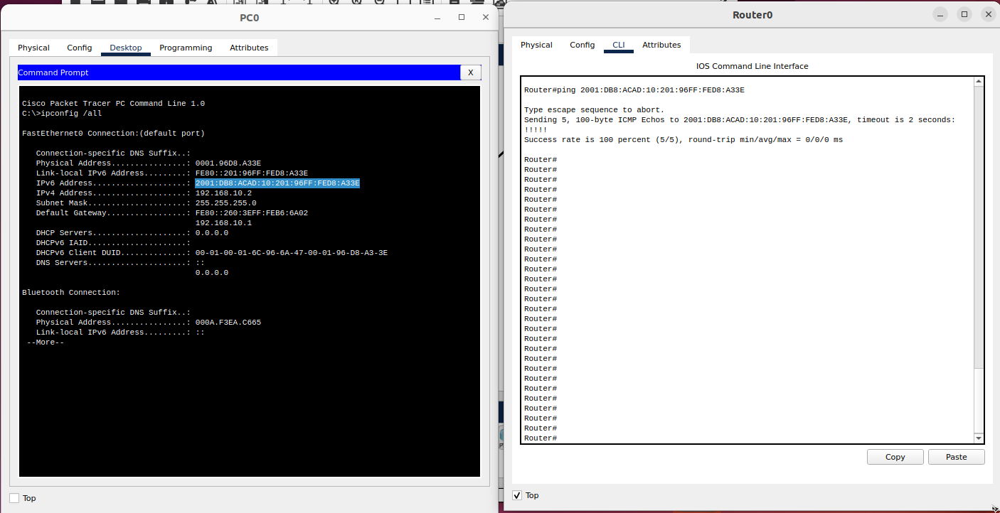

#### Laptop2

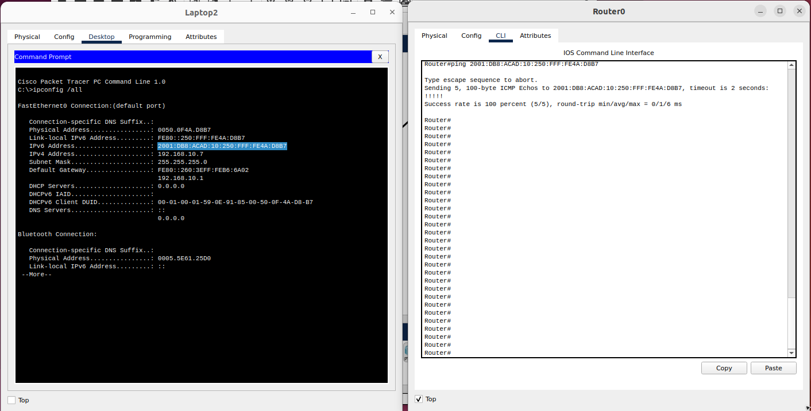

#### PC4

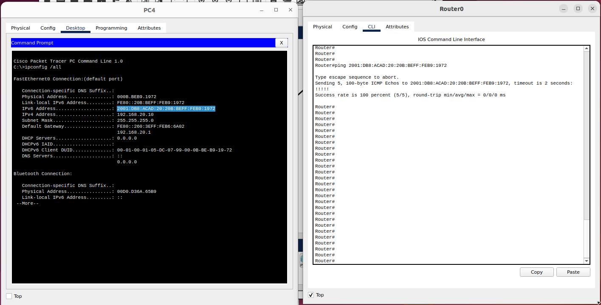

# Задание 2

#### ВАЖНО
Задание является сквозным и составлено на основе практической задачи из домашней работы [“L3-сеть”].

#### Описание задания
Перед вами стоит задача настроить для второй части сети (главного офиса) адресацию IPv6 с помощью механизма EUI-64 и соединить сети.

#### Требование к результату
    1. Вы должны отправить файл .pkt с выполненным заданием
    2. К выполненной задаче добавьте скриншоты с доступностью устройств между собой и ответы на вопросы.
#### Процесс выполнения
    1. Запустите программу Cisco Packet Tracer
    2. В программе Cisco Packet Tracer загрузите предыдущую практическую работу.
    3. На маршрутизаторе главного офиса настройте выдачу IPv6-адресов по DHCP с помощью механизма EUI-64.
    4. Создайте связность между маршрутизаторами с помощью IPv6-адресов.
    5. Проверьте доступность каждого типа устройств с маршрутизатора куда они подключены, командой ping.

# Решение 2
1) На маршрутизаторе главного офиса настройте выдачу IPv6-адресов по DHCP с помощью механизма EUI-64.

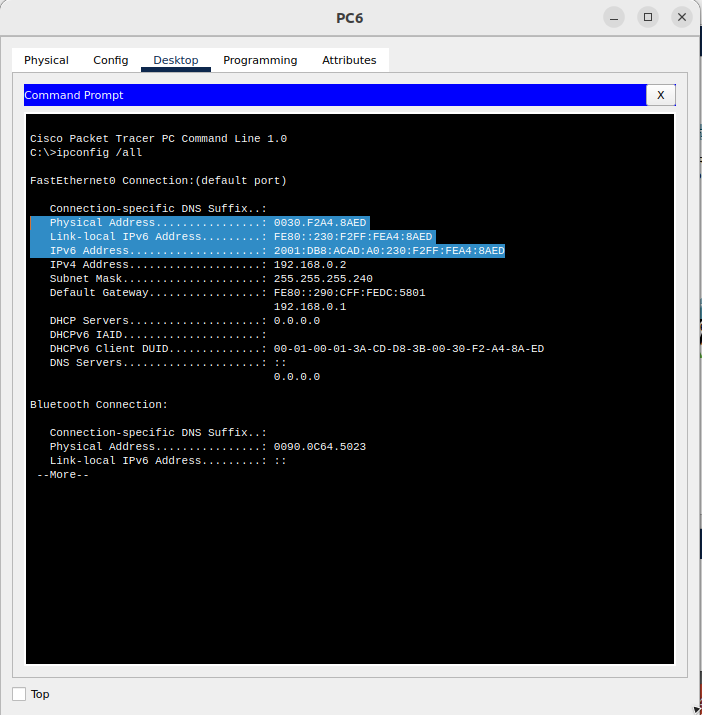

2) Создаем связность между маршрутизаторами с помощью IPv6-адресов.

#### Router0
```
Router>en
Router#conf t
Router(config)#interface gigabitEthernet 0/0/0
Router(config-if)#ipv6 enable
Router(config-if)#ipv6 add 2001:db8:acad:a001::1/64
Router(config-if)#no shutdown
Router(config-if)#exit
Router(config)#end
Router#wr mem
```

#### Router1
``` 
Router(config)#interface gigabitEthernet 0/0/1
Router(config-if)#ipv6 enable
Router(config-if)#ipv6 add 2001:db8:acad:a001::2/64
Router(config-if)#no shutdown
Router(config-if)#exit
Router(config)#end
Router#wr mem
```

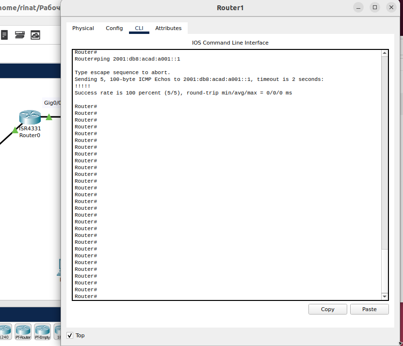

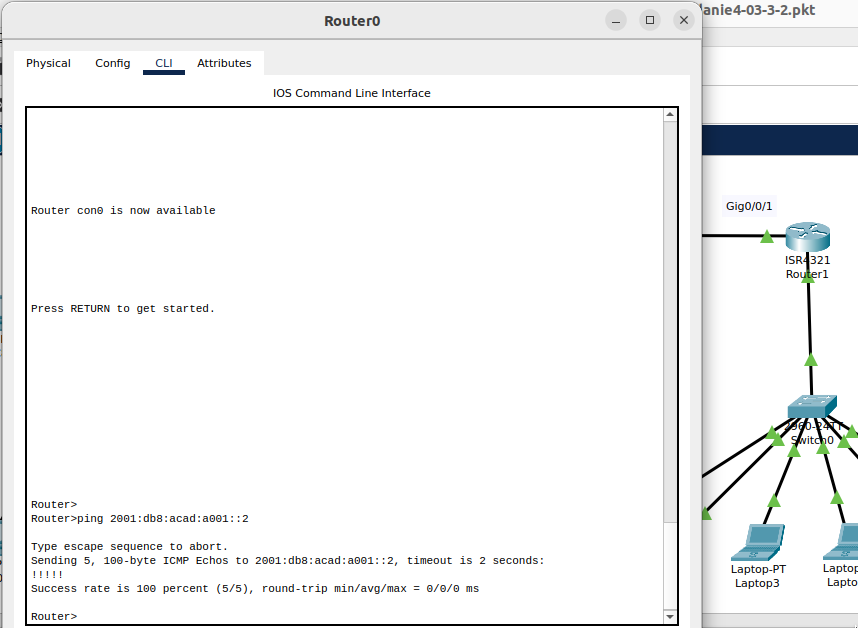

3) Проверьте доступность каждого типа устройств с маршрутизатора куда они подключены, командой ping.

#### Router1 - PC7

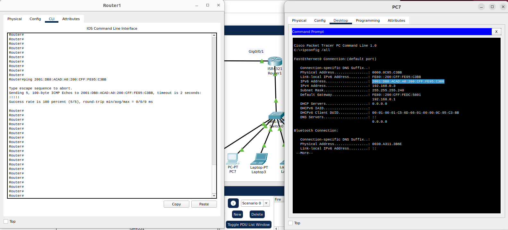

#### Router0 - PC5

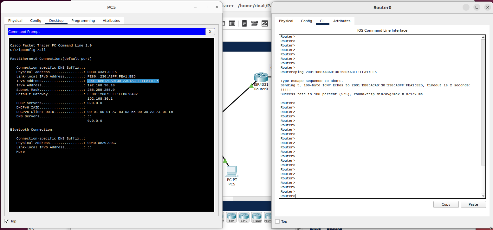

# Задание 3

Задание является сквозным и составлено на основе практической задачи из домашней работы [“L3-сеть”].

#### Описание задания
Перед вами стоит задача создать доступность устройств небольшой локальной сети к главной сети офиса.

#### Требование к результату
    1. Вы должны отправить файл .pkt с выполненным заданием
    2. К выполненной задаче добавьте скриншоты с доступностью устройств между собой.
Процесс выполнения
    1. Запустите программу Cisco Packet Tracer
    2. В программе Cisco Packet Tracer загрузите предыдущую практическую работу.
    3. На маршрутизаторах добавьте статические записи маршрутизации о доступности других сетей.
    4. Проверьте связь по IPv6 - адресам с конечного устройств за одним маршрутизатором до конечного устройства за другим маршрутизатором.

# Решение 3

1) На маршрутизаторах добавьте статические записи маршрутизации о доступности других сетей.

```
Router0
Router>enable
Router#configure terminal
Router(config)#ipv6 route 2001:DB8:ACAD:A0::1/64 2001:DB8:ACAD:A001::2
Router(config)#end
```
```
Router1
ipv6 route 2001:DB8:ACAD:1::1/64 2001:DB8:ACAD:A001::1
ipv6 route 2001:DB8:ACAD:10::1/64 2001:DB8:ACAD:A001::1
ipv6 route 2001:DB8:ACAD:20::1/64 2001:DB8:ACAD:A001::1
ipv6 route 2001:DB8:ACAD:30::1/64 2001:DB8:ACAD:A001::1
```
2) Проверьте связь по IPv6 - адресам с конечного устройств за одним маршрутизатором до конечного устройства за другим маршрутизатором.

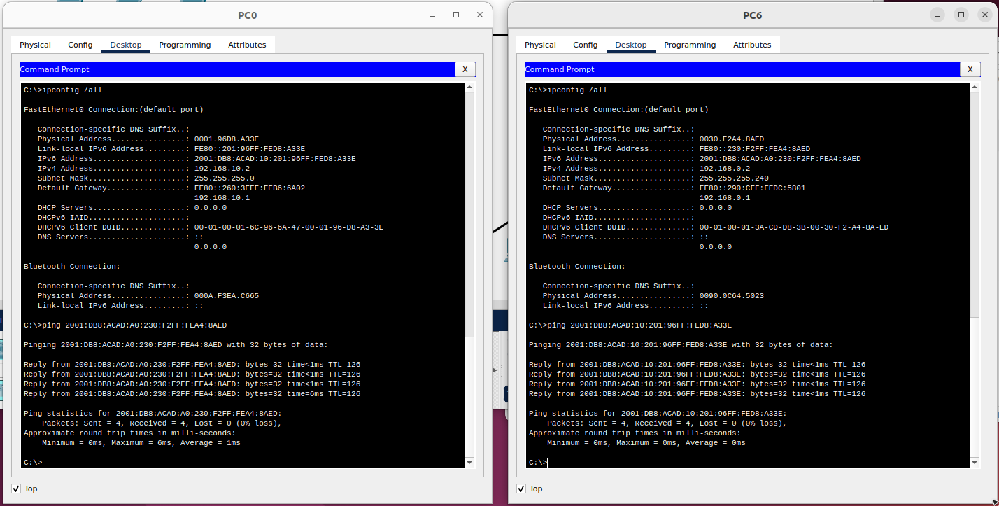
