# Задание 1

Выполните действия:

1. Запустите Kubernetes локально, используя k3s или minikube на свой выбор.
2. Добейтесь стабильной работы всех системных контейнеров.
3. В качестве ответа пришлите скриншот результата выполнения команды kubectl get po -n kube-system.

# Решение 1

Установка 
Вывод команды:

```
kubectl get po -n kube-system
```

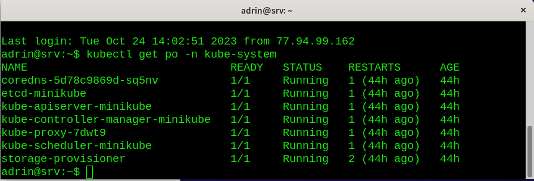

# Pадание 2

Есть файл с деплоем:

```
---
apiVersion: apps/v1
kind: Deployment
metadata:
  name: redis
spec:
  selector:
    matchLabels:
      app: redis
  replicas: 1
  template:
    metadata:
      labels:
        app: redis
    spec:
      containers:
      - name: master
        img/image: bitnami/redis
        env:
         - name: REDIS_PASSWORD
           value: password123
        ports:
        - containerPort: 6379
```

#### Выполните действия:

Измените файл с учётом условий:
1. redis должен запускаться без пароля;
2. создайте Service, который будет направлять трафик на этот Deployment;
3. версия образа redis должна быть зафиксирована на 6.0.13.
4. Запустите Deployment в своём кластере и добейтесь его стабильной работы.

В качестве решения пришлите получившийся файл.


# Решение 2

Запуск 
```
kubectl apply -f redis-hw.yaml
```

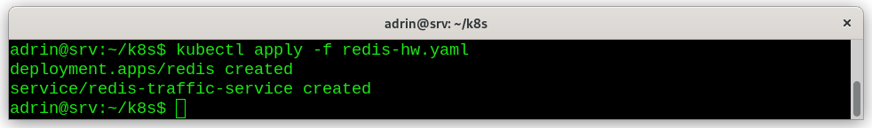

Вывод команды: 
```
kubectl get pods
```

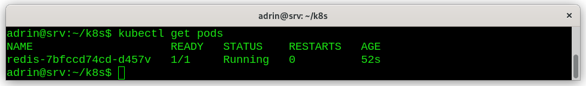

Вывод команды: 
```
kubectl describe po
```

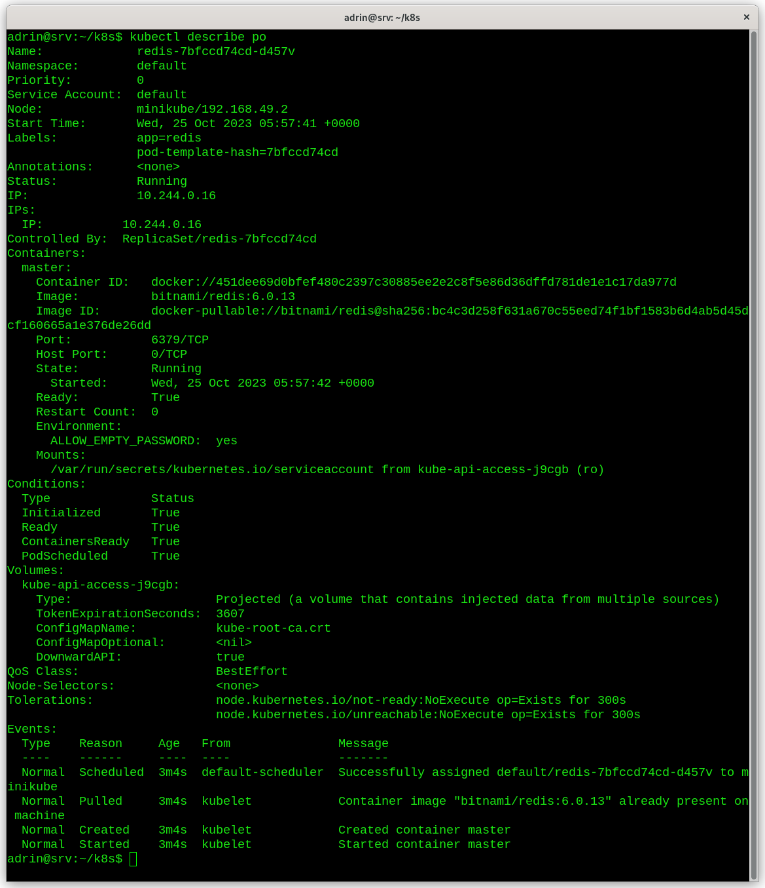

Вывод команды: 
```
kubectl get services 
```
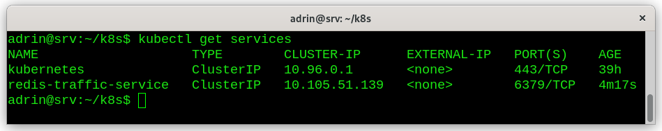

Вывод команды: 

```
kubectl get pods
```

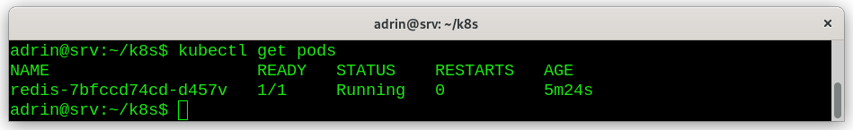

# Задание 3

#### Выполните действия:

Напишите команды kubectl для контейнера из предыдущего задания:
1. выполнения команды ps aux внутри контейнера;
2. просмотра логов контейнера за последние 5 минут;
3. удаления контейнера;
4. проброса порта локальной машины в контейнер для отладки.

В качестве решения пришлите получившиеся команды.

# Решение 3

1. 
```
kubectl exec -it redis-7bfccd74cd-d457v -- /bin/bash 
```

Вывод команд: 

```
ps aux
```

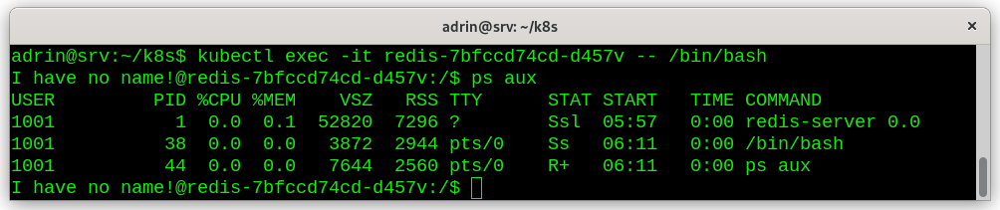

2. 
Вывод логов за 5 минут

```
kubectl logs --since=5m redis-7bfccd74cd-d457v
```

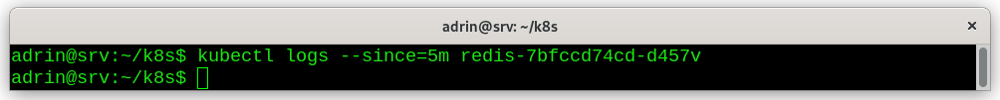

Вывод логов за 24 часа

```
kubectl logs --since=24h redis-7bfccd74cd-d457v
```

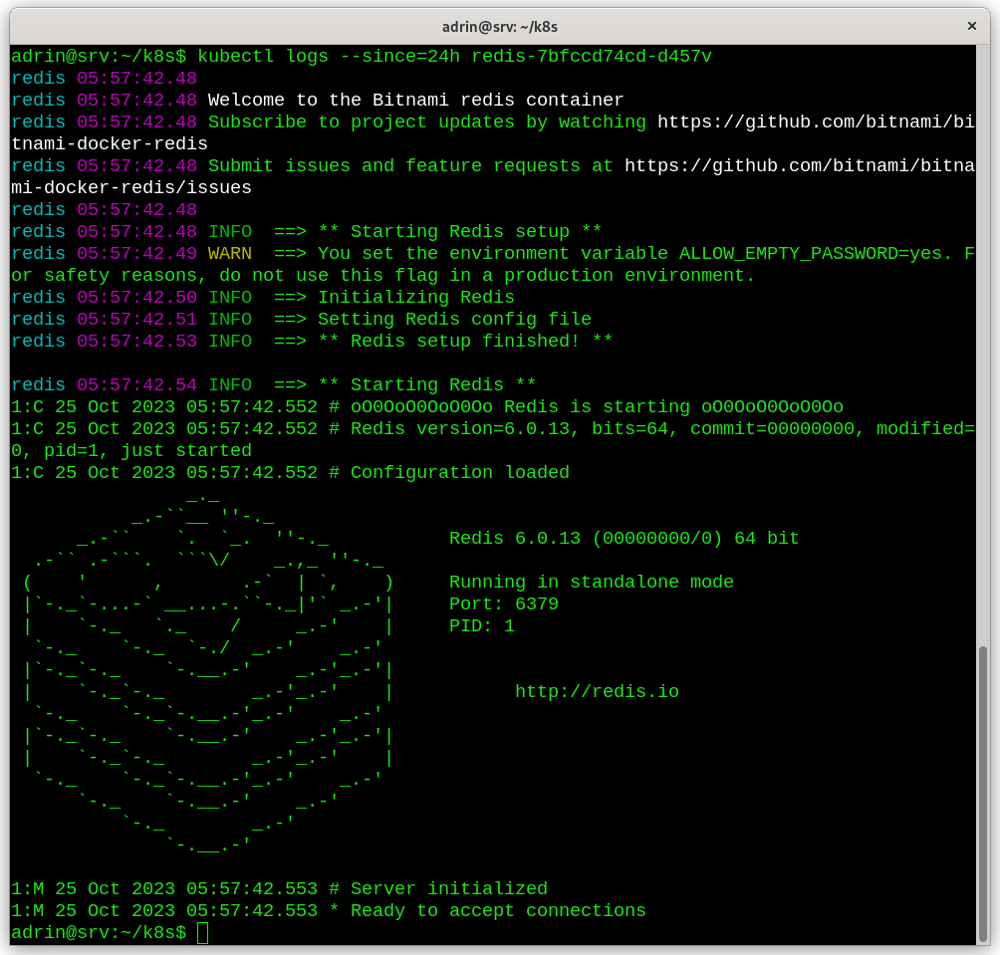

4. Проброс портов

```
kubectl port-forward redis-7bfccd74cd-d457v 6379:80
```
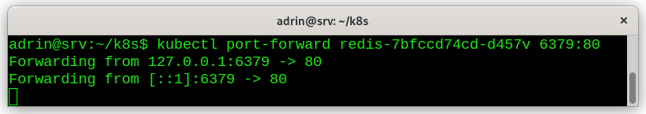

3. Удаление контейнера

```
kubectl delete -n test -f redis-hw.yaml
```

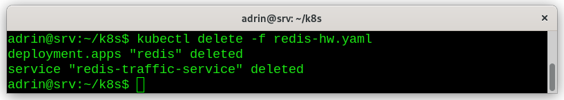

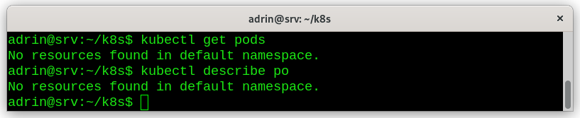