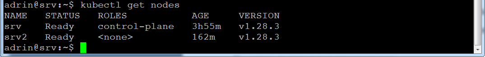

# Задание 1

#### Выполните действия:

1. Создайте свой кластер с помощью kubeadm.
2. Установите любой понравившийся CNI плагин.
3. Добейтесь стабильной работы кластера.

В качестве ответа пришлите скриншот результата выполнения команды 

```
kubectl get po -n kube-system.
```

# Решение 1

```
sudo swapoff -a
sudo sed -i '/ swap / s/^/#/' /etc/fstab 
sudo nano /etc/fstab #swap
sudo reboot
sudo apt update
sudo apt install -y apt-transport-https ca-certificates curl gpg
```
```
curl -fsSL https://pkgs.k8s.io/core:/stable:/v1.28/deb/Release.key | sudo gpg --dearmor -o /etc/apt/keyrings/kubernetes-apt-keyring.gpg
```
```
echo 'deb [signed-by=/etc/apt/keyrings/kubernetes-apt-keyring.gpg] https://pkgs.k8s.io/core:/stable:/v1.28/deb/ /' | sudo tee /etc/apt/sources.list.d/kubernetes.list
```
```
sudo apt update
sudo apt install -y kubelet kubeadm kubectl containerd
sudo apt-mark hold kubelet kubeadm kubectl

sudo systemctl restart containerd 
sudo systemctl enable containerd
```
```
sudo -i
modprobe br_netfilter
echo "net.ipv4.ip_forward=1" >> /etc/sysctl.conf
echo "net.bridge.bridge-nf-call-iptables=1" >> /etc/sysctl.conf
#echo "net.ipv4.ip_forward=1" >> /etc/sysctl.d/kubernetes.conf
#echo "net.bridge.bridge-nf-call-iptables=1" >> /etc/sysctl.d/kubernetes.conf
sysctl -p /etc/sysctl.conf
logout  # Стоп на второй. Далее kubeadm join …
```
```
#sudo kubeadm config images pull
```
```
sudo kubeadm init  \
   --apiserver-advertise-address=192.168.0.87 \
   --pod-network-cidr=10.244.0.0/16 \
   --apiserver-cert-extra-sans=94.41.18.218
  # --control-plane-endpoint=hicluster_ip_address
```

```
mkdir -p $HOME/.kube
sudo cp -i /etc/kubernetes/admin.conf $HOME/.kube/config
sudo chown $(id -u):$(id -g) $HOME/.kube/config
```

Then you can join any number of worker nodes by running the following on each as root: 

```
kubeadm join 192.168.0.87:6443 --token fchs34.igkwonjr9hmtgk8g \ 	--discovery-token-ca-cert-hash sha256:b684db1b815a934bd490da7dceae8f345b95ba52e6b576582fe6709b38ebf00a
```

На мастере, после подключения воркер ноды

```
kubectl apply -f https://github.com/coreos/flannel/raw/master/Documentation/kube-flannel.yml
```

Вывод команды 

```
kubectl get nodes
```


Вывод команды: 

```
kubectl get po -A
```


Установка CNI (weave)
```
kubectl apply -f 
https://github.com/weaveworks/weave/releases/download/v2.8.1/weave-daemonset-k8s.yaml
```

Вывод команды:

```
kubectl get po -n kube-system
```


# Задание 2

Есть файл с деплоем:

```
---
apiVersion: apps/v1
kind: Deployment
metadata:
  name: redis
spec:
  selector:
    matchLabels:
      app: redis
  replicas: 1
  template:
    metadata:
      labels:
        app: redis
    spec:
      containers:
      - name: master
        image: bitnami/redis
        env:
         - name: REDIS_PASSWORD
           value: password123
        ports:
        - containerPort: 6379
```

#### Выполните действия:

Создайте Helm Charts.
1. Добавьте в него сервис.
2. Вынесите все нужные, на ваш взгляд, параметры в values.yaml.
3. Запустите чарт в своём кластере и добейтесь его стабильной работы.

В качестве ответа пришлите вывод команды helm get manifest <имя_релиза>.

# Решение 2

```
helm install redis ./helm
```


```
helm list
```


```
kubectl get service
```


```
helm get manifest redis
```

```
---
# Source: frontend-chart/templates/redis-deployment.yaml
apiVersion: v1 #v1
kind: Service
metadata:
  name: redis-traffic-service-v1
spec:
  selector:
    app: redis
  ports:
    - protocol: TCP
      port: 6379
      targetPort: 6379
---
# Source: frontend-chart/templates/redis-deployment.yaml
apiVersion: apps/v1
kind: Deployment
metadata:
  name: redis
spec:
  selector:
    matchLabels:
      app: redis
  replicas: 1 # 1
  template:
    metadata:
      labels:
        app: redis
    spec:
      containers:
      - name: master
        image: bitnami/redis # bitnami/redis
        env:
         - name: REDIS_PASSWORD
           value: password123
        ports:
        - containerPort: 6379
```


