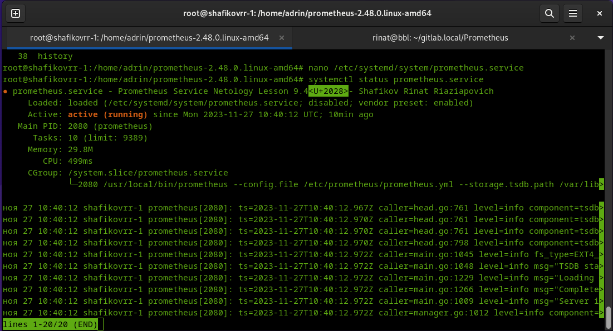
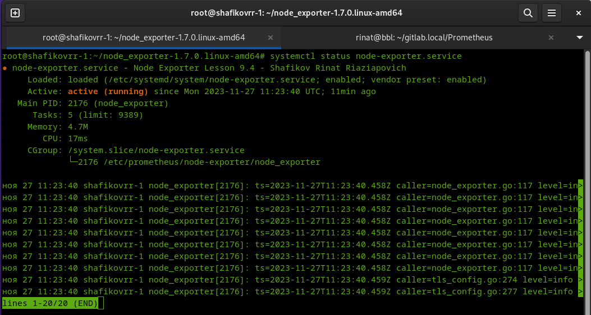

# Задание 1

### Установите Prometheus.

#### Процесс выполнения

1. Выполняя задание, сверяйтесь с процессом, отражённым в записи лекции
2. Создайте пользователя prometheus
3. Скачайте prometheus и в соответствии с лекцией разместите файлы в целевые директории
4. Создайте сервис как показано на уроке
5. Проверьте что prometheus запускается, останавливается, перезапускается и отображает статус с помощью systemctl

#### Требования к результату

Прикрепите к файлу README.md скриншот systemctl status prometheus, где будет написано: prometheus.service — Prometheus Service Netology Lesson 9.4 — [Ваши ФИО]

# Решение 1

Создание пользователя prometheus
```
useradd --no-create-home --shell /bin/false prometheus
```
Установка prometheus

```
wget https://github.com/prometheus/prometheus/releases/download/v2.48.0/prometheus-2.48.0.linux-amd64.tar.gz
tar xvfz prometheus-2.48.0.linux-amd64.tar.gz
cd prometheus-2.48.0.linux-amd64
mkdir /etc/prometheus
mkdir /var/lib/prometheus
cp ./prometheus promtool /usr/local/bin
cp -R ./console_libraries/ /etc/prometheus/
cp -R ./consoles/ /etc/prometheus/
cp ./prometheus.yml /etc/prometheus/
chown -R prometheus:prometheus /etc/prometheus/ 
chown -R prometheus:prometheus /var/lib/prometheus/
chown prometheus:prometheus /usr/local/bin/prometheus
chown prometheus:prometheus /usr/local/bin/promtool 
```
Запуск prometheus
```
/usr/local/bin/prometheus --config.file /etc/prometheus/prometheus.yml --storage.tsdb.path /var/lib/prometheus/ --web.console.templates=/etc/prometheus/consoles --web.console.libraries=/etc/prometheus/console_libraries
```
Создание сервиса prometheus
```
nano /etc/systemd/system/prometheus.service
```

```
[Unit]
Description=Prometheus Service Netology Lesson 9.4 - Shafikov Rinat Riaziapovich
After=network.target
[Service]
User=prometheus
Group=prometheus
Type=simple
ExecStart=/usr/local/bin/prometheus \
--config.file /etc/prometheus/prometheus.yml \
--storage.tsdb.path /var/lib/prometheus/ \
--web.console.templates=/etc/prometheus/consoles \
--web.console.libraries=/etc/prometheus/console_libraries
ExecReload=/bin/kill -HUP $MAINPID Restart=on-failure
[Install]
WantedBy=multi-user.target
```
Запуск сервиса prometheus

```
systemctl enable prometheus.service
systemctl start prometheus.service
systemctl status prometheus.service
```



---

# Задание 2

### Установите Node Exporter.

#### Процесс выполнения

1. Выполняя ДЗ сверяйтесь с процессом отражённым в записи лекции.
2. Скачайте node exporter приведённый в презентации и в соответствии с лекцией разместите файлы в целевые директории
3. Создайте сервис для как показано на уроке
4. Проверьте что node exporter запускается, останавливается, перезапускается и отображает статус с помощью systemctl

#### Требования к результату

Прикрепите к файлу README.md скриншот systemctl status node-exporter, где будет написано: node-exporter.service — Node Exporter Netology Lesson 9.4 — [Ваши ФИО]

# Решение 2

Установка Node Exporter

```
wget https://github.com/prometheus/node_exporter/releases/download/v1.7.0/node_exporter-1.7.0.linux-amd64.tar.gz
tar xvfz node_exporter-1.7.0.linux-amd64.tar.gz
```
Первый запуск Node Exporter

```
cd node_exporter-1.7.0.linux-amd64
./node_exporter
```
Копируем Node Exporter в папку prometheus

```
mkdir /etc/prometheus/node-exporter
cp ./node_exporter /etc/prometheus/node-exporter
```
Передаем права на папку Node Exporter пользователю Prometheus

```
chown prometheus:prometheus -R /etc/prometheus/node-exporter
```
Создаем сервис Node Exporter
```
nano /etc/systemd/system/node-exporter.service
systemctl enable node-exporter.service
systemctl start node-exporter.service
systemctl status node-exporter.service
```
 
