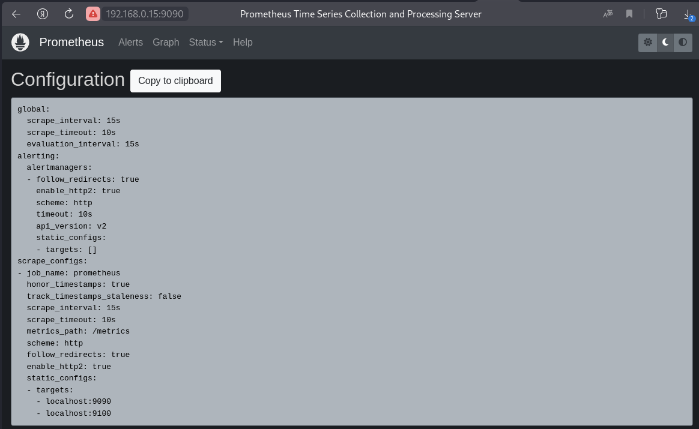
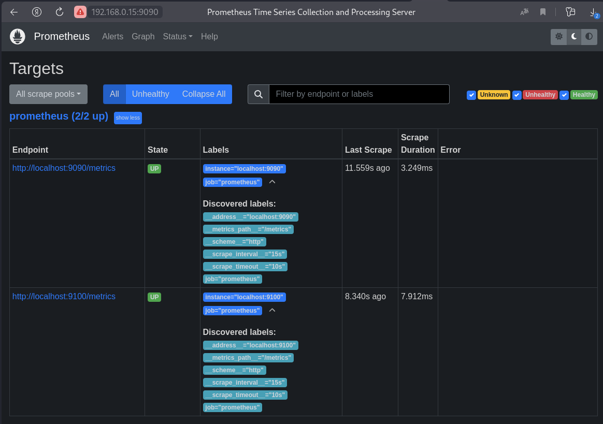
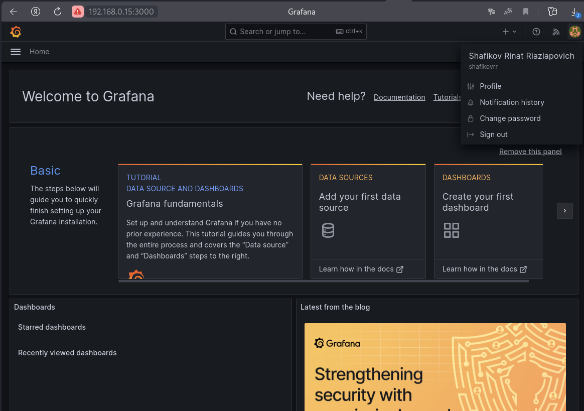
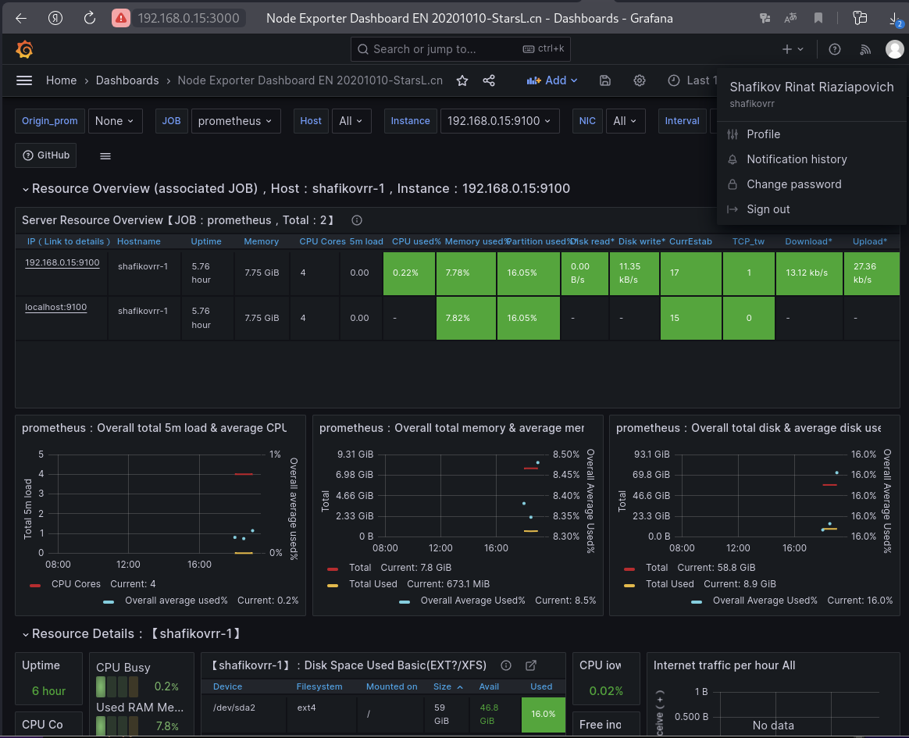

# Задание 1

### Установите Prometheus.

#### Процесс выполнения

1. Выполняя задание, сверяйтесь с процессом, отражённым в записи лекции
2. Создайте пользователя prometheus
3. Скачайте prometheus и в соответствии с лекцией разместите файлы в целевые директории
4. Создайте сервис как показано на уроке
5. Проверьте что prometheus запускается, останавливается, перезапускается и отображает статус с помощью systemctl

#### Требования к результату

Прикрепите к файлу README.md скриншот systemctl status prometheus, где будет написано: prometheus.service — Prometheus Service Netology Lesson 9.4 — [Ваши ФИО]

# Решение 1

Создание пользователя prometheus
```
useradd --no-create-home --shell /bin/false prometheus
```
Установка prometheus

```
wget https://github.com/prometheus/prometheus/releases/download/v2.48.0/prometheus-2.48.0.linux-amd64.tar.gz
tar xvfz prometheus-2.48.0.linux-amd64.tar.gz
cd prometheus-2.48.0.linux-amd64
mkdir /etc/prometheus
mkdir /var/lib/prometheus
cp ./prometheus promtool /usr/local/bin
cp -R ./console_libraries/ /etc/prometheus/
cp -R ./consoles/ /etc/prometheus/
cp ./prometheus.yml /etc/prometheus/
chown -R prometheus:prometheus /etc/prometheus/ 
chown -R prometheus:prometheus /var/lib/prometheus/
chown prometheus:prometheus /usr/local/bin/prometheus
chown prometheus:prometheus /usr/local/bin/promtool 
```
Запуск prometheus
```
/usr/local/bin/prometheus --config.file /etc/prometheus/prometheus.yml --storage.tsdb.path /var/lib/prometheus/ --web.console.templates=/etc/prometheus/consoles --web.console.libraries=/etc/prometheus/console_libraries
```
Создание сервиса prometheus
```
nano /etc/systemd/system/prometheus.service
```

```
[Unit]
Description=Prometheus Service Netology Lesson 9.4 - Shafikov Rinat Riaziapovich
After=network.target
[Service]
User=prometheus
Group=prometheus
Type=simple
ExecStart=/usr/local/bin/prometheus \
--config.file /etc/prometheus/prometheus.yml \
--storage.tsdb.path /var/lib/prometheus/ \
--web.console.templates=/etc/prometheus/consoles \
--web.console.libraries=/etc/prometheus/console_libraries
ExecReload=/bin/kill -HUP $MAINPID Restart=on-failure
[Install]
WantedBy=multi-user.target
```
Запуск сервиса prometheus

```
systemctl enable prometheus.service
systemctl start prometheus.service
systemctl status prometheus.service
```
Адрес входа 

```
http://192.168.0.15:9090
```


---

# Задание 2

### Установите Node Exporter.

#### Процесс выполнения

1. Выполняя ДЗ сверяйтесь с процессом отражённым в записи лекции.
2. Скачайте node exporter приведённый в презентации и в соответствии с лекцией разместите файлы в целевые директории
3. Создайте сервис для как показано на уроке
4. Проверьте что node exporter запускается, останавливается, перезапускается и отображает статус с помощью systemctl

#### Требования к результату

Прикрепите к файлу README.md скриншот systemctl status node-exporter, где будет написано: node-exporter.service — Node Exporter Netology Lesson 9.4 — [Ваши ФИО]

# Решение 2

Установка Node Exporter

```
wget https://github.com/prometheus/node_exporter/releases/download/v1.7.0/node_exporter-1.7.0.linux-amd64.tar.gz
tar xvfz node_exporter-1.7.0.linux-amd64.tar.gz
```
Первый запуск Node Exporter

```
cd node_exporter-1.7.0.linux-amd64
./node_exporter
```
Копируем Node Exporter в папку prometheus

```
mkdir /etc/prometheus/node-exporter
cp ./node_exporter /etc/prometheus/node-exporter
```
Передаем права на папку Node Exporter пользователю Prometheus

```
chown prometheus:prometheus -R /etc/prometheus/node-exporter
```
Создаем сервис Node Exporter
```
nano /etc/systemd/system/node-exporter.service
```

```
[Unit]
Description=Node Exporter Lesson 9.4 - Shafikov Rinat Riaziapovich
After=network.target
[Service]
User=prometheus
Group=prometheus
Type=simple
ExecStart=/etc/prometheus/node-exporter/node_exporter
[Install]
WantedBy=multi-user.target
```

Запуск сервиса Node Exporter

```
systemctl enable node-exporter.service
systemctl start node-exporter.service
systemctl status node-exporter.service
```

Адрес входа

```
http://192.168.0.15:9100
```


 

---

# Задание 3

### Подключите Node Exporter к серверу Prometheus.

#### Процесс выполнения

1. Выполняя ДЗ сверяйтесь с процессом отражённым в записи лекции.
2. Отредактируйте prometheus.yaml, добавив в массив таргетов установленный в задании 2 node exporter
3. Перезапустите prometheus
4. Проверьте что он запустился

#### Требования к результату
Прикрепите к файлу README.md скриншот конфигурации из интерфейса Prometheus вкладки Status > Configuration
Прикрепите к файлу README.md скриншот из интерфейса Prometheus вкладки Status > Targets, чтобы было видно минимум два эндпоинта

# Решение 3

Отредактируем файл prometheus.yml и добавим туда таргет для отслеживния

```
nano /etc/prometheus/prometheus.yml
```
```
    static_configs:
      - targets: ["localhost:9090", "localhost:9100"]
```

Перезапустим prometheus.service 

```
systemctl start prometheus.service
systemctl status prometheus.service
```




---

# Задание 4

### Установите Grafana.

#### Требования к результату

Прикрепите к файлу README.md скриншот левого нижнего угла интерфейса, чтобы при наведении на иконку пользователя были видны ваши ФИО

# Решение 4

Установка Grafana

```
sudo apt-get install -y adduser libfontconfig1 musl
wget https://dl.grafana.com/oss/release/grafana_10.2.2_amd64.deb
sudo dpkg -i grafana_10.2.2_amd64.deb
```

Включаем автозапуск и запускаем сервер Grafana

```
systemctl enable grafana-server.service
systemctl start grafana-server.service
systemctl status grafana-server.service
```
Адресс Входа в Grafana

```
http://192.168.0.15:3000
admin
admin
```



Интеграция Grafana и Prometheus

```
Home > Connections > Data sourses > Add data sourse > Prometheus
Prometheus > Connection (http://localhost:9090) > Save and test

```
Подключаем дашборд

Home > Dashboard > New (Import) > "1860" > Load > Prometheus > Import


---

# Задание 5

### Интегрируйте Grafana и Prometheus.

#### Требования к результату

* Прикрепите к файлу README.md скриншот дашборда (ID:11074) с поступающими туда данными из Node Exporter

#### Критерии оценки

* Выполнено минимум 3 обязательных задания
* Прикреплены требуемые скриншоты
* Задание оформлено в шаблоне с решением и опубликовано на GitHub

# Решение 5

Подключаем дашборд

Home > Dashboard > New (Import) > "11074" > Load > Prometheus > Import


