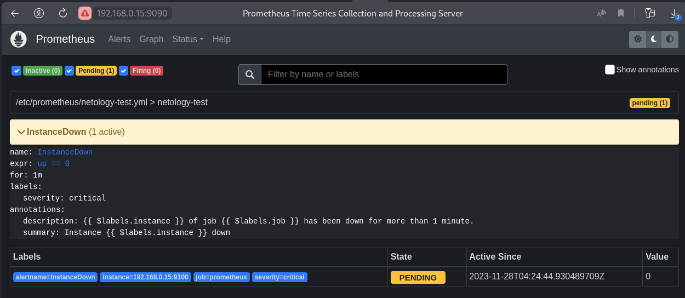
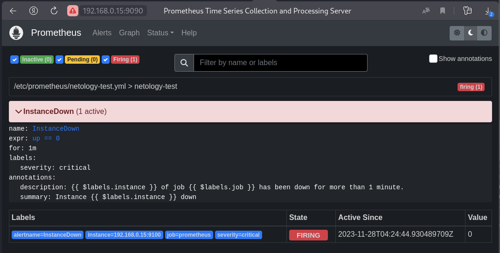
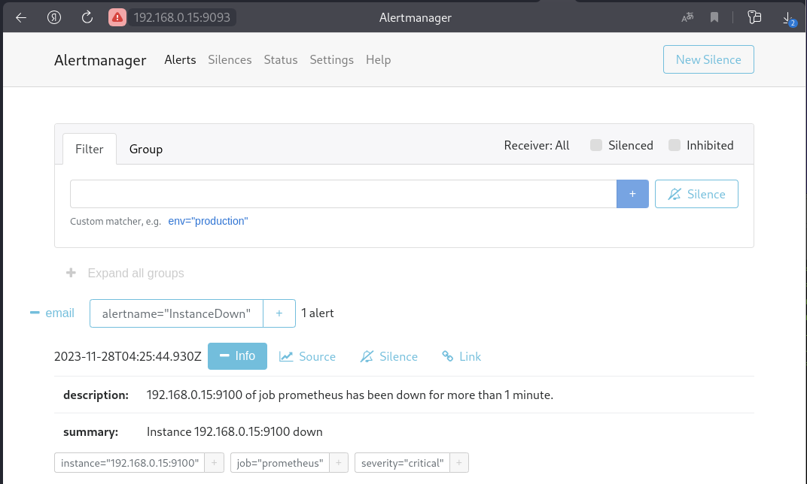
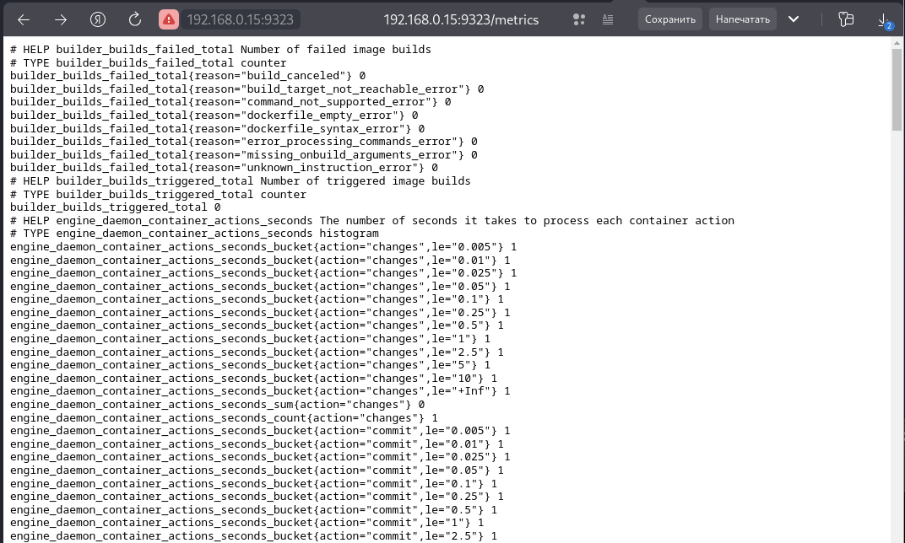
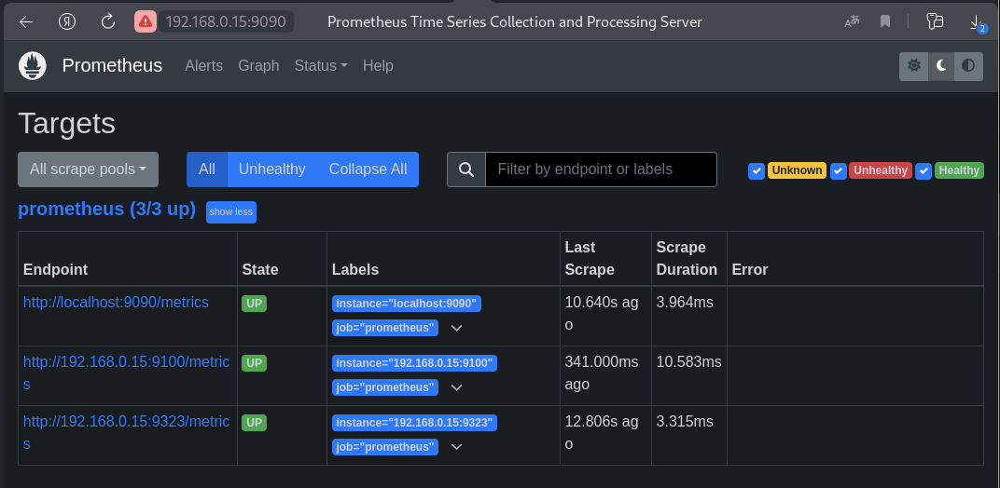
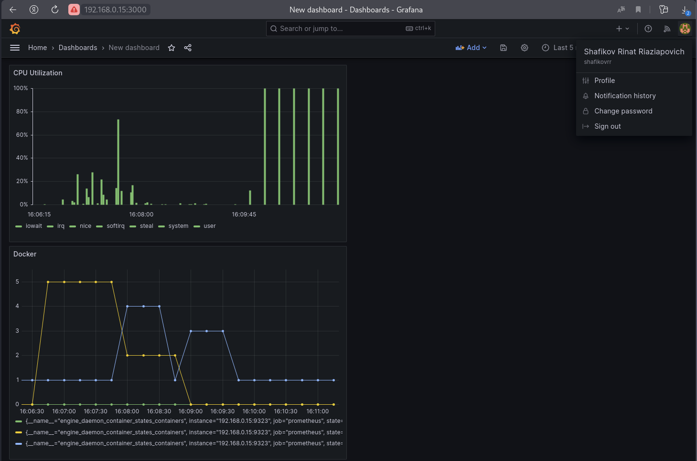

# Задание 1

Создайте файл с правилом оповещения, как в лекции, и добавьте его в конфиг Prometheus.

#### Требования к результату

Погасите node exporter, стоящий на мониторинге, и прикрепите скриншот раздела оповещений Prometheus, где оповещение будет в статусе Pending

# Решение

Установка alertmanager

```
wget https://github.com/prometheus/alertmanager/releases/download/v0.26.0/alertmanager-0.26.0.linux-amd64.tar.gz
tar -xvf alertmanager-0.26.0.linux-amd64.tar.gz
```

Копируем распакованные файлы в необходимые директории

``` 
cp ./alertmanager-0.26.0.linux-amd64/alertmanager /usr/local/bin/
cp ./alertmanager-0.26.0.linux-amd64/amtool /usr/local/bin/
cp ./alertmanager-0.26.0.linux-amd64/alertmanager.yml /etc/prometheus/
```
Передаем права на файл alertmanager.yml пользователю и группе prometheus

```
chown prometheus:prometheus /etc/prometheus/alertmanager.yml
```

Создайте сервис для работы с Node Exporter

```
nano /etc/systemd/system/prometheus-alertmanager.service
```

```
[Unit]
Description=Alertmanager Service
After=network.target
[Service]
EnvironmentFile=-/etc/default/alertmanager
User=prometheus
Group=prometheus
Type=simple
ExecStart=/usr/local/bin/alertmanager --config.file=/etc/prometheus/alertmanager.yml --storage.path=/var/lib/prometheus/aler>
ExecReload=/bin/kill -HUP $MAINPID
Restart=on-failure
[Install]
WantedBy=multi-user.target
```
Добавление в автозагрузку, старт и проверка prometheus-alertmanager.service

```
systemctl enable prometheus-alertmanager.service
systemctl start prometheus-alertmanager.service
systemctl status prometheus-alertmanager.service
```

Отредактируем конфигурацию Alertmanager в prometheus.yml

```
nano /etc/prometheus/prometheus.yml 
```

```
# Alertmanager configuration
alerting:
  alertmanagers:
    - static_configs:
        - targets:
          - localhost:9093
```

Перезапустим и проверим статус prometheus

```
systemctl restart prometheus
systemctl status prometheus
```

Создадим файл с правилом оповещения

```
nano /etc/prometheus/netology-test.yml
```

```
groups: # Список групп
- name: netology-test # Имя группы
  rules: # Список правил текущей группы
  - alert: InstanceDown # Название текущего правила
    expr: up == 0 # Логическое выражение
    for: 1m # Сколько ждать отбоя сработки перед отправкой оповещения
    labels:
      severity: critical # Критичность события
    annotations: # Описание
      description: '{{ $labels.instance }} of job {{ $labels.job }} has been down for more than 1 minute.' # Полное описание>
      summary: Instance {{ $labels.instance }} down # Краткое описание алерта
```

Добавим файл оповещения в Prometheus

```
nano /etc/prometheus/prometheus.yml
```

```
rule_files:
  - "netology-test.yml"
```

Перезапустим и проверим статус prometheus

```
systemctl restart prometheus
systemctl status prometheus
```

Настройка оповещений в Alertmanager

```
nano /etc/prometheus/alertmanager.yml
```

```
global:
route:
  group_by: ['alertname'] # Параметр группировки оповещений — по имени
  group_wait: 30s # Сколько ждать восстановления, перед тем как отправить первое оповещение
  group_interval: 10m # Сколько ждать, перед тем как дослать оповещение о новых сработках по текущему алерту
  repeat_interval: 60m # Сколько ждать, перед тем как отправить повторное оповещение
  receiver: 'email' # Способ, которым будет доставляться текущее оповещение
receivers: # Настройка способов оповещения
- name: 'email'
  email_configs:
  - to: 'yourmailto@todomain.com'
    from: 'yourmailfrom@fromdomain.com'
    smarthost: 'mailserver:25'
    auth_username: 'user'
    auth_identity: 'user'
    auth_password: 'paS$w0rd'
```

Перезапустим и проверим статус prometheus-alertmanager

```
systemctl restart prometheus-alertmanager.service
systemctl status prometheus-alertmanager.service
```

Остановим и проверим статус node-exporter

```
systemctl stop node-exporter.service
systemctl status node-exporter.service
```

Результат срабатывания правила оповещения



---

# Задание 2

Установите Alertmanager и интегрируйте его с Prometheus.

#### Требования к результату

Прикрепите скриншот Alerts из Prometheus, где правило оповещения будет в статусе Fireing, и скриншот из Alertmanager, где будет видно действующее правило оповещения

# Решение 2




Обратный запуска сервиса node-exporter

```
systemctl start node-exporter.service
systemctl status node-exporter.service
```

---

# Задание 3

Активируйте экспортёр метрик в Docker и подключите его к Prometheus.

#### Требования к результату

Приложите скриншот браузера с открытым эндпоинтом, а также скриншот списка таргетов из интерфейса Prometheus.*

# Решение 3

Установка Docker

```
sudo apt-get update
sudo apt-get install ca-certificates curl gnupg
sudo install -m 0755 -d /etc/apt/keyrings
curl -fsSL https://download.docker.com/linux/ubuntu/gpg | sudo gpg --dearmor -o /etc/apt/keyrings/docker.gpg
sudo chmod a+r /etc/apt/keyrings/docker.gpg
```
```
echo   "deb [arch=$(dpkg --print-architecture) signed-by=/etc/apt/keyrings/docker.gpg] https://download.docker.com/linux/ubuntu \
  $(. /etc/os-release && echo "$VERSION_CODENAME") stable" |   sudo tee /etc/apt/sources.list.d/docker.list > /dev/null
```
```
sudo apt-get update
sudo apt-get install docker-ce docker-ce-cli containerd.io docker-buildx-plugin docker-compose-plugin
```
Автозапуск Docker, старт и статус

```
systemctl enable docker
systemctl start docker
systemctl status docker
```

Чтобы включить выгрузку данных на хосте с Docker, нужно создать файл daemon.json

```
nano /etc/docker/daemon.json
```

```
{
 "metrics-addr" : "0.0.0.0:9323", #0.0.0.0 - подключение со всех хостов
 "experimental" : true
}
```
Рестарт Docker, статус

```
systemctl restart docker
systemctl status docker
```
Чтобы поставить только что организованный эндпоинт на мониторинг, необходимо отредактировать файл prometheus.yml ("192.168.0.15:9323")

```
nano /etc/prometheus/prometheus.yml 
```

```
    static_configs:
      - targets: ["localhost:9090", "192.168.0.15:9100", "192.168.0.15:9323"]
```

Рестарт prometheus, статус

```
systemctl restart prometheus
systemctl status prometheus
``` 

```http://192.168.0.15:9323/metrics```



```
http://192.168.0.15:9090/targets
```



---

# Задание 4

Создайте свой дашборд Grafana с различными метриками Docker и сервера, на котором он стоит.

#### Требования к результату

Приложите скриншот, на котором будет дашборд Grafana с действующей метрикой

# Решение 4

```
http://192.168.0.15:3000
```

Home>Dashboards>New (New Dashboard)>Add visualization>Prometheus

CPU Utilization

```
avg without(cpu) (irate(node_cpu_seconds_total{job="prometheus", instance="192.168.0.15:9100", mode!="idle"}[1m]))
```

Docker

```
engine_daemon_container_states_containers{job="prometheus"}
```


