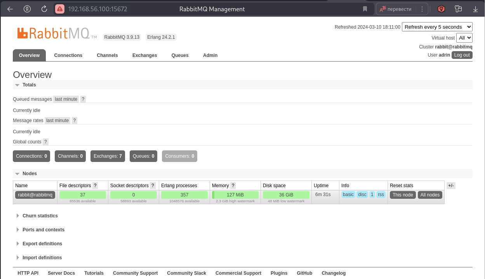
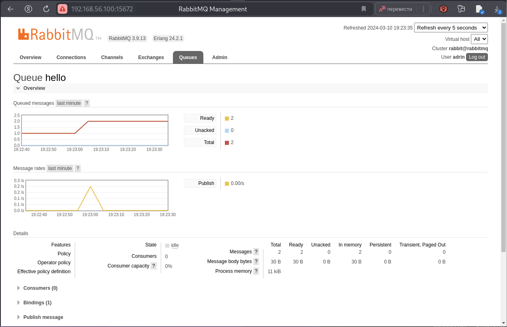
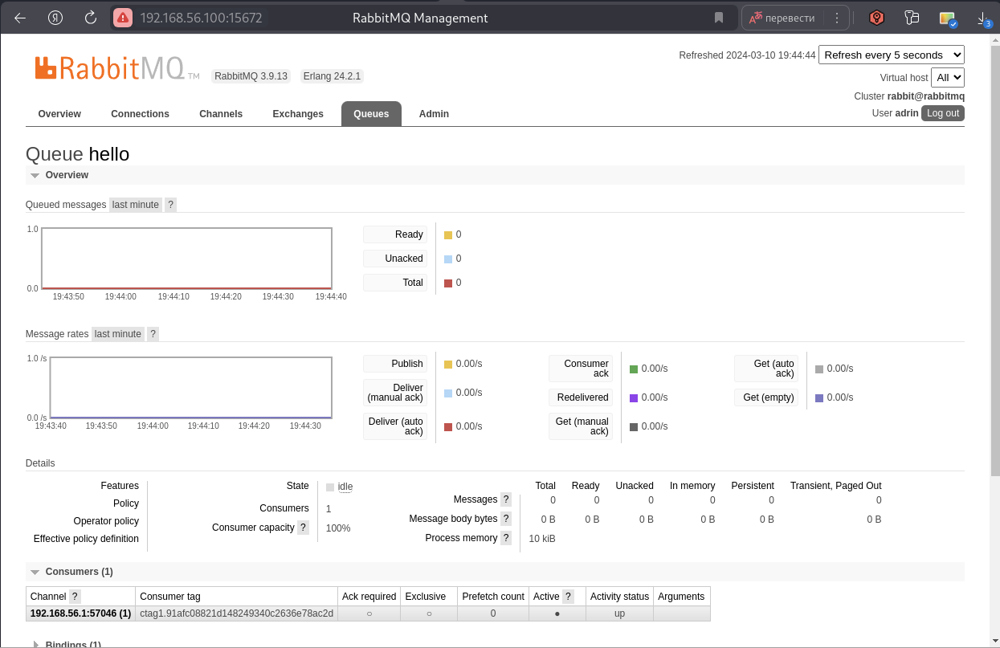
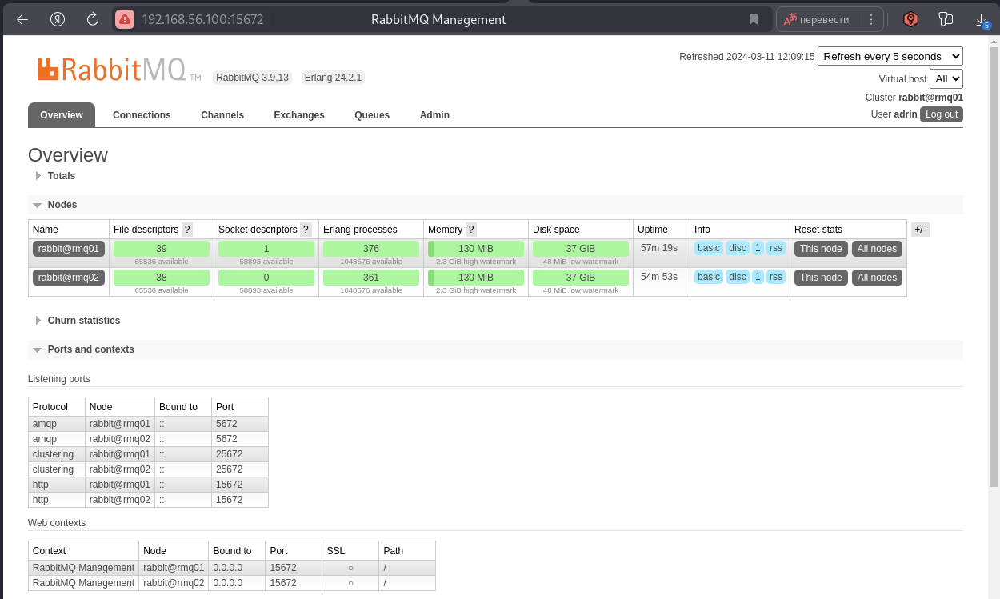
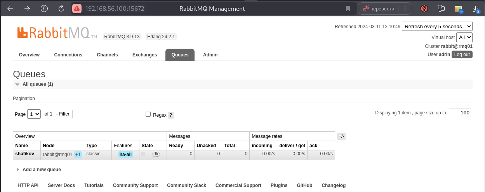
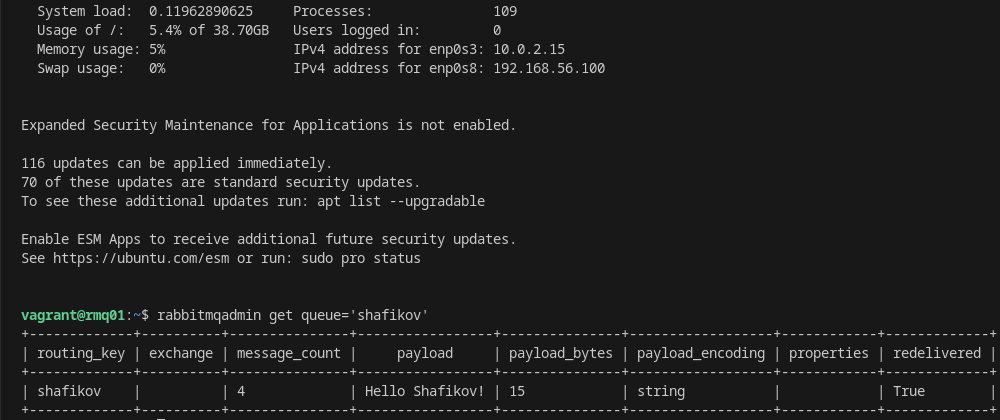
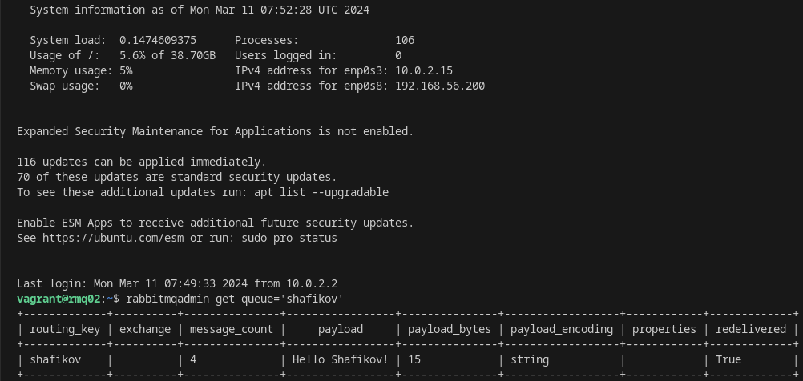
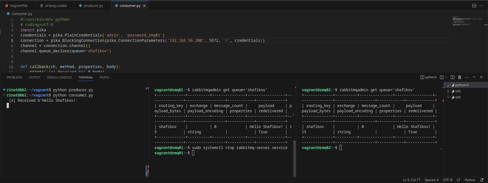

# Домашнее задание к занятию "`Очереди RabbitMQ`" - `Шафиков Ринат`

### Задание 1. Установка RabbitMQ

Используя Vagrant или VirtualBox, создайте виртуальную машину и установите RabbitMQ. Добавьте management plug-in и зайдите в веб-интерфейс.
Итогом выполнения домашнего задания будет приложенный скриншот веб-интерфейса RabbitMQ.

### Решение 1

Vagrant файл
```
# -*- mode: ruby -*-
# vi: set ft=ruby :
Vagrant.configure("2") do |config|
  config.vm.box = "ubuntu/jammy64"
  config.vm.network "private_network", ip: "192.168.56.100"
  config.vm.disk :disk, size: "20GB", primary: true
  config.vm.provider "virtualbox" do |vb|
    vb.name = "rabbitmq"
    vb.gui = false
    vb.memory = "6144"
    vb.cpus = "2"
end
config.vm.hostname = "rabbitmq"
config.vm.network :forwarded_port, guest: 5672, host: 5672
config.vm.network :forwarded_port, guest: 15672, host: 15672

  config.vm.provision "shell", inline: <<-SHELL
    export DEBIAN_FRONTEND=noninteractive
    sudo apt update
    sudo apt upgrade
    sudo apt install rabbitmq-server -y
    sudo systemctl start rabbitmq-server
    sudo systemctl enable rabbitmq-server
    sudo rabbitmq-plugins enable rabbitmq_management
    sudo systemctl restart rabbitmq-server
    echo -e "192.168.56.100\tubuntu-jammy\tubuntu-jammy" >> /etc/hosts
  SHELL
end
```
Установка системы и настройка доступа пользователя
```
vagrant up
vagrant ssh
sudo rabbitmqctl add_user adrin password
sudo rabbitmqctl set_permissions -p / adrin ".*" ".*" ".*"
sudo rabbitmqctl set_user_tags adrin administrator
```



---

### Задание 2

`Задание 2. Отправка и получение сообщений
Используя приложенные скрипты, проведите тестовую отправку и получение сообщения. Для отправки сообщений необходимо запустить скрипт producer.py.

Для работы скриптов вам необходимо установить Python версии 3 и библиотеку Pika. Также в скриптах нужно указать IP-адрес машины, на которой запущен RabbitMQ, заменив localhost на нужный IP.

```pip install pika```

Зайдите в веб-интерфейс, найдите очередь под названием hello и сделайте скриншот. После чего запустите второй скрипт consumer.py и сделайте скриншот результата выполнения скрипта

В качестве решения домашнего задания приложите оба скриншота, сделанных на этапе выполнения.

Для закрепления материала можете попробовать модифицировать скрипты, чтобы поменять название очереди и отправляемое сообщение.`

### Решение 2

Измененный файл producer.py

```
#!/usr/bin/env python
# coding=utf-8
import pika
credentials = pika.PlainCredentials('adrin', 'password')
connection = pika.BlockingConnection(pika.ConnectionParameters('192.168.56.100',
                                                            5672,
                                                            '/',
                                                            credentials))
channel = connection.channel()
channel.queue_declare(queue='hello')
channel.basic_publish(exchange='', routing_key='hello', body='Hello Netology!')
connection.close()
```



```
#!/usr/bin/env python
# coding=utf-8
import pika
credentials = pika.PlainCredentials('adrin', 'password')
connection = pika.BlockingConnection(pika.ConnectionParameters('192.168.56.100',
                                                            5672,
                                                            '/',
                                                            credentials))
channel = connection.channel()
channel.queue_declare(queue='hello')


def callback(ch, method, properties, body):
    print(" [x] Received %r" % body)


# channel.basic_consume(callback, queue='hello', no_ack=True)
channel.basic_consume('hello', callback, auto_ack=True)
channel.start_consuming()
```



---

### Задание 3

Задание 3. Подготовка HA кластера
Используя Vagrant или VirtualBox, создайте вторую виртуальную машину и установите RabbitMQ. Добавьте в файл hosts название и IP-адрес каждой машины, чтобы машины могли видеть друг друга по имени.

Пример содержимого hosts файла:

```
cat /etc/hosts
192.168.0.10 rmq01
192.168.0.11 rmq02
```

После этого ваши машины могут пинговаться по имени.

Затем объедините две машины в кластер и создайте политику ha-all на все очереди.

В качестве решения домашнего задания приложите скриншоты из веб-интерфейса с информацией о доступных нодах в кластере и включённой политикой.

Также приложите вывод команды с двух нод:

```
rabbitmqctl cluster_status
```

Для закрепления материала снова запустите скрипт producer.py и приложите скриншот выполнения команды на каждой из нод:

```
rabbitmqadmin get queue='hello'
```
После чего попробуйте отключить одну из нод, желательно ту, к которой подключались из скрипта, затем поправьте параметры подключения в скрипте consumer.py на вторую ноду и запустите его.

Приложите скриншот результата работы второго скрипта.

### Решение 3

Vagrant файл

```
Vagrant.configure("2") do |config|
  config.vm.box = "ubuntu/jammy64"

  # nod 1
  config.vm.define "rmq01" do |rmq01|
    rmq01.vm.hostname = "rmq01"
    rmq01.vm.network "private_network", ip: "192.168.56.100"
    rmq01.vm.disk :disk, size: "20GB", primary: true
    rmq01.vm.provider "virtualbox" do |vb|
      vb.name = "rmq01"
      vb.gui = false
      vb.memory = "6144"
      vb.cpus = "2"
    end
    rmq01.vm.provision "shell", inline: <<-SHELL
      sudo apt update
      sudo apt upgrade -y
      sudo apt install rabbitmq-server -y
      sudo systemctl start rabbitmq-server
      sudo systemctl enable rabbitmq-server
      sudo rabbitmq-plugins enable rabbitmq_management
      sudo systemctl restart rabbitmq-server
      sudo rabbitmqctl add_user adrin password_rmq01
      sudo rabbitmqctl set_permissions -p / adrin ".*" ".*" ".*"
      sudo rabbitmqctl set_user_tags adrin administrator
      echo -e "192.168.56.100\trmq01\trmq01" >> /etc/hosts
      echo -e "192.168.56.200\turmq02\trmq02" >> /etc/hosts
      sudo cp /var/lib/rabbitmq/.erlang.cookie /vagrant/
      
    SHELL
  end

    # nod 2
    config.vm.define "rmq02" do |rmq02|
      rmq02.vm.hostname = "rmq02"
      rmq02.vm.network "private_network", ip: "192.168.56.200"
      rmq02.vm.disk :disk, size: "20GB", primary: true
      rmq02.vm.provider "virtualbox" do |vb|
        vb.name = "rmq02"
        vb.gui = false
        vb.memory = "6144"
        vb.cpus = "2"
      end
      rmq02.vm.provision "shell", inline: <<-SHELL
        sudo apt update
        sudo apt upgrade -y
        sudo apt install rabbitmq-server -y
        sudo systemctl start rabbitmq-server
        sudo systemctl enable rabbitmq-server
        sudo rabbitmq-plugins enable rabbitmq_management
        sudo systemctl restart rabbitmq-server
        sudo rabbitmqctl add_user adrin password_rmq02
        sudo rabbitmqctl set_permissions -p / adrin ".*" ".*" ".*"
        sudo rabbitmqctl set_user_tags adrin administrator
        echo -e "192.168.56.100\trmq01\trmq01" >> /etc/hosts
        echo -e "192.168.56.200\trmq02\trmq02" >> /etc/hosts
        sudo cp /vagrant/.erlang.cookie /var/lib/rabbitmq/
        sudo chown rabbitmq:rabbitmq /var/lib/rabbitmq/.erlang.cookie
        sudo systemctl restart rabbitmq-server
        sudo rabbitmqctl stop_app
        sudo rabbitmqctl join_cluster rabbit@rmq01
        sudo rabbitmqctl start_app
        sudo rabbitmqctl set_policy ha-all ".*" '{"ha-mode":"all","ha-sync-mode":"automatic"}'
      SHELL
    end
  end
```





Вывод команды rabbitmqctl cluster_status на rabbit@rmq01

```
sudo rabbitmqctl cluster_status
Cluster status of node rabbit@rmq01 ...
Basics

Cluster name: rabbit@rmq01

Disk Nodes

rabbit@rmq01
rabbit@rmq02

Running Nodes

rabbit@rmq01
rabbit@rmq02

Versions

rabbit@rmq01: RabbitMQ 3.9.13 on Erlang 24.2.1
rabbit@rmq02: RabbitMQ 3.9.13 on Erlang 24.2.1

Maintenance status

Node: rabbit@rmq01, status: not under maintenance
Node: rabbit@rmq02, status: not under maintenance

Alarms

(none)

Network Partitions

(none)

Listeners

Node: rabbit@rmq01, interface: [::], port: 15672, protocol: http, purpose: HTTP API
Node: rabbit@rmq01, interface: [::], port: 25672, protocol: clustering, purpose: inter-node and CLI tool communication
Node: rabbit@rmq01, interface: [::], port: 5672, protocol: amqp, purpose: AMQP 0-9-1 and AMQP 1.0
Node: rabbit@rmq02, interface: [::], port: 15672, protocol: http, purpose: HTTP API
Node: rabbit@rmq02, interface: [::], port: 25672, protocol: clustering, purpose: inter-node and CLI tool communication
Node: rabbit@rmq02, interface: [::], port: 5672, protocol: amqp, purpose: AMQP 0-9-1 and AMQP 1.0

Feature flags

Flag: drop_unroutable_metric, state: disabled
Flag: empty_basic_get_metric, state: disabled
Flag: implicit_default_bindings, state: enabled
Flag: maintenance_mode_status, state: enabled
Flag: quorum_queue, state: enabled
Flag: stream_queue, state: enabled
Flag: user_limits, state: enabled
Flag: virtual_host_metadata, state: enabled
```
Вывод команды rabbitmqctl cluster_status на rabbit@rmq02

```
sudo rabbitmqctl cluster_status
Cluster status of node rabbit@rmq02 ...
Basics

Cluster name: rabbit@rmq02

Disk Nodes

rabbit@rmq01
rabbit@rmq02

Running Nodes

rabbit@rmq01
rabbit@rmq02

Versions

rabbit@rmq01: RabbitMQ 3.9.13 on Erlang 24.2.1
rabbit@rmq02: RabbitMQ 3.9.13 on Erlang 24.2.1

Maintenance status

Node: rabbit@rmq01, status: not under maintenance
Node: rabbit@rmq02, status: not under maintenance

Alarms

(none)

Network Partitions

(none)

Listeners

Node: rabbit@rmq01, interface: [::], port: 15672, protocol: http, purpose: HTTP API
Node: rabbit@rmq01, interface: [::], port: 25672, protocol: clustering, purpose: inter-node and CLI tool communication
Node: rabbit@rmq01, interface: [::], port: 5672, protocol: amqp, purpose: AMQP 0-9-1 and AMQP 1.0
Node: rabbit@rmq02, interface: [::], port: 15672, protocol: http, purpose: HTTP API
Node: rabbit@rmq02, interface: [::], port: 25672, protocol: clustering, purpose: inter-node and CLI tool communication
Node: rabbit@rmq02, interface: [::], port: 5672, protocol: amqp, purpose: AMQP 0-9-1 and AMQP 1.0

Feature flags

Flag: drop_unroutable_metric, state: disabled
Flag: empty_basic_get_metric, state: disabled
Flag: implicit_default_bindings, state: enabled
Flag: maintenance_mode_status, state: enabled
Flag: quorum_queue, state: enabled
Flag: stream_queue, state: enabled
Flag: user_limits, state: enabled
Flag: virtual_host_metadata, state: enabled
```

Вывод команды rabbitmqadmin get queue='shafikov'





Остановка rmq01




---

### Задание 4. Ansible playbook

Напишите плейбук, который будет производить установку RabbitMQ на любое количество нод и объединять их в кластер. При этом будет автоматически создавать политику ha-all.

Готовый плейбук разместите в своём репозитории.

### Решение 4

---
