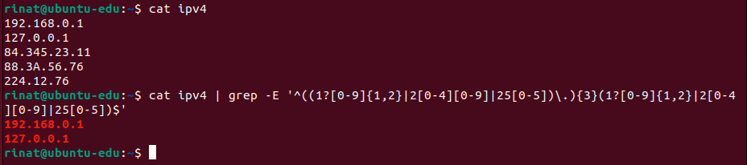
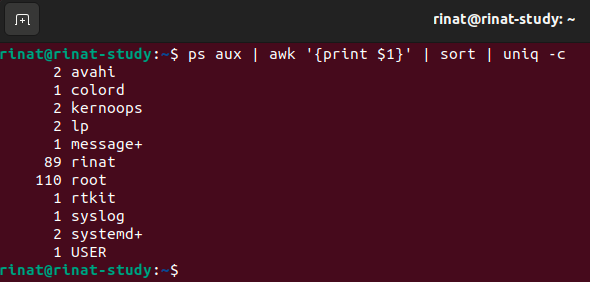
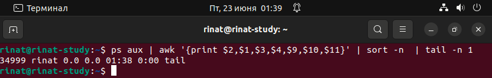
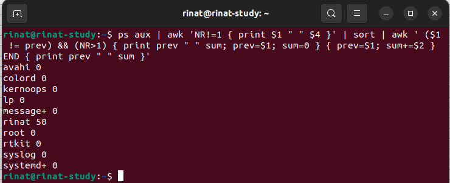

# Задание 1

Напишите регулярное выражение для проверки является ли строка IPv4 адресом.
Для тестов можно использовать файл со следующим содержимым, фильтруя вывод с помощью команды grep -E:

```
192.168.0.1
127.0.0.1
84.345.23.11
88.3A.56.76
224.12.76
```

Пришлите получившееся выражение в качестве ответа.

# Решение 1



# Задание 2

В Вашей конфигурации Nginx скопилось много неиспользуемых сегментов и становится сложно его читать.
Используя sed удалите все пустые строки и комментарии в конфигурации Nginx. Попробуйте сделать это одним запуском.
Файл расположен по ссылке
Пришлите получившуюся команду в качестве ответа

```
sed '/^#/d;/^[[:space:]]*$/d' nginx.conf
```
/^#/d - удаление задокументированных строк
/^[[:space:]]*$/d - удаление пустых строк содержащих пробелы

# Задание 3

Используя awk и ps aux соберите информацию о:
• количестве процессов для каждого пользователя;
• процессе с самым большим PID;
• (дополнительное задание со звездочкой*) суммарном использовании памяти различными пользователями.
Пришлите скриншоты со скриптами и демонстрацией их работы

# Решение 3

1) 

```
ps aux | awk '{print $1}' | sort | uniq -c
```

print $1 #вывод на экран значений первого столбца с наименованием пользователей
sort #сортировка по пользователям
uniq -c #показать сколько процессов запущено каждым пользователем



2) 

```
ps aux | awk '{print $2,$1,$3,$4,$9,$10,$11}' | sort -n  | tail -n 1
```


3) 

```
ps aux | awk 'NR!=1 { print $1 " " $4 }' | sort | awk ' ($1 != prev) && (NR>1) { print prev " " sum; prev=$1; sum=0 } { prev=$1; sum+=$2 } END { print prev " " sum }'
```

При этом сумма собирается из целых чисел (округление вниз - проверено в экселе с функцией =ОКРУГЛВНИЗ(), т.е. 9,9 =9; 0,5=0 и т.д.).

