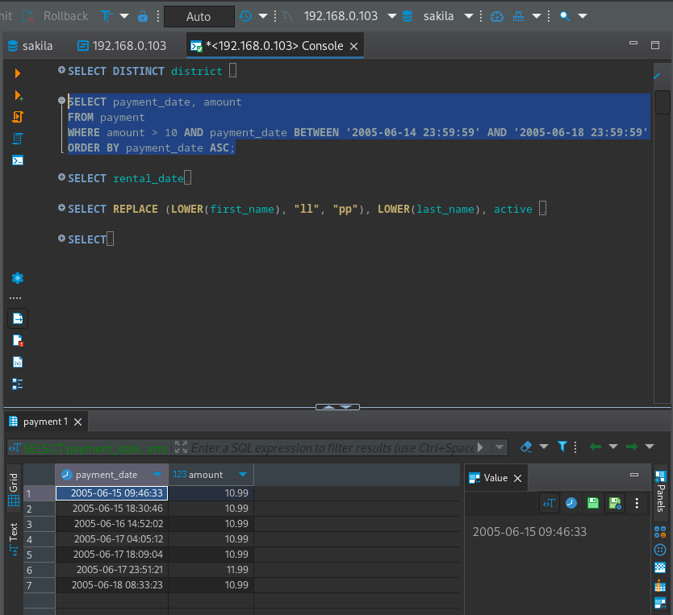

# Домашнее задание к занятию "`SQL. Часть 1`" - `Шафиков Ринат`

Задание можно выполнить как в любом IDE, так и в командной строке.

### Задание 1

`Получите уникальные названия районов из таблицы с адресами, которые начинаются на “K” и заканчиваются на “a” и не содержат пробелов.`

### Решение 1

```
SELECT DISTINCT district
FROM address
WHERE district LIKE 'K%a' and district not LIKE '% %';
```


---

### Задание 2

`Получите из таблицы платежей за прокат фильмов информацию по платежам, которые выполнялись в промежуток с 15 июня 2005 года по 18 июня 2005 года включительно и стоимость которых превышает 10.00.`

### Решение 2

```
SELECT payment_date, amount 
FROM payment 
WHERE amount > 10 AND payment_date BETWEEN '2005-06-14 23:59:59' AND '2005-06-18 23:59:59'
ORDER BY payment_date ASC;
```



---

### Задание 3

`Получите последние пять аренд фильмов.`

### Решение 3

```
SELECT rental_date
FROM rental
ORDER BY rental_date DESC
LIMIT 5;
```


---

### Задание 4

`Одним запросом получите активных покупателей, имена которых Kelly или Willie. Сформируйте вывод в результат таким образом:`

- `все буквы в фамилии и имени из верхнего регистра переведите в нижний регистр,`
- `замените буквы 'll' в именах на 'pp'.`

### Решение 4

```
SELECT REPLACE (LOWER(first_name), "ll", "pp"), LOWER(last_name), active 
FROM customer
WHERE first_name = 'Kelly' AND active = 1 OR first_name = 'Willie'  AND active = 1;
```


---

### Задание 5

`Выведите Email каждого покупателя, разделив значение Email на две отдельных колонки: в первой колонке должно быть значение, указанное до @, во второй — значение, указанное после @.`

### Решение 5

```
SELECT
SUBSTRING_INDEX(email, '@', 1) AS login,
SUBSTRING_INDEX(email, '@', -1) AS domen
FROM customer;
```


---

### Задание 6

`Доработайте запрос из предыдущего задания, скорректируйте значения в новых колонках: первая буква должна быть заглавной, остальные — строчными.`

### Решение 6

```
SELECT
SUBSTRING_INDEX(email, '@', 1) AS login,
SUBSTRING_INDEX(email, '@', -1) AS domen
FROM customer;
```


---
