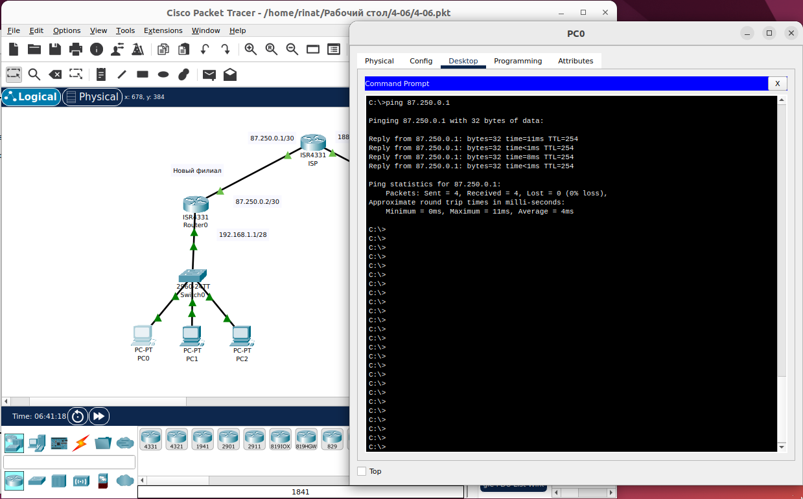

# Задание

#### Задание. Создание дополнительного офиса и настройка ISAKMP-туннеля для согласования параметров протокола.

#### Описание задания

Руководство решило открыть новый филиал в соседней области. Перед вами стоит задача между главным офисом и филиалом создать VPN-туннель. Новый филиал подключен к тому же интернет-провайдеру. Но имеет другие “белые” ip-адреса для подключения: 87.250.0.0/30

#### Требование к результату

- Вы должны отправить файл .pkt с выполненным заданием
- К выполненной задаче добавьте скриншоты с доступностью “внешней сети” и ответы на вопросы.

#### Процесс выполнения

1) Запустите программу Cisco Packet Tracer
2) В программе Cisco Packet Tracer загрузите [файл с сетью](<files/VPN (8.2.0).pkt>)
3) Настройте связность сети нового филиала, состоящую из 3 ПК, 1 коммутатора и 1 маршрутизатора. Адресацию внутри сети филиала можно использовать любую.
4) Создайте сетевую связность между маршрутизатором филиала и маршрутизатором интернет-провайдера, согласно условиям.
5) На маршрутизаторе филиала и главного офиса создайте NAT-трансляции с помощью access-листов для внутренней сети.
6) На маршрутизаторе главного офиса настройте политики ISAKMP:

```
R1(config)# crypto isakmp policy 1
R1(config-isakmp)# encr 3des - метод шифрования
R1(config-isakmp)# hash md5 - алгоритм хеширования
R1(config-isakmp)# authentication pre-share - использование предварительного общего ключа (PSK) в качестве метода проверки подлинности
R1(config-isakmp)# group 2 - группа Диффи-Хеллмана, которая будет использоваться
R1(config-isakmp)# lifetime 86400 - время жизни ключа сеанса
```

И укажите Pre-Shared ключ для аутентификации с маршрутизатором филиала.Проверьте доступность с любого конечного устройства доступность роутера интернет-провайдера, командой ping.

7) Создайте набор преобразования (Transform Set), используемого для защиты наших данных.

```
crypto ipsec transform-set <название> esp-3des esp-md5-hmac
```

8) Создайте крипто-карту с указанием внешнего ip-адреса интерфейса и привяжите его к интерфейсу.

```
R1(config)# crypto map <название> 10 ipsec-isakmp
R1(config-crypto-map)# set peer
R1(config-crypto-map)# set transform-set <название>
R1(config-crypto-map)# match address <название access-листа>
R1(config- if)# crypto map <название крипто-карты>
```

9) Проделайте вышеуказанные операции на маршрутизаторе филиала в соответствии ip-адресов и access-листов и отключите NAT-трансляцию сетевых адресов.
10) Проверьте сетевую доступность между роутерами командой ping.
11) Проверьте, что установившееся VPN-соединения на каждом маршрутизаторе активны. Для этого:
- проверьте, что установлены SA первой фазы командой: "show crypto isakmp sa". Статус должен быть ACTIVE.
- проверьте, что установлены SA второй фазы командой: "show crypto ipsec sa". При взаимодействии устройств между офисами можно сделать косвенный вывод, что оно работает по изменению счетчика пакетов в выводе второй команды (pkts encaps\pkts decaps).
13) Ответ внесите в комментарии к решению задания в личном кабинете Нетологии.

#### Общие критерии оценки
Задание считается выполненным при соблюдении следующих условий:
- Задание выполнено полностью
- К заданию прикреплены скриншоты статусов VPN-соединений и доступности сетей двух офисов.
- Отображены настройки конфигурации VPN.

#### Связанность маршрутизаторов
##### Филиал


##### Головной офис 


Пинг с ПК нового филиала до роутера провайдера 



Пинг с ПК Главного офиса до роутера провайдера

#### Главный офис

Настройка Router1 (Главный офис)
Поднимаем порты на маршрутизаторе Главного офиса (внешний)

```
Head_office>enable
Head_office#configure terminal
Head_office(config)#interface GigabitEthernet0/0/0
Head_office(config-if)#no shutdown
Head_office(config)#interface GigabitEthernet0/0/0
Head_office(config-if)#ip address 188.144.0.2 255.255.255.252
Router(config-if)#exit
Head_office(config)#ip route 0.0.0.0 0.0.0.0 188.144.0.1
```

```
Head_office>
Head_office>en
Head_office#conf t
Head_office(config)#crypto isakmp policy 1
Head_office(config-isakmp)#encryption 3des
Head_office(config-isakmp)#hash md5
Head_office(config-isakmp)#authentication pre-share
Head_office(config-isakmp)#group 2
Head_office(config-isakmp)#exit
Head_office(config)#crypto isakmp policy 1
Head_office(config-isakmp)#encryption 3des
Head_office(config-isakmp)#hash md5
Head_office(config-isakmp)#authentication pre-share
Head_office(config-isakmp)#group 2
Head_office(config-isakmp)#lifetime 86400
Head_office(config-isakmp)#exit
Head_office(config)#crypto isakmp key netology address 87.250.0.2
Head_office(config)#crypto ipsec transform-set TS esp-3des esp-md5-hmac
Head_office(config)#ip access-list extended FOR-VPN
Head_office(config-ext-nacl)#permit ip 192.168.0.0 0.0.0.15 192.168.1.0 0.0.0.15
Head_office(config-ext-nacl)#exit
Head_office(config)#crypto map CMAP 10 ipsec-isakmp 
Head_office(config-crypto-map)#set peer 87.250.0.2
Head_office(config-crypto-map)#set transform-set TS
Head_office(config-crypto-map)#match address FOR-VPN
Head_office(config-crypto-map)#exit
Head_office(config)#int gigabitEthernet 0/0/0
Head_office(config-if)#crypto map CMAP
Head_office(config-if)#end
Head_office#wr mem
```

Удалил часть старой конфигурации (с ней VPN не работал)

```
Head_office#conf t
Head_office(config)#no access-list 50 deny host 192.168.0.6
Head_office(config)#no access-list 50 deny host 192.168.0.7
Head_office(config)#no access-list 50 permit 192.168.0.0 0.0.0.255
```

Добавил для работоспособности NAT

```
Head_office(config)#ip nat inside source list FOR-NAT interface GigabitEthernet 0/0/0 overload
Head_office(config)#end
Head_office#wr mem
```

Проверка NAT


Проверка VPN

```
Head_office#show crypto isakmp sa
```


Вывод команды 

```
show crypto ipsec sa
```


#### Филиал

На машинах через IP Configuration зададим IP 192.168.1.2-4 и шлюз по умолчанию 192.168.1.1

Настройка switch0 (филиал)
Переведем порт соединения с маршрутизатором в режим «Trunk»

```
Switch>enable
Switch#configure terminal
Switch(config)#interface GigabitEthernet0/1
Switch(config-if)#switchport mode trunk
```

Настройка Router0 (филиал)
Поднимаем порты на маршрутизаторе Филиала (внутренний и внешний), зададим ip

```
Router>enable
Router#configure terminal
Router(config)#interface GigabitEthernet0/0/0
Router(config-if)#ip address 87.250.0.2 255.255.255.252
Router(config-if)#no shutdown
Router(config-if)#exit
Router(config)#interface GigabitEthernet0/0/1
Router(config-if)#ip address 192.168.1.1 255.255.255.240
Router(config-if)#no shutdown
Router(config-if)#end
```
Шлюз по умолчанию для Router0
```
Router#configure terminal 
Router(config)#ip route 0.0.0.0 0.0.0.0 87.250.0.1
Router(config)#end
Router#wr mem
```

Настройка внутренних и внешних интерфейсов (inside, outside)

```
Router#conf t
Router(config)#int Gig0/0/0
Router(config-if)#ip nat outside
Router(config-if)#exit
Router(config)#int Gig0/0/1
Router(config-if)#ip nat inside
Router(config-if)#end
Router#
Router#wr mem
```

Запрещаем натить с 192.168.1.0 до 192.168.0.0

```
Router#conf t
Router(config)#ip access-list extended NAT-FOR-FIL
Router(config-ext-nacl)#deny ip 192.168.1.0 0.0.0.15 192.168.0.0 0.0.0.15
```

Разрешаем натить на остальные адреса

```
Router(config-ext-nacl)#permit ip 192.168.1.0 0.0.0.15 any
Router(config-ext-nacl)# end
```

На каждом маршрутизаторе создаем NAT-трансляцию с помощью вышеуказанного access-листа. 

```
Router#conf t
Router(config)#ip nat inside source list NAT-FOR-FIL interface GigabitEthernet 0/0/0 overload
```

Нат настроен

```
Router#conf t
Router(config)#crypto isakmp policy 1
Router(config-isakmp)#encryption 3des
Router(config-isakmp)#hash md5
Router(config-isakmp)#authentication pre-share 
Router(config-isakmp)#group 2
Router(config-isakmp)#lifetime 86400
Router(config-isakmp)#exit
Router(config)#crypto isakmp key netology address 188.144.0.2
Router(config)#crypto ipsec transform-set TS esp-3des esp-md5-hmac 
Router(config)#ip access-list extended FOR-VPN
Router(config-ext-nacl)#permit ip 192.168.1.0 0.0.0.15 192.168.0.0 0.0.0.15
Router(config-ext-nacl)#exit
Router(config)#crypto map CMAP 10 ipsec-isakmp
Router(config-crypto-map)#set peer 188.144.0.2
Router(config-crypto-map)#set transform-set TS
Router(config-crypto-map)#match address FOR-VPN
Router(config-crypto-map)#exit
Router(config)#int gigabitEthernet 0/0/0
Router(config-if)#crypto map CMAP
Router(config-if)#end
Router#wr mem
Router#show crypto isakmp sa
```


Вывод команды 

```
show crypto ipsec sa
```


[4-06.pkt](files/4-06.pkt)


