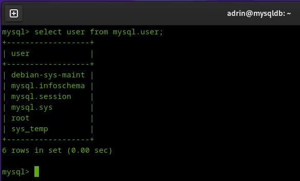
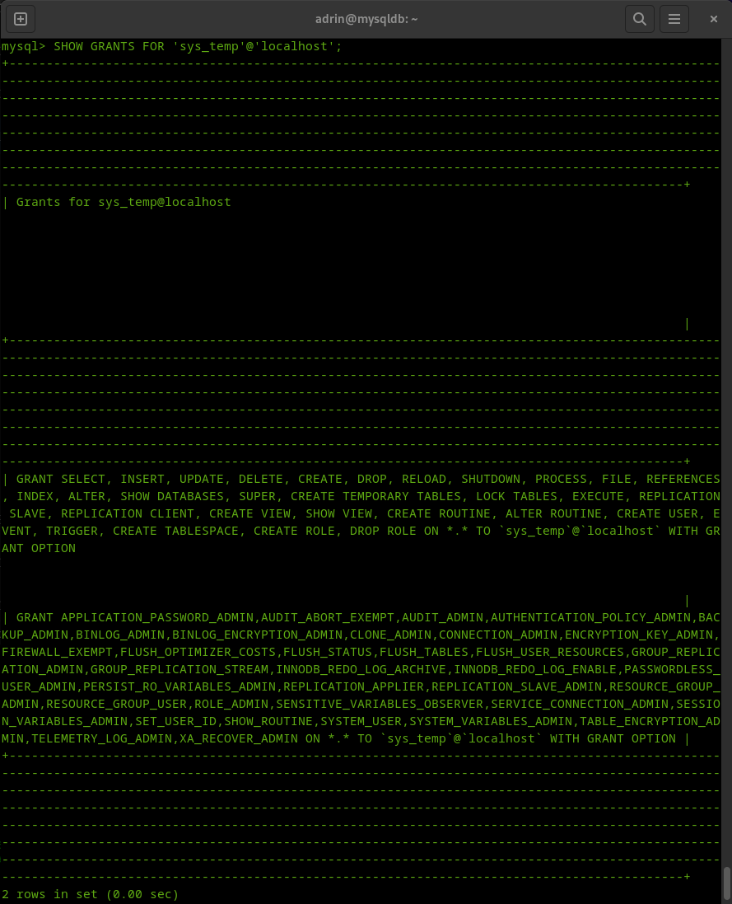
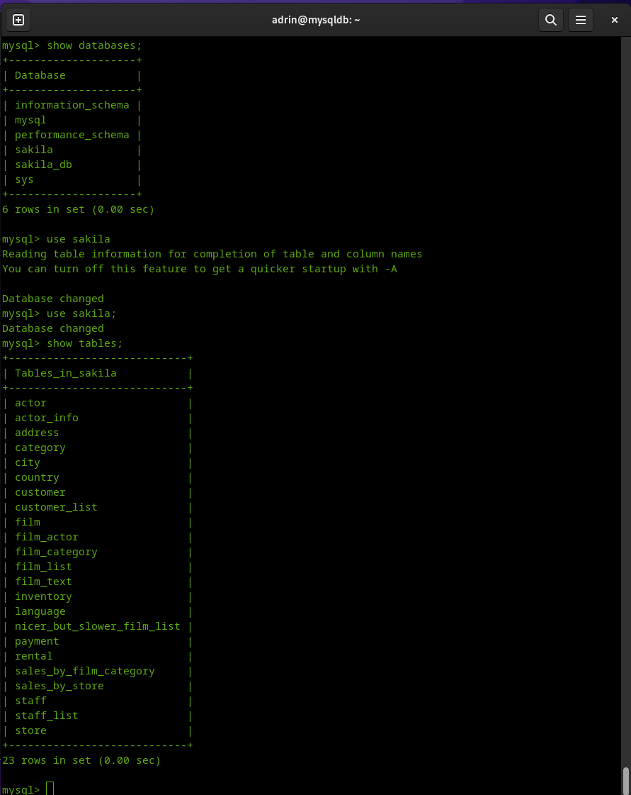
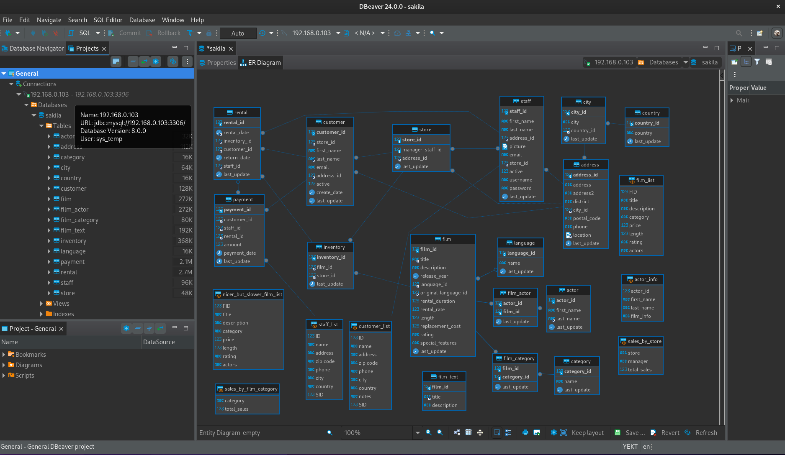
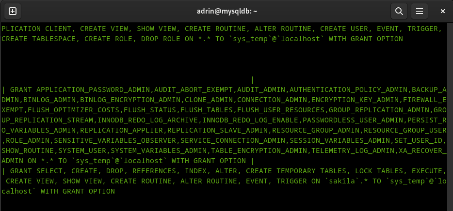

# Домашнее задание к занятию "`Работа с данными (DDL/DML)`" - `Шафиков Ринат`

### Задание 1

`Приведите ответ в свободной форме........`

1. `Поднимите чистый инстанс MySQL версии 8.0+. Можно использовать локальный сервер или контейнер Docker.`
2. `Создайте учётную запись sys_temp.`
3. `Выполните запрос на получение списка пользователей в базе данных. (скриншот)`
4. `Дайте все права для пользователя sys_temp.`
5. `Выполните запрос на получение списка прав для пользователя sys_temp. (скриншот)`
6. `Переподключитесь к базе данных от имени sys_temp.`
   
Для смены типа аутентификации с sha2 используйте запрос:

```
ALTER USER 'sys_test'@'localhost' IDENTIFIED WITH mysql_native_password BY 'password';
```

7. `По ссылке https://downloads.mysql.com/docs/sakila-db.zip скачайте дамп базы данных.`
8. `Восстановите дамп в базу данных.`
9. `При работе в IDE сформируйте ER-диаграмму получившейся базы данных. При работе в командной строке используйте команду для получения всех таблиц базы данных. (скриншот)`

Результатом работы должны быть скриншоты обозначенных заданий, а также простыня со всеми запросами.

### Решение 1

1. `Поднимите чистый инстанс MySQL версии 8.0+. Можно использовать локальный сервер или контейнер Docker.`

Установка mysql
```
sudo apt update && sudo apt upgrade -y
sudo apt install mysql-server
sudo service mysql status
```
Если не пускает под рутом
```
sudo mysql
ALTER USER 'root'@'localhost' IDENTIFIED WITH mysql_native_password BY 'password';
exit
```

Настройка безопасности

```
sudo mysql_secure_installation
```
```
VALIDATE PASSWORD COMPONENT Press y|Y for Yes, any other key for No: y
Change the password for root ? ((Press y|Y for Yes, any other key for No) : n
Remove anonymous users? (Press y|Y for Yes, any other key for No) : y
Disallow root login remotely? (Press y|Y for Yes, any other key for No) : y
Remove test database and access to it? (Press y|Y for Yes, any other key for No) : y
Reload privilege tables now? (Press y|Y for Yes, any other key for No) : y
```

2. `Создайте учётную запись sys_temp.`

Создаем пользователя sys_temp (с правом доступа только с localhost, иначе 'sys_temp'@'%')

```
mysql -u root -p
CREATE USER 'sys_temp'@'localhost' identified by 'password';
```

3. `Выполните запрос на получение списка пользователей в базе данных. (скриншот)`

Вывод списка пользователей

```
select user from mysql.user;
```



4. `Дайте все права для пользователя sys_temp.`

Даем все права пользователю sys_temp

```
grant all privileges on *.* to 'sys_temp'@'localhost' with grant option;
flush privileges;
```
опция with grant option - дает возможность давать права другим пользователям.


5. `Выполните запрос на получение списка прав для пользователя sys_temp. (скриншот)`

```
SHOW GRANTS FOR 'sys_temp'@'localhost';
exit
```



6. `Переподключитесь к базе данных от имени sys_temp.`

```
mysql -u sys_temp -p
exit
```
Сменим тип аутентификации с sha2 используя запрос:

```
mysql -u root -p
ALTER USER 'sys_test'@'localhost' IDENTIFIED WITH mysql_native_password BY 'password';
exit
```

7. `По ссылке https://downloads.mysql.com/docs/sakila-db.zip скачайте дамп базы данных.`

```
wget https://downloads.mysql.com/docs/sakila-db.zip
```
8. `Восстановите дамп в базу данных.`

```
sudo apt install unzip
unzip sakila-db.zip
mysql -p -h 127.0.0.1 -P 3306 -u sys_temp -p < sakila-db/sakila-schema.sql
mysql -p -h 127.0.0.1 -P 3306 -u sys_temp -p < sakila-db/sakila-data.sql
```

9. `При работе в IDE сформируйте ER-диаграмму получившейся базы данных. При работе в командной строке используйте команду для получения всех таблиц базы данных. (скриншот)`

```
mysql -u sys_temp -p
show databases;
use sakila;
show tables;
```



Для подключения к базе данных через dbeaver изменим файл

```
sudo nano /etc/mysql/mysql.conf.d/mysqld.cnf
```
```
bind-address            = 0.0.0.0
```
```
sudo systemctl restart mysql.service
```
Для подключения через dbeaver изменил на 'sys_temp'@'%'

`

---

### Задание 2

1. `Составьте таблицу, используя любой текстовый редактор или Excel, в которой должно быть два столбца: в первом должны быть названия таблиц восстановленной базы, во втором названия первичных ключей этих таблиц. Пример: (скриншот/текст)`

```
Название таблицы | Название первичного ключа
customer         | customer_id
```
### Решение 2

```
Название таблицы             | Название первичного ключа
actor                        | actor_id
actor_info                   |
address                      | address_id
category                     | category_id
city                         | city_id
country                      | country_id
customer                     | customer_id
customer_list                |
film                         | film_id   
film_actor                   | actor_id
film_category                | film_id   category_id
staff_list                   |
film_text                    | film_id
inventory                    | inventory_id
language                     | language_id
nicer_but_slower_film_list   |
payment                      | payment_id
rental                       | rental_id
sales_by_film_category       |
sales_by_store               |
staff                        | staff_id
film_list                    |
store                        | store_id
```

---

### Задание 3

1. `Уберите у пользователя sys_temp права на внесение, изменение и удаление данных из базы sakila.`
2. `Выполните запрос на получение списка прав для пользователя sys_temp. (скриншот)`

Результатом работы должны быть скриншоты обозначенных заданий, а также простыня со всеми запросами.`

### Решение 3

```
mysql -u root -p
grant all privileges on sakila.* to 'sys_temp'@'localhost' with grant option;
show grants for 'sys_temp'@'localhost';
```


```
revoke DELETE, INSERT, UPDATE on sakila.* from 'sys_temp'@'localhost';
show grants for 'sys_temp'@'localhost';
flush privileges;
```



---
