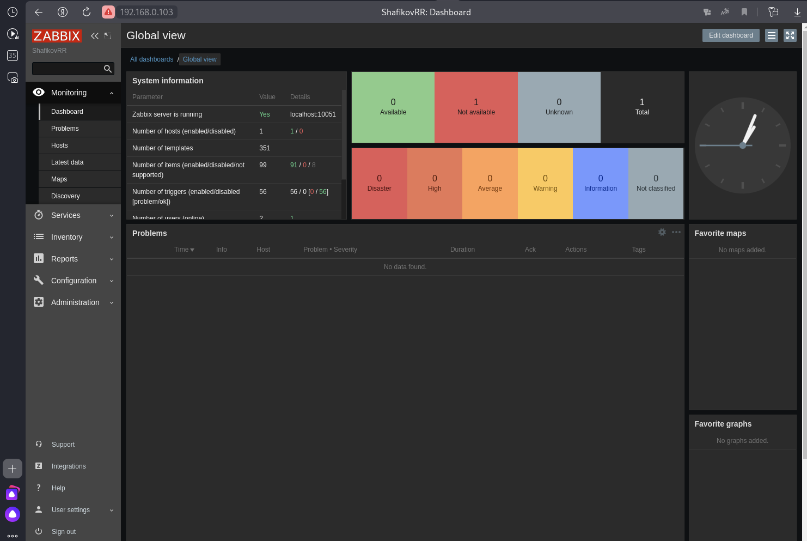
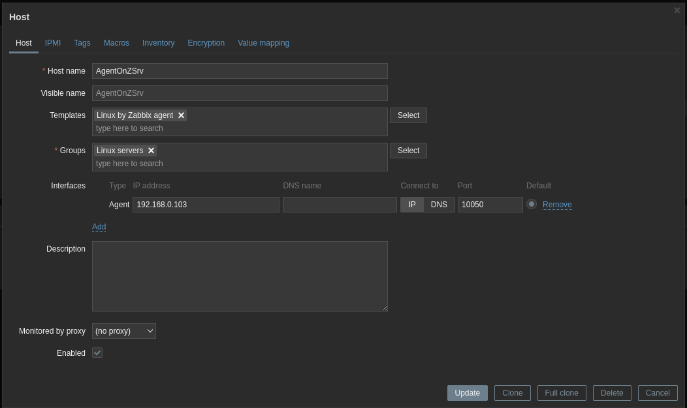
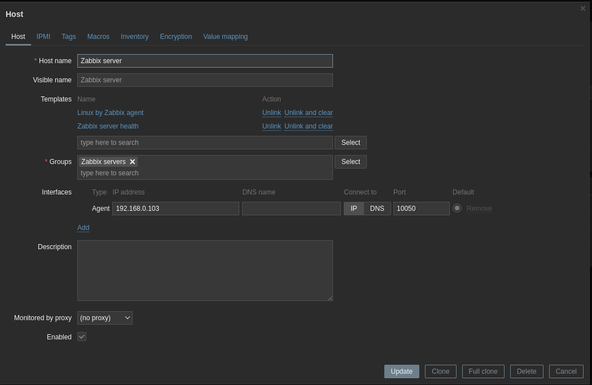
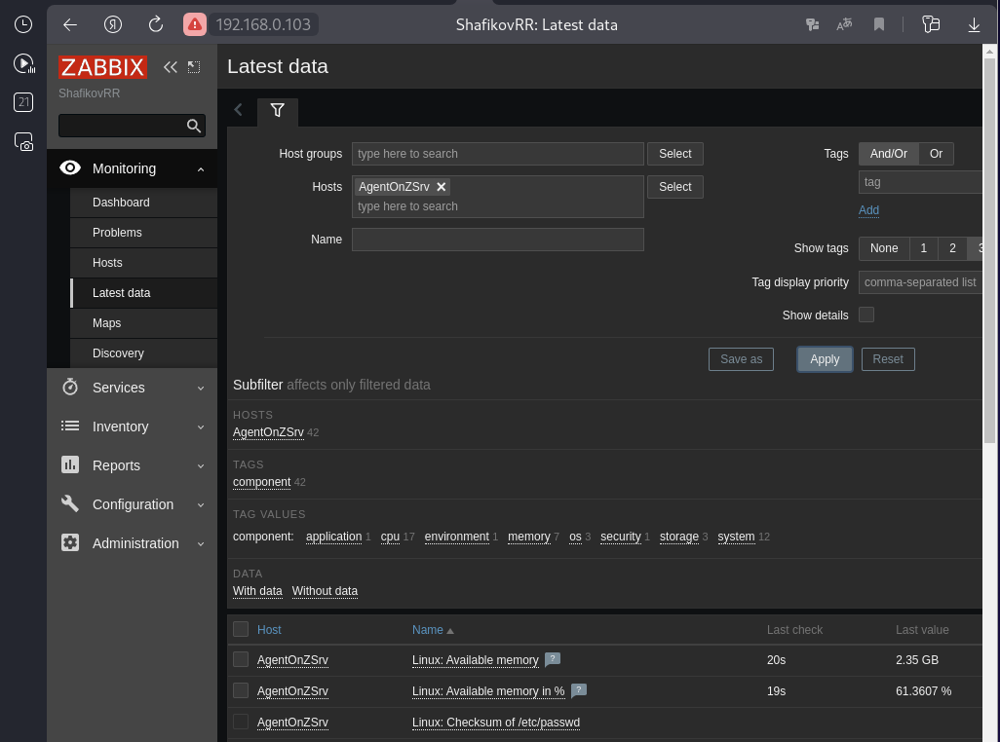
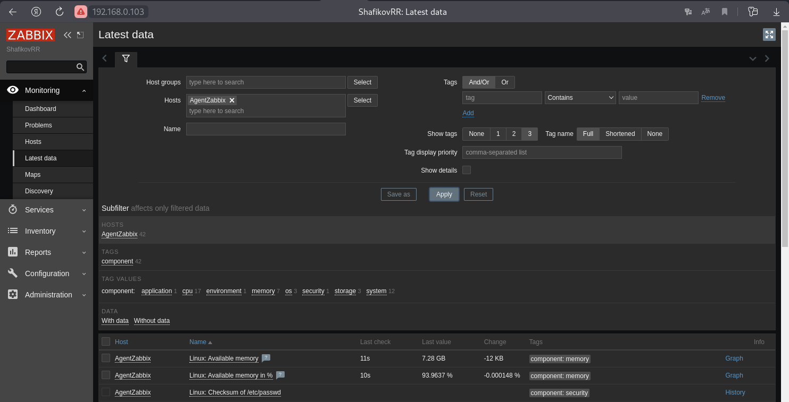
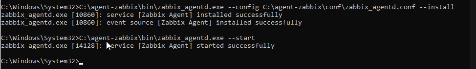
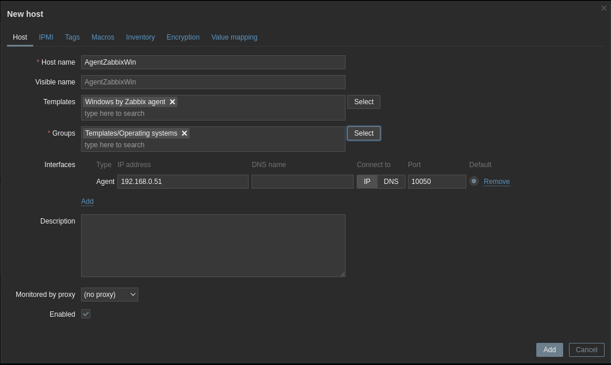
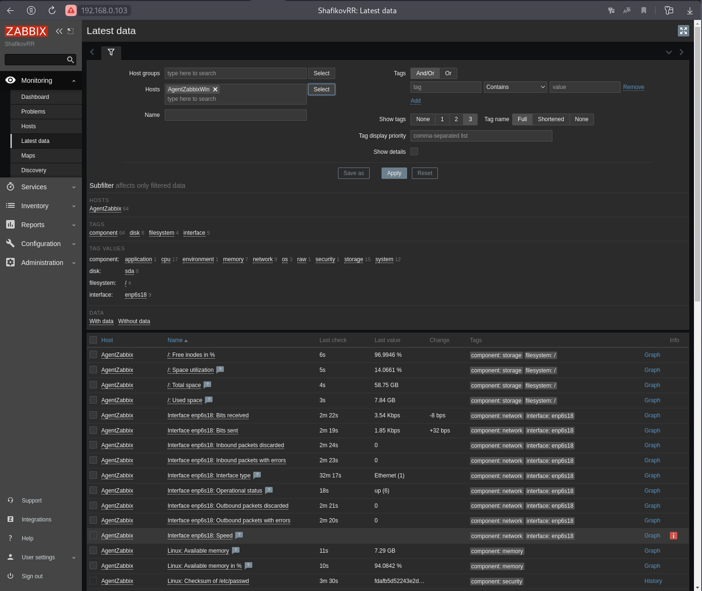
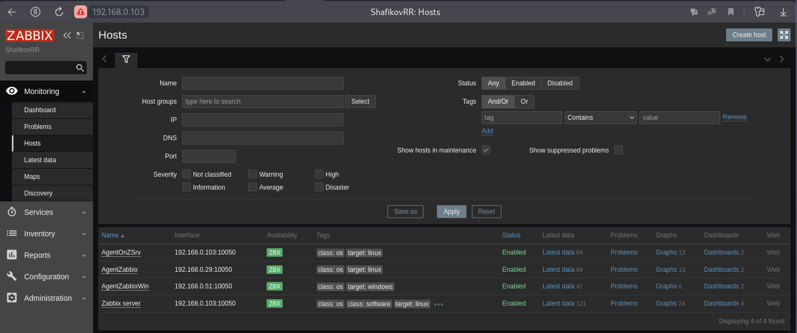

## Задание 1

### Установите Zabbix Server с веб-интерфейсом.

#### Процесс выполнения
1. Выполняя ДЗ, сверяйтесь с процессом отражённым в записи лекции.
2. Установите PostgreSQL. Для установки достаточна та версия, что есть в системном репозитороии Debian 11.
3. Пользуясь конфигуратором команд с официального сайта, составьте набор команд для установки последней версии Zabbix с поддержкой PostgreSQL и Apache.
4. Выполните все необходимые команды для установки Zabbix Server и Zabbix Web Server.

#### Требования к результаты
* Прикрепите в файл README.md скриншот авторизации в админке.
* Приложите в файл README.md текст использованных команд в GitHub.

## Решение 1

Установка Postgresql

```
sudo su
apt update
apt install postgresql
```
Установка Zabbix

Добавляем репозиторий
```
wget https://repo.zabbix.com/zabbix/6.0/debian/pool/main/z/zabbix-release/zabbix-release_6.0-5+debian12_all.deb
dpkg -i zabbix-release_6.0-5+debian12_all.deb
#ls -la /etc/apt/sources.list.d/
#cat /etc/apt/sources.list.d/zabbix.list
apt update
```
Установка Zabbix и веб-сервера
```
apt install zabbix-server-pgsql zabbix-frontend-php php8.2-pgsql zabbix-apache-conf zabbix-sql-scripts
systemctl status zabbix-server.service
```
Создание пользователя postgresql и базы данных
```
su - postgres -c 'psql --command "CREATE USER zabbix WITH PASSWORD '\'123456789\'';"'
su - postgres -c 'psql --command "CREATE DATABASE zabbix OWNER zabbix;"'
```
или
```
sudo -u postgres createuser --pwprompt zabbix
sudo -u postgres createdb -O zabbix zabbix
```
Импортирт начальной схемы базы данных
```
zcat /usr/share/zabbix-sql-scripts/postgresql/server.sql.gz | sudo -u zabbix psql zabbix
```
Настройка базы данных для Zabbix сервера
```
#find / -name zabbix_server.conf
#cat /etc/zabbix/zabbix_server.conf | grep DBP
sed -i 's/# DBPassword=/DBPassword=123456789/g' /etc/zabbix/zabbix_server.conf
```
или
```
nano /etc/zabbix/zabbix_server.conf
```
DBPassword=123456789

Перезапуск Zabbix сервера и веб-сервера и добавление в загрузку
```
systemctl restart zabbix-server apache2
systemctl enable zabbix-server apache2
```
Если при установке операционной системы выбрана RU-локаль, то установить US-локаль 
```
locale -a
locale-gen en_US.UTF-8
dpkg-reconfigure locales
```


---

## Задание 2

### Установите Zabbix Agent на два хоста.

#### Процесс выполнения
1. Выполняя ДЗ, сверяйтесь с процессом отражённым в записи лекции.
2. Установите Zabbix Agent на 2 вирт.машины, одной из них может быть ваш Zabbix Server.
3. Добавьте Zabbix Server в список разрешенных серверов ваших Zabbix Agentов.
4. Добавьте Zabbix Agentов в раздел Configuration > Hosts вашего Zabbix Servera.
5. Проверьте, что в разделе Latest Data начали появляться данные с добавленных агентов.

#### Требования к результаты

1. Приложите в файл README.md скриншот раздела Configuration > Hosts, где видно, что агенты подключены к серверу
2. Приложите в файл README.md скриншот лога zabbix agent, где видно, что он работает с сервером
3. Приложите в файл README.md скриншот раздела Monitoring > Latest data для обоих хостов, где видны поступающие от агентов данные.
4. Приложите в файл README.md текст использованных команд в GitHub

## Решение 2

Установите Zabbix Agent на 2 вирт.машины.
Установка на виртуальную машину с zabbix-server:

* установка Zabbix агента
```
apt install zabbix-agent
```
* рестарт Zabbix агента и настройка автозапуска при старте системы
```
systemctl restart zabbix-agent
systemctl enable zabbix-agent
```
### Установка на чистую виртуальную машину:
* добавляем репозиторий
```
sudo su
apt update
wget https://repo.zabbix.com/zabbix/6.0/debian/pool/main/z/zabbix-release/zabbix-release_6.0-5+debian12_all.deb
dpkg -i zabbix-release_6.0-5+debian12_all.deb
apt update
```
* установка Zabbix агента
```
apt install zabbix-agent
```
* рестарт Zabbix агента и настройка автозапуска при старте системы
```
systemctl restart zabbix-agent
systemctl enable zabbix-agent
```

Добавление доверенного сервера zabbix-server на виртуальную машину с zabbix агентом
```
nano /etc/zabbix/zabbix_agentd.conf
Server=127.0.0.1 заменить на Server=192.168.0.103
systemctl restart zabbix-agent
systemctl status zabbix-agent
```
или
```
sed -i 's/Server=127.0.0.1/Server=192.168.0.103/g' /etc/zabbix/zabbix_agentd.conf
systemctl restart zabbix-agent
systemctl status zabbix-agent
```
Добавление Zabbix Agentов в раздел "Configuration > Hosts" на Zabbix Server.
Configuration > Hosts > Create host > (Host name-AgentOnZSrv); (Templates-Linux by Zabbix agent); (Groups-Linux servers); (Interfaces-192.168.0.29) > Add
Configuration > Hosts > Create host > (Host name-AgentZabbix); (Templates-Linux by Zabbix agent); (Groups-Linux servers); (Interfaces-192.168.0.29) > Add

Zabbix на сервере


Zabbix на ВМ


### Latest data
Zabbix на сервере


Zabbix на ВМ


---

## Задание 3 со звёздочкой*

Установите Zabbix Agent на Windows (компьютер) и подключите его к серверу Zabbix.

### Требования к результаты
Приложите в файл README.md скриншот раздела Latest Data, где видно свободное место на диске C:

## Решение 3

Загрузка агента на windows 11 (Windows-Any-amd64-6.0 LTS-No encryption-msi)
```
https://cdn.zabbix.com/zabbix/binaries/stable/6.0/6.0.23/zabbix_agent-6.0.23-windows-amd64.zip
```
Извлекаем файлы из архива в папку С:\agent-zabbix
Правка файла С:\agent-zabbix\conf\zabbix_agentd.conf >> Server=192.168.0.103

Установка агента
```
C:\agent-zabbix\bin\zabbix_agentd.exe –-config  C:\agent-zabbix\conf\zabbix_agentd.conf -–install
```

Запуск агента
```
C:\agent-zabbix\bin\zabbix_agentd.exe --start
```



Настройка файрвола на Windows (PowerShell - с правами администратора)

```
New-NetFirewallRule -DisplayName 'Zabbix agent_inb' -Profile 'Any' -Direction Inbound -Action Allow -Protocol TCP -LocalPort 10050
New-NetFirewallRule -DisplayName 'Zabbix agent_out' -Profile 'Any' -Direction Outbound -Action Allow -Protocol TCP -LocalPort 10050

```
Добавляем хост на Zabix сервере



### Latest data
Zabbix на сервере


