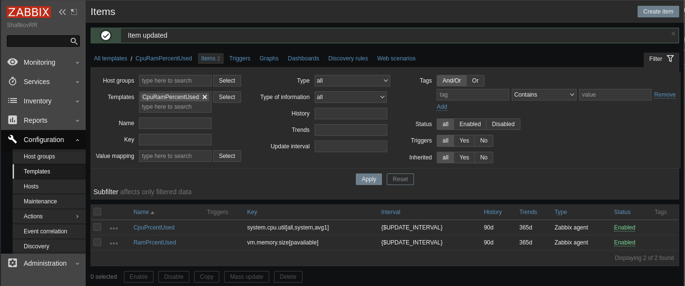

# Задание 1

### Создайте свой шаблон, в котором будут элементы данных, мониторящие загрузку CPU и RAM хоста.

#### Процесс выполнения

1. Выполняя ДЗ сверяйтесь с процессом отражённым в записи лекции.
2. В веб-интерфейсе Zabbix Servera в разделе Templates создайте новый шаблон
3. Создайте Item который будет собирать информацию об загрузке CPU в процентах
4. Создайте Item который будет собирать информацию об загрузке RAM в процентах

#### Требования к результату

Прикрепите в файл README.md скриншот страницы шаблона с названием «Задание 1»

# Решение 1

1. Создание шаблона:
Configuration > Create template > (Template > Template name:"CpuRamPercentUsed">Groups:"Edu, Linux servers") \
                                  (Macros > Macro:"{$UPDATE_INTERVAL}">Value:"5s") > Add
2. Добавление Items
CpuRamPercentUsed > Items > Create items > (Items > Name:"CpuPrcentUsed">Key:"system.cpu.util[all,system,avg1]" \
                                            Update interval:"{$UPDATE_INTERVAL}") > Add
CpuRamPercentUsed > Items > Create items > (Items > Name:"RamPrcentUsed">Key:"vm.memory.size[active]" \
                                            Update interval:"{$UPDATE_INTERVAL}") > Add

4. Прикрепление созданных items к виртуальной машине
Configuration > Hosts >
