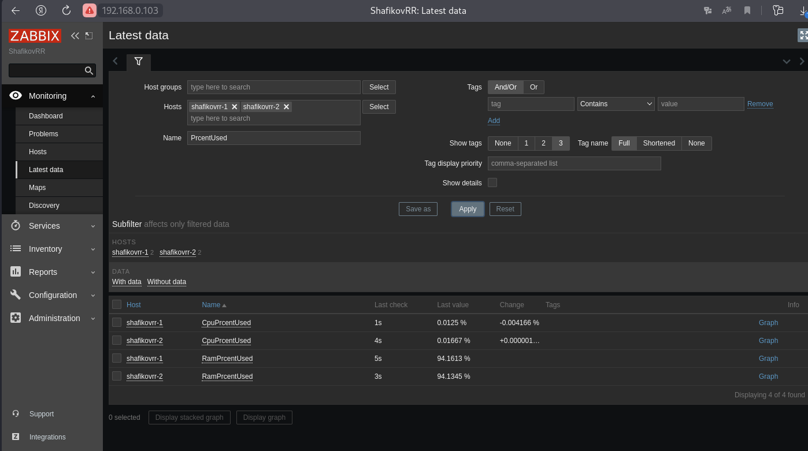

# Задание 1

### Создайте свой шаблон, в котором будут элементы данных, мониторящие загрузку CPU и RAM хоста.

#### Процесс выполнения

1. Выполняя ДЗ сверяйтесь с процессом отражённым в записи лекции.
2. В веб-интерфейсе Zabbix Servera в разделе Templates создайте новый шаблон
3. Создайте Item который будет собирать информацию об загрузке CPU в процентах
4. Создайте Item который будет собирать информацию об загрузке RAM в процентах

#### Требования к результату

Прикрепите в файл README.md скриншот страницы шаблона с названием «Задание 1»

# Решение 1

1. Создание шаблона:

Configuration > Create template > (Template > Template name:"CpuRamPercentUsed">Groups:"Edu, Linux servers") \
                                  (Macros > Macro:"{$UPDATE_INTERVAL}">Value:"5s") > Add

2. Добавление Items

CpuRamPercentUsed > Items > Create items > (Items > Name:"CpuPrcentUsed">Key:"system.cpu.util[all,system,avg1]" \
                                            Units:"%">Update interval:"{$UPDATE_INTERVAL}") > Add
                                            
CpuRamPercentUsed > Items > Create items > (Items > Name:"RamPrcentUsed">Key:"vm.memory.size[pavailable]" \
                                            Units:"%">Update interval:"{$UPDATE_INTERVAL}") > Add

3. Прикрепление созданных items к виртуальной машине

Configuration > Hosts > AgentZabbix > Templates (Name:"CpuRamPercentUsed") > Update

Latest data

---

# Задание 2

### Добавьте в Zabbix два хоста и задайте им имена <фамилия и инициалы-1> и <фамилия и инициалы-2>. Например: ivanovii-1 и ivanovii-2.

#### Процесс выполнения

1. Выполняя ДЗ сверяйтесь с процессом отражённым в записи лекции.
2. Установите Zabbix Agent на 2 виртмашины, одной из них может быть ваш Zabbix Server
3. Добавьте Zabbix Server в список разрешенных серверов ваших Zabbix Agentов
4. Добавьте Zabbix Agentов в раздел Configuration > Hosts вашего Zabbix Servera
5. Прикрепите за каждым хостом шаблон Linux by Zabbix Agent
6. Проверьте что в разделе Latest Data начали появляться данные с добавленных агентов

#### Требования к результату

Результат данного задания сдавайте вместе с заданием 3

# Решение 2

---

# Задание 3

### Привяжите созданный шаблон к двум хостам. Также привяжите к обоим хостам шаблон Linux by Zabbix Agent.

#### Процесс выполнения

1. Выполняя ДЗ сверяйтесь с процессом отражённым в записи лекции.
2. Зайдите в настройки каждого хоста и в разделе Templates прикрепите к этому хосту ваш шаблон
3. Так же к каждому хосту привяжите шаблон Linux by Zabbix Agent
4. Проверьте что в раздел Latest Data начали поступать необходимые данные из вашего шаблона

#### Требования к результату

Прикрепите в файл README.md скриншот страницы хостов, где будут видны привязки шаблонов с названиями «Задание 2-3». Хосты должны иметь зелёный статус подключения

# Решение 3

Для подключения свего шаблона пришлось удалить из Linux by Zabbix Agent повторябщиеся items

---

# Задание 4

### Создайте свой кастомный дашборд.

#### Процесс выполнения

1. Выполняя ДЗ сверяйтесь с процессом отражённым в записи лекции.
2. В разделе Dashboards создайте новый дашборд
3. Разместите на нём несколько графиков на ваше усмотрение.

#### Требования к результату

Прикрепите в файл README.md скриншот дашборда с названием «Задание 4»

# Решение 4

---

# Задание 5* со звёздочкой

### Создайте карту и расположите на ней два своих хоста.

#### Процесс выполнения

1. Настройте между хостами линк.
2. Привяжите к линку триггер, связанный с agent.ping одного из хостов, и установите индикатором сработавшего триггера красную пунктирную линию.
3. Выключите хост, чей триггер добавлен в линк. Дождитесь срабатывания триггера.

#### Требования к результату

Прикрепите в файл README.md скриншот карты, где видно, что триггер сработал, с названием «Задание 5»

# Решение 5

Добавление к хостам ICMP 

Configuration>Hosts>shafikovrr-1>Templates>ICMP ping>Update
Configuration>Hosts>shafikovrr-2>Templates>ICMP ping>Update

Создание карты

Administration>General>Images>Type(Background)>Create background>(Name:"plan"-Upload:"plan.png")>Add
Monitoring>Maps>Create map>(Name:"HomeLab"-Width:"493"-Height:"734"-BackgroundImage:"plan")>Add
EdiEditt Map>Map element>Add (Type:"Host"-Label:"SRV_shafikovrr-1"-Host:/Host group/Name:"shafikovrr-1")>Apply>Close
             Map element>Add (Type:"Host"-Label:"SRV_shafikovrr-2"-Host:/Host group/Name:"shafikovrr-2")>Apply>Close
Выделить два хоста>Link:Add>Apply>Close
Выделить shafikovrr-1>Links:/Action/Edit>(Label:"Link"-Link indicators-Add)> \
	(Host:"shafikovrr-1"-"ICMP: Unavailable by ICMP ping"-Select)
	(Host:"shafikovrr-2"-"ICMP: Unavailable by ICMP ping"-Select)
Выключаем хост shafikovrr-2

