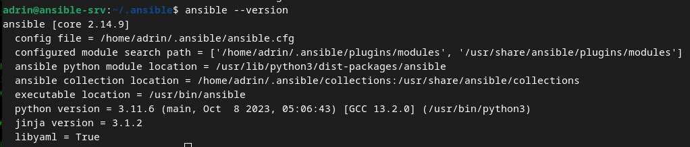
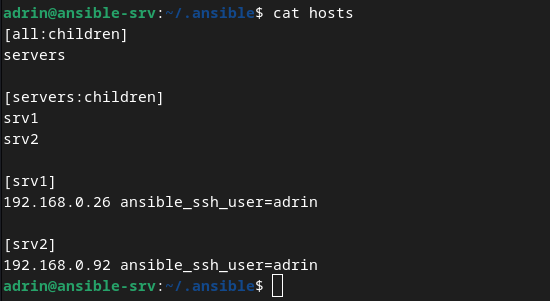
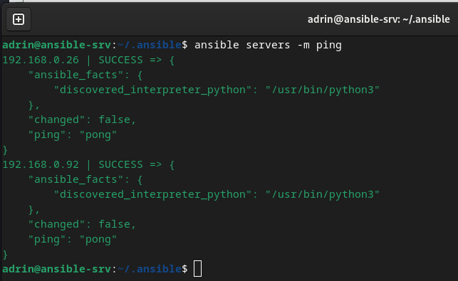
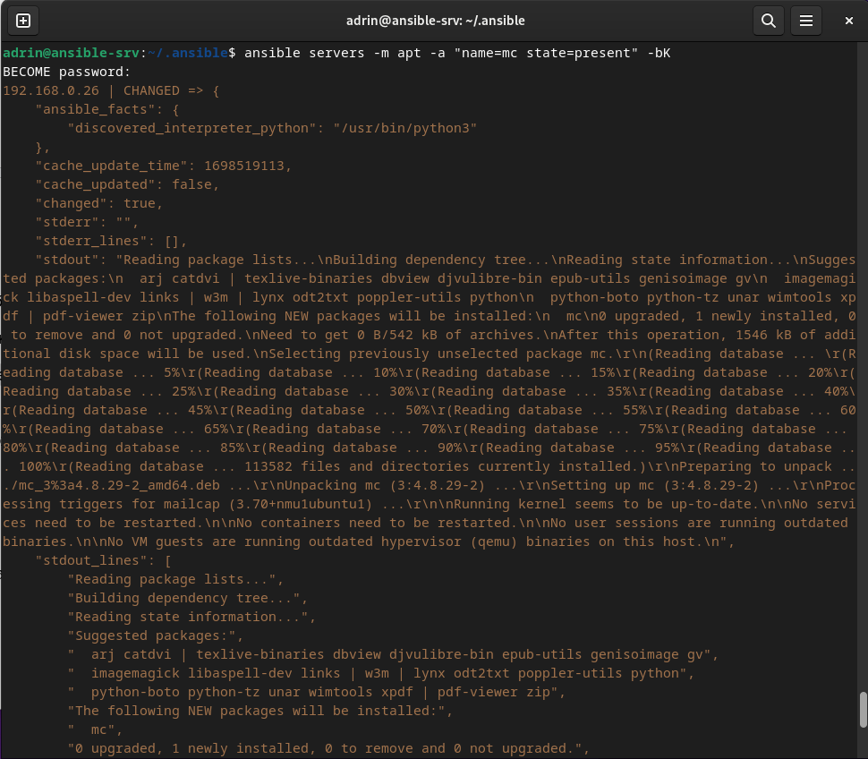
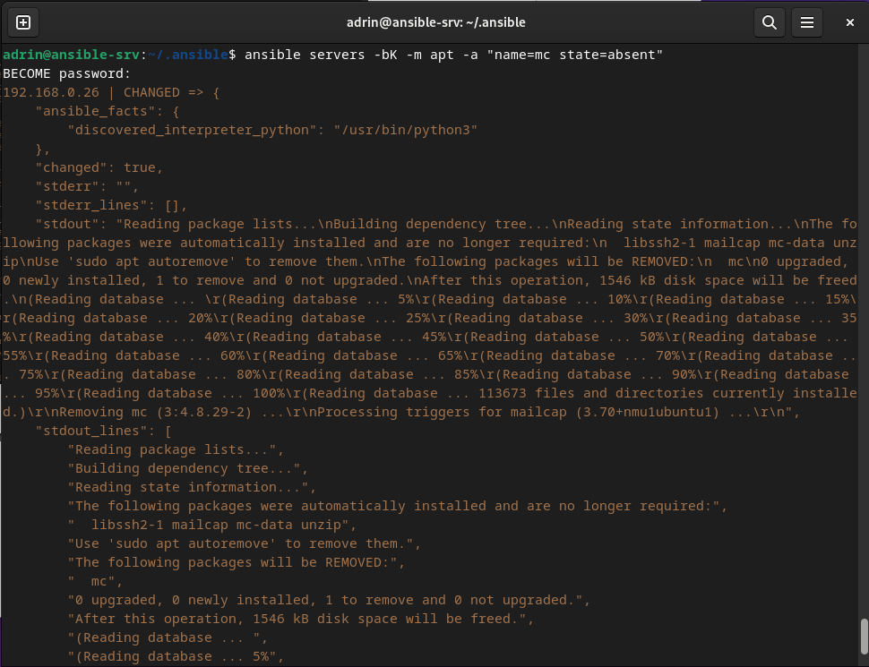
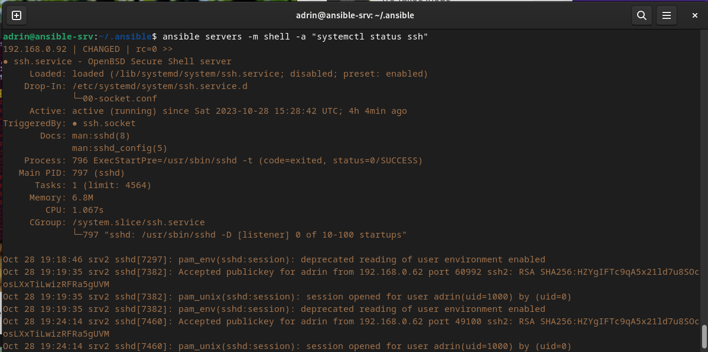
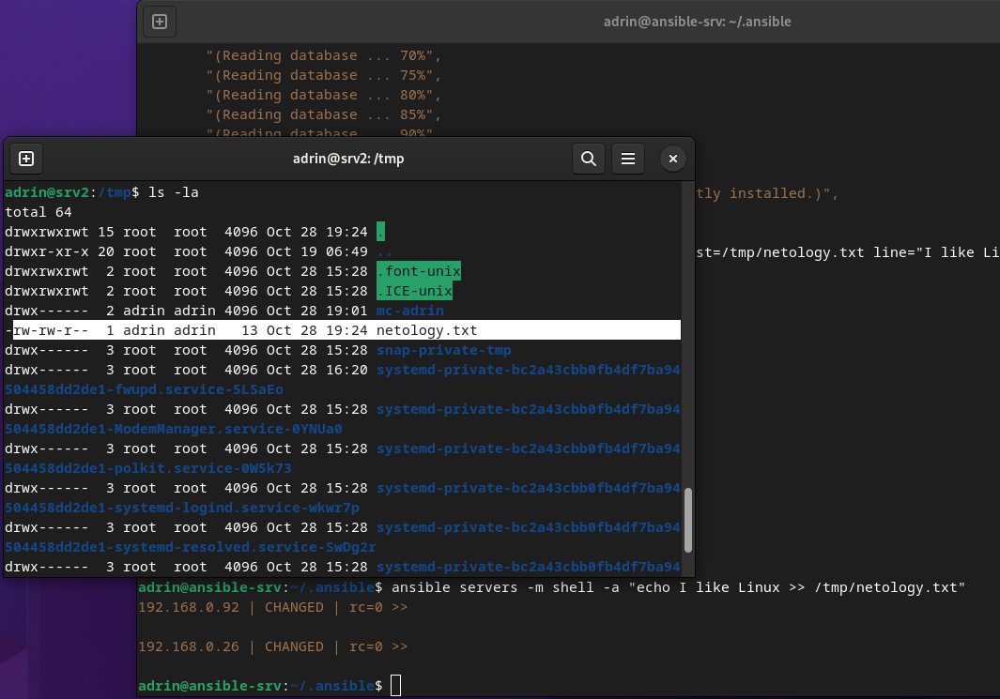

# Задание 1

Ответьте на вопрос в свободной форме.
Какие преимущества даёт подход IAC?

# Решение 1

Автоматизация администрирования (выполнения однотипных задач на множестве машин) через конфигурационный файл или с помощью команд по сети по ssh.

# Задание 2

Выполните действия и приложите скриншоты действий.
1. Установите Ansible.
2. Настройте управляемые виртуальные машины, не меньше двух.
3. Создайте файл inventory с созданными вами ВМ.
4. Проверьте доступность хостов с помощью модуля ping.

# Решение 2

Установка ansible:

```
sudo apt install ansible
```

Создание файла конфигурации ansible (при его отсутствии):

```
ansible-config init --disabled > ansible.cfg
```

Вывод команды 

```
ansible –version
```



Файл inventory=hosts



Пингуем серверы: 

```
ansible servers -m ping
```



# Задание 3

Ответьте на вопрос в свободной форме.
Какая разница между параметрами forks и serial?

# Решение 3

forks - параллельное выполнение команды (одновременное обновление на всех машинах)
serial - последовательное выполнение команды (обновление на первой машине, потом на второй и т.д.)

# Задание 4

В этом задании вы будете работать с Ad-hoc командами.
Выполните действия и приложите скриншоты запуска команд.
1. Установите на управляемых хостах любой пакет, которого нет.
2. Проверьте статус любого, присутствующего на управляемой машине, сервиса.
3. Создайте файл с содержимым «I like Linux» по пути /tmp/netology.txt.


# Решение 4
1. Установка mc:

```
ansible servers -m apt -a "name=mc state=latest" -bK
```

-b - под рутом, K - для ввода пароль



Удаление mc:

```
ansible servers -bK -m apt -a "name=mc state=absent" -v
```



2. Проверка статуса процесса

```
ansible servers -m shell -a "systemctl status ssh"
```



3. Создание файла /tmp/netology.txt с содержимым «I like Linux».

```
ansible servers -m shell -a "echo I like Linux >> /tmp/netology.txt"
```




