#  Задание 1

Выполните действия, приложите файлы с плейбуками и вывод выполнения.

Напишите три плейбука. При написании рекомендуем использовать текстовый редактор с подсветкой синтаксиса YAML.

Плейбуки должны:

1. Скачать какой-либо архив, создать папку для распаковки и распаковать скаченный архив. Например, можете использовать официальный сайт и зеркало Apache Kafka. При этом можно скачать как исходный код, так и бинарные файлы, запакованные в архив — в нашем задании не принципиально.  
2. Установить пакет tuned из стандартного репозитория вашей ОС. Запустить его, как демон — конфигурационный файл systemd появится автоматически при установке. Добавить tuned в автозагрузку.  
3. Изменить приветствие системы (motd) при входе на любое другое. Пожалуйста, в этом задании используйте переменную для задания приветствия. Переменную можно задавать любым удобным способом.

# Решение 1

1. Вывод команды: ansible-playbook playbook1.yaml \-v \-K

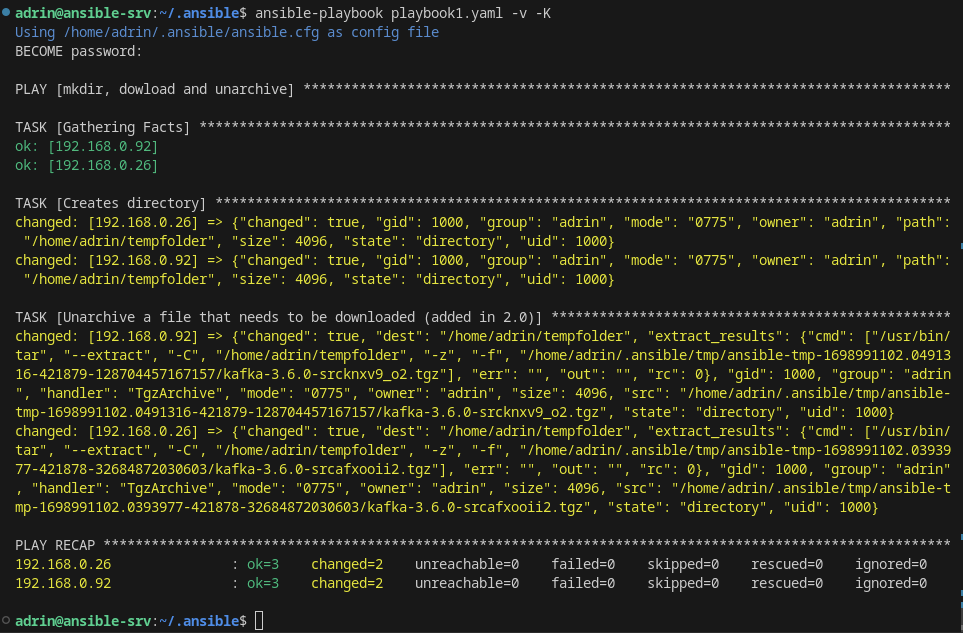

2. Вывод команды: ansible-playbook playbook2.yaml \-v \-K

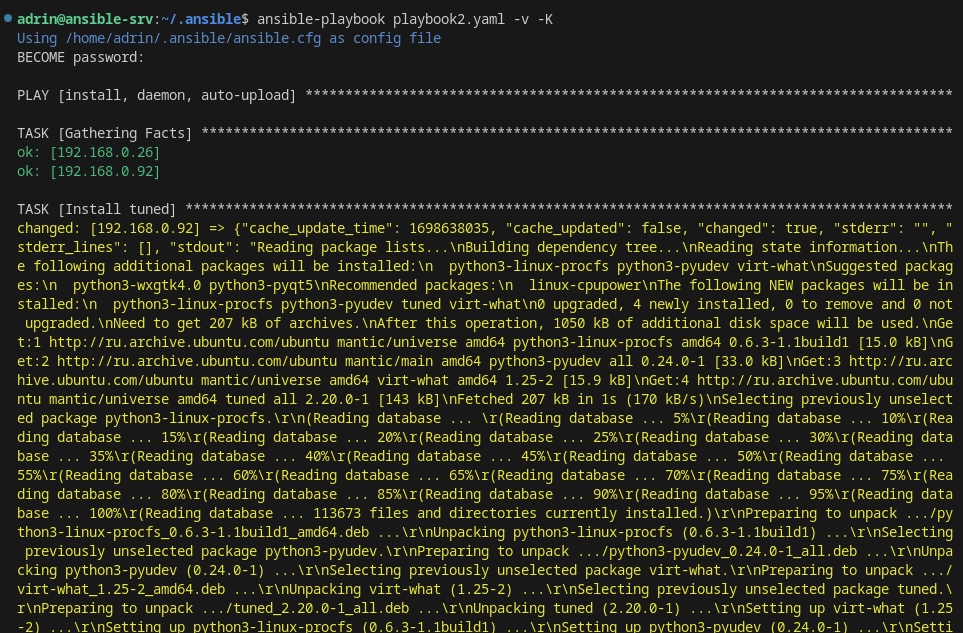

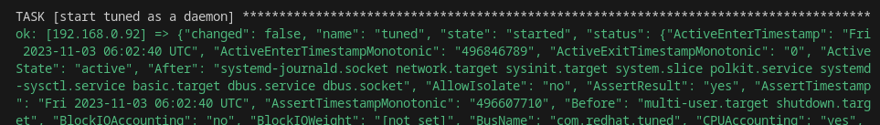

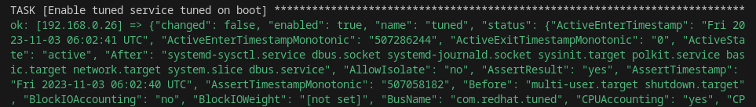

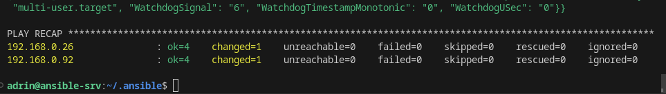

3. Вывод команды: ansible-playbook playbook3.yaml \-v \-K

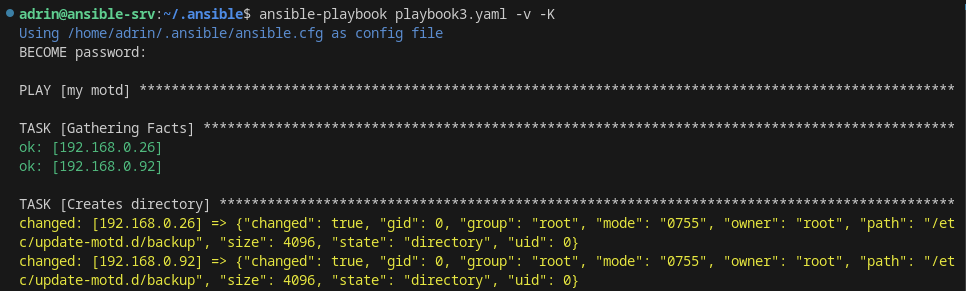

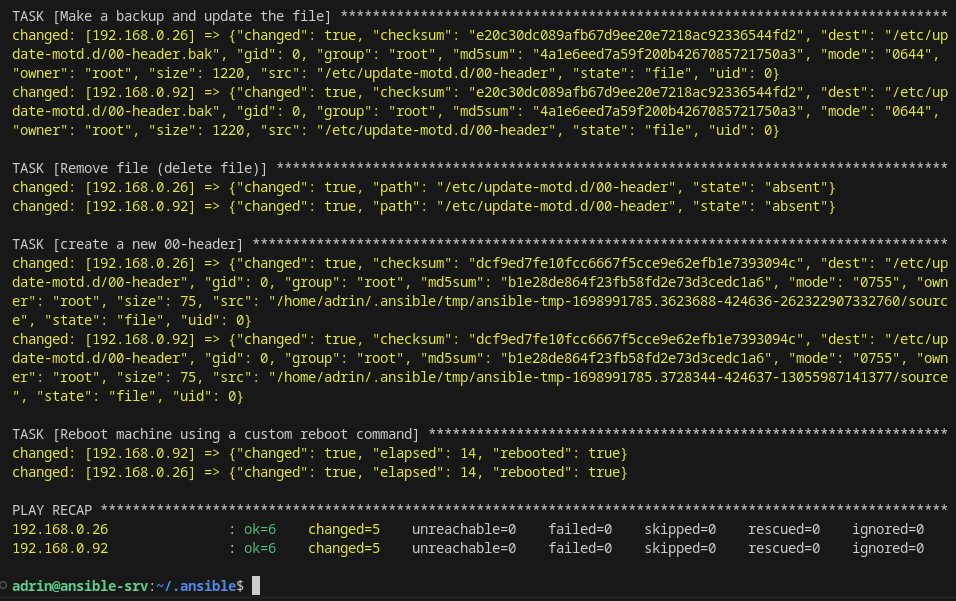

Скрин входа по SSH на сервер srv2

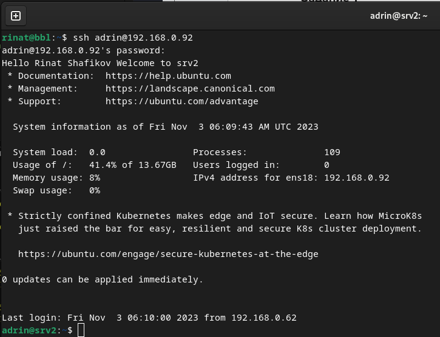

# Задание 2

Выполните действия, приложите файлы с модифицированным плейбуком и вывод выполнения.  
Модифицируйте плейбук из пункта 3, задания 1\. В качестве приветствия он должен установить IP-адрес и hostname управляемого хоста, пожелание хорошего дня системному администратору.

# Решение 2

Вывод команды: ansible-playbook playbook4.yaml \-v \-K

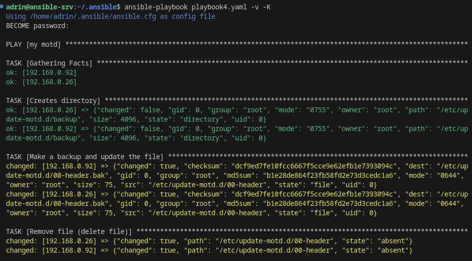 
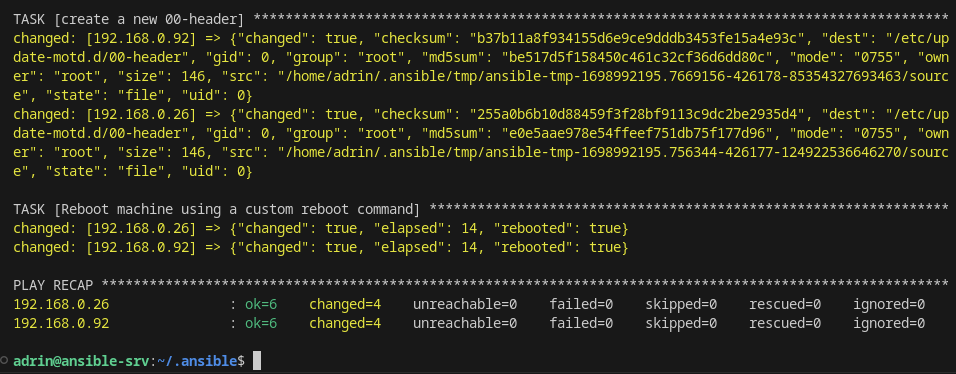

Скрин входа по SSH на сервер srv1

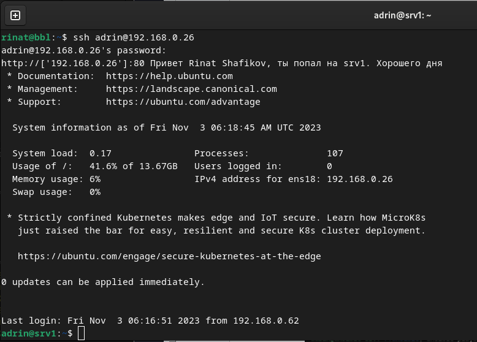

# Задание 3

Выполните действия, приложите архив с ролью и вывод выполнения.  
Ознакомьтесь со статьёй «Ansible \- это вам не bash», сделайте соответствующие выводы и не используйте модули shell или command при выполнении задания.  
Создайте плейбук, который будет включать в себя одну, созданную вами роль. Роль должна:

1. Установить веб\-сервер Apache на управляемые хосты.

2. Сконфигурировать файл index.html c выводом характеристик каждого компьютера как веб\-страницу по умолчанию для Apache. Необходимо включить CPU, RAM, величину первого HDD, IP-адрес. Используйте Ansible facts и jinja2-template. Необходимо реализовать handler: перезапуск Apache только в случае изменения файла конфигурации Apache.

3. Открыть порт 80, если необходимо, запустить сервер и добавить его в автозагрузку.

4. Сделать проверку доступности веб\-сайта (ответ 200, модуль uri).

В качестве решения:

* предоставьте плейбук, использующий роль;  
* разместите архив созданной роли у себя на Google диске и приложите ссылку на роль в своём решении;  
* предоставьте скриншоты выполнения плейбука;  
* предоставьте скриншот браузера, отображающего сконфигурированный index.html в качестве сайта.

# Решение 3

Вывод команды: ansible-playbook playbook5.yaml \-v \-K  
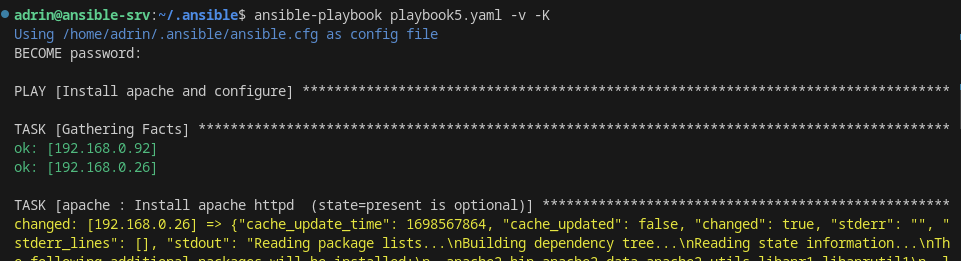  
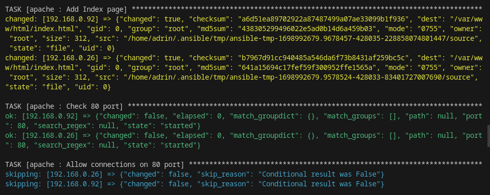  
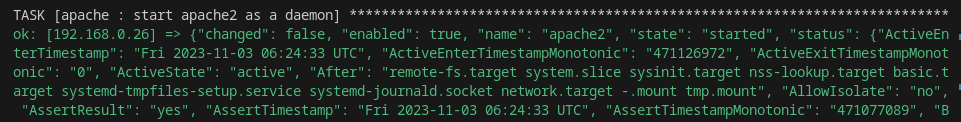  
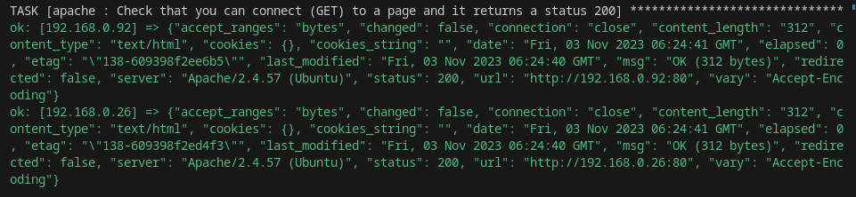  
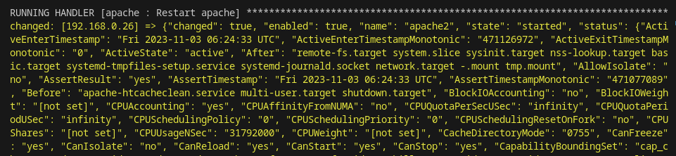  
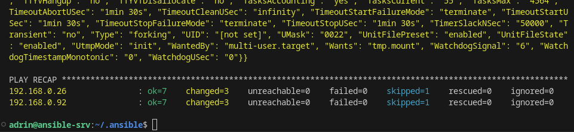

Скриншот index.html

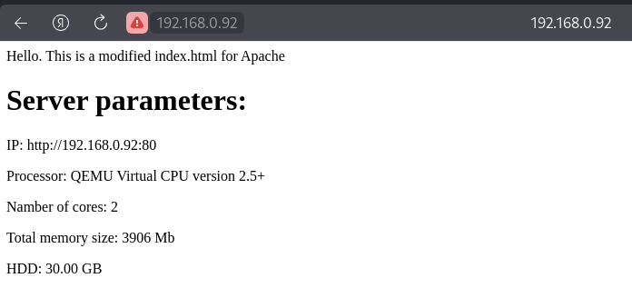
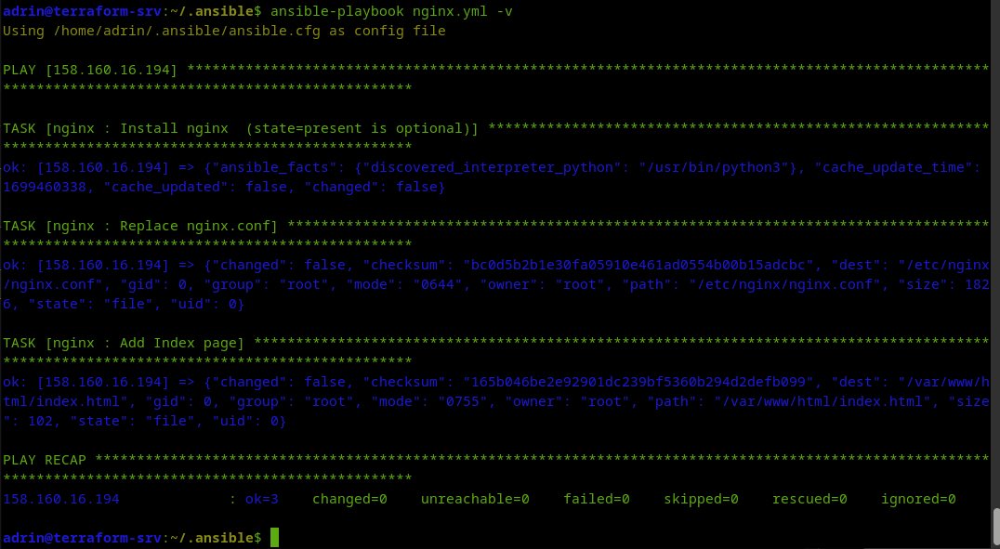