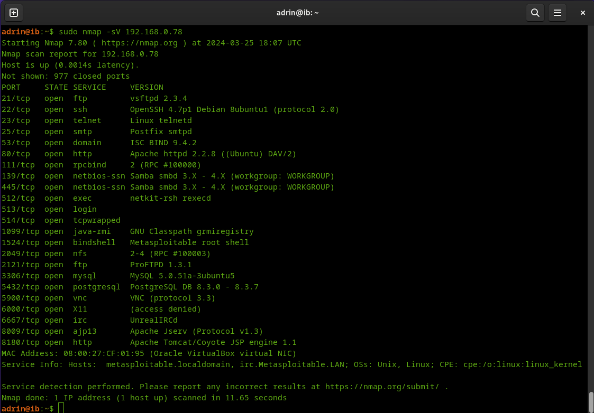
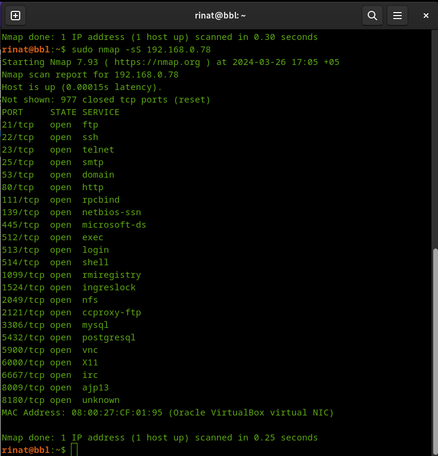
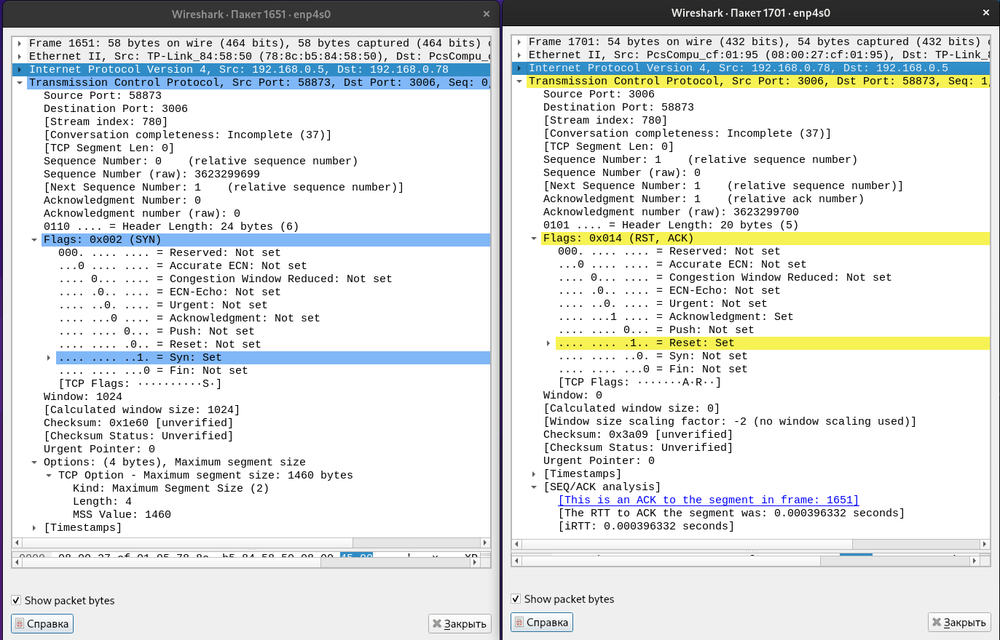
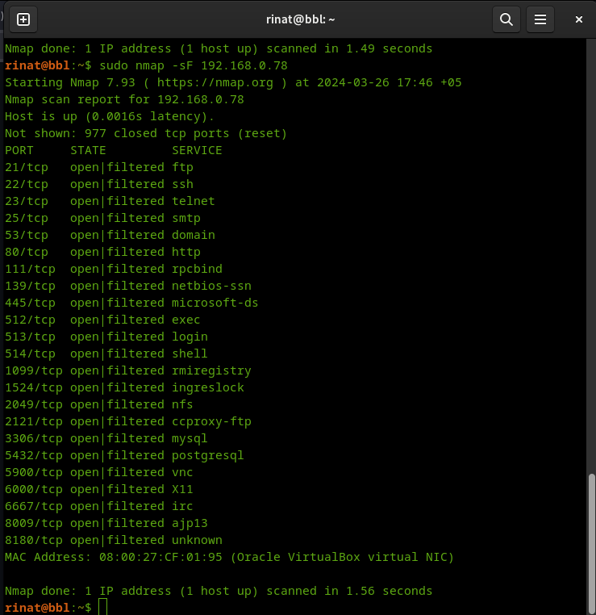
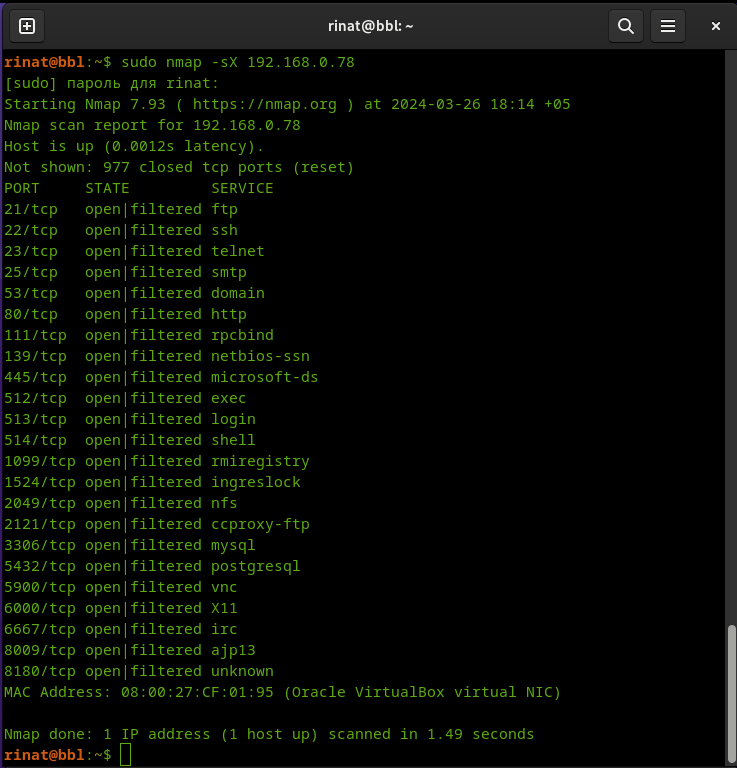
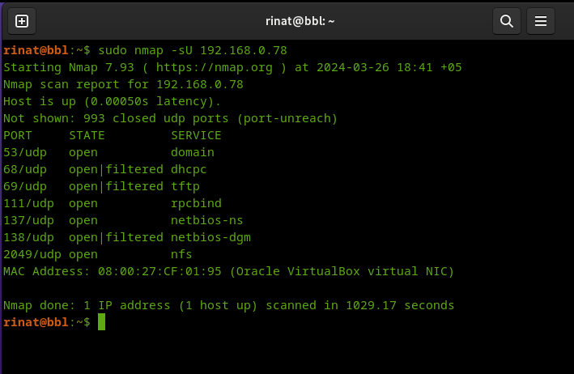

# Домашнее задание к занятию "`Уязвимости и атаки на информационные системы`" - `Шафиков Ринат`

---

### Задание 1

`Скачайте и установите виртуальную машину Metasploitable: https://sourceforge.net/projects/metasploitable/.
Это типовая ОС для экспериментов в области информационной безопасности, с которой следует начать при анализе уязвимостей.
Просканируйте эту виртуальную машину, используя nmap.
Попробуйте найти уязвимости, которым подвержена эта виртуальная машина.
Сами уязвимости можно поискать на сайте` 

```
https://www.exploit-db.com/
```

`Для этого нужно в поиске ввести название сетевой службы, обнаруженной на атакуемой машине, и выбрать подходящие по версии уязвимости.
Ответьте на следующие вопросы:`
- `Какие сетевые службы в ней разрешены?`
- `Какие уязвимости были вами обнаружены? (список со ссылками: достаточно трёх уязвимостей)`

`Приведите ответ в свободной форме.`

### Решение 1

```
sudo apt update && sudo apt upgrate -y
sudo apt install nmap
```
```
sudo nmap -sV 192.168.0.78
```



Уязвимости

- 21/tcp   open  ftp         vsftpd 2.3.4

`vsftpd 2.3.4 - Backdoor Command Execution
vsftpd 2.3.4 - Backdoor Command Execution (Metasploit)`

- 139/tcp  open  netbios-ssn Samba smbd 3.X - 4.X (workgroup: WORKGROUP)
- 445/tcp  open  netbios-ssn Samba smbd 3.X - 4.X (workgroup: WORKGROUP)

`Samba 3.5.0 < 4.4.14/4.5.10/4.6.4 - 'is_known_pipename()' Arbitrary Module Load (Metasploit)`

- 2121/tcp open  ftp         ProFTPD 1.3.1

`ProFTPd IAC 1.3.x - Remote Command Execution`

---

### Задание 2

`Проведите сканирование Metasploitable в режимах SYN, FIN, Xmas, UDP.
Запишите сеансы сканирования в Wireshark.
Ответьте на следующие вопросы:`

- `Чем отличаются эти режимы сканирования с точки зрения сетевого трафика?`
- `Как отвечает сервер?`
- `Приведите ответ в свободной форме.`

### Решение 2

1. Cканирование Metasploitable в режиме SYN

SYN сканирование отправляет начальный пакет SYN на сканируемый хост. Если порт открыт, сканируемый хост вернет пакет SYN-ACK, если порт закрыт, сканируемый хост вернет пакет RST.Если нет ответа после нескольких повторных передач, порт будет помечен как отфильтрованный. На третье рукопожатие SYN сканирование отправит пакеты RST для разрыва соединения (открыт порт или нет, не имеет значение).


3306/tcp open  mysql

```
sudo nmap -sS 192.168.0.78
```




2. Cканирование Metasploitable в режиме FIN

FIN SCAN - отправляется пакет с флагом в виде FIN, означающим окончание сеанса, на целевой брандмауэр или хост. Если ответа не получено, это означает, что порт открыт, а если возвращается значение RST // ACK, это означает, что порт сервера закрыт. 

```
sudo nmap -sF 192.168.0.78
```



3. Cканирование Metasploitable в режиме Xmas

При этом сканировании будут установлены флаги FIN, PSH и URG. Если в ответ сканируемый хост отвечает RST, то порт считается закрытым. Если ответа нет, то порт считается открытым|фильтруется. Некоторые системы (например windows) посылают RST ответы на запросы не зависимо от того, открыт порт или закрыт. Порт помечается как фильтруется, если в ответ приходит ICMP ошибка о недостижимости. 
```
sudo nmap -sX 192.168.0.78
```



4. Cканирование Metasploitable в режиме UDP.

UDP сканирование работает путем посылки пустого (без данных) UDP заголовка на каждый целевой порт. Если в ответ приходит ICMP ошибка о недостижимости порта, значит порт закрыт.  Иногда, служба будет отвечать UDP пакетом, указывая на то, что порт открыт. Если после нескольких попыток не было получено никакого ответа, то порт классифицируется как открыт|фильтруется. Это означает, что порт может быть открыт, или, возможно, пакетный фильтр блокирует его.

```
sudo nmap -sU 192.168.0.78
```




---
