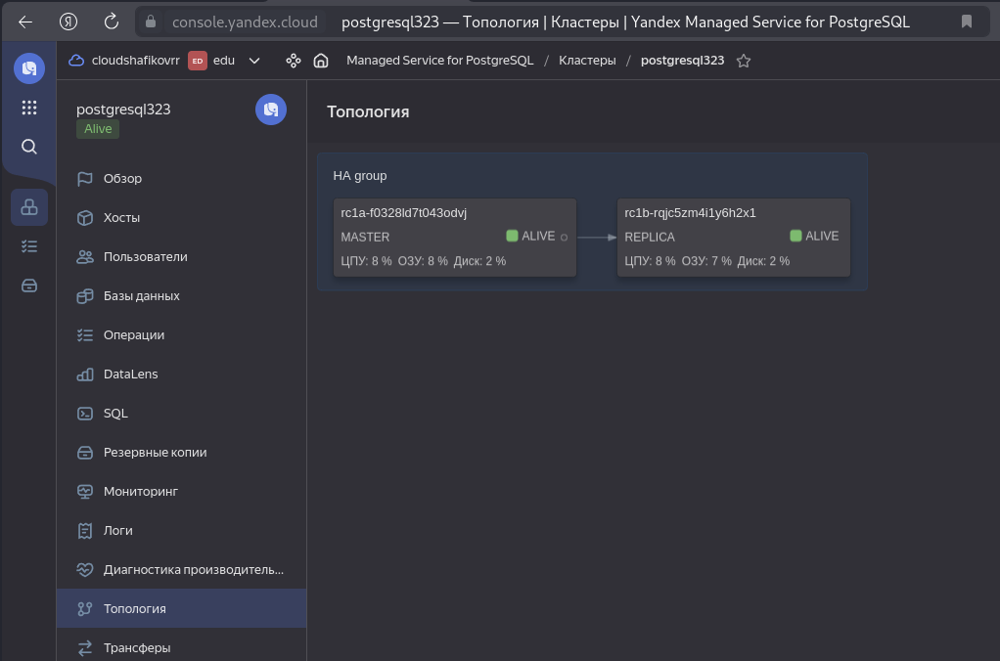
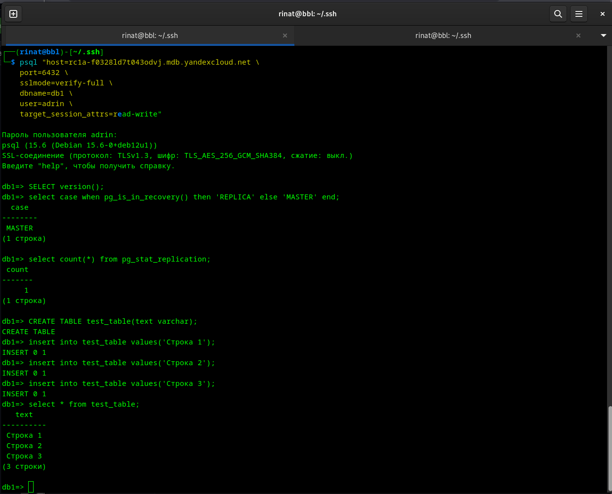
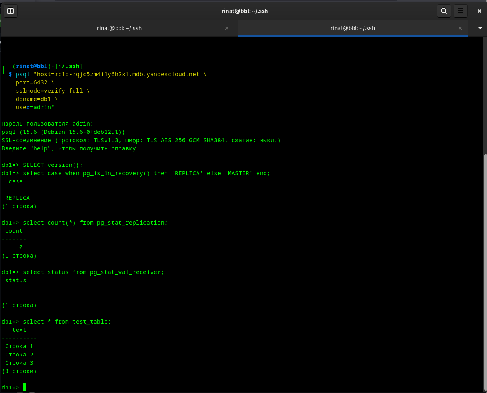

# Домашнее задание к занятию "`Базы данных в облаке`" - `Шафиков Ринат`

---

### Задание 1

# Домашнее задание к занятию «Базы данных в облаке»

Примерное время выполнения задания: 4 часа

Это задание для самостоятельной работы — оно не будет проверяться экспертом.

**Почему его важно и полезно выполнить:**

* Загрузив выполненное домашнее задание в личный кабинет, вы получите эталонное решение от преподавателя.
  
* Сколько бы теории вы ни изучали, мастерство приходит только с практикой. Не научившись решать простые задачи, вы будете испытывать всё больше затруднений при переходе к более сложным.

### Цель задания

На лекции вы узнали, как работать с системами управления баз данных. Теперь вы поработаете над созданием кластера и проверке работоспособности репликации в кластере. В результате выполнения этого задания вы научитесь:

* создавать кластер PostgreSQL;

* подключаться к мастеру и реплике;

* проверять работоспособность репликации в кластере

### Инструкция по выполнению домашнего задания

1. Сделайте fork [репозитория c шаблоном решения](https://github.com/netology-code/sys-pattern-homework) к себе в Github и переименуйте его по названию или номеру занятия, например, https://github.com/имя-вашего-репозитория/gitlab-hw или https://github.com/имя-вашего-репозитория/8-03-hw).
2. Выполните клонирование этого репозитория к себе на ПК с помощью команды `git clone`.
3. Выполните домашнее задание и заполните у себя локально этот файл README.md:
   - впишите вверху название занятия и ваши фамилию и имя;
   - в каждом задании добавьте решение в требуемом виде: текст/код/скриншоты/ссылка;
   - для корректного добавления скриншотов воспользуйтесь инструкцией [«Как вставить скриншот в шаблон с решением»](https://github.com/netology-code/sys-pattern-homework/blob/main/screen-instruction.md);
   - при оформлении используйте возможности языка разметки md. Коротко об этом можно посмотреть в [инструкции по MarkDown](https://github.com/netology-code/sys-pattern-homework/blob/main/md-instruction.md).
4. После завершения работы над домашним заданием сделайте коммит (`git commit -m "comment"`) и отправьте его на Github (`git push origin`).
5. Для получения эталонного решения по домашнему заданию в личном кабинете прикрепите и отправьте ссылку на решение в виде md-файла в вашем Github.
6. Любые вопросы задавайте в чате учебной группы и/или в разделе «Вопросы по заданию» в личном кабинете.

Желаем успехов в выполнении домашнего задания.

---

Домашнее задание подразумевает, что вы уже делали предыдущие работы в Яндекс.Облаке, и у вас есть аккаунт и каталог.


Используйте следующие рекомендации во избежание лишних трат в Яндекс.Облаке:
1) Сразу после выполнения задания удалите кластер.
2) Если вы решили взять паузу на выполнение задания, то остановите кластер.

### Задание


#### Создание кластера
1. Перейдите на главную страницу сервиса Managed Service for PostgreSQL.
1. Создайте кластер PostgreSQL со следующими параметрами:
- класс хоста: s2.micro, диск network-ssd любого размера;
- хосты: нужно создать два хоста в двух разных зонах доступности и указать необходимость публичного доступа, то есть публичного IP адреса, для них;
- установите учётную запись для пользователя и базы.

Остальные параметры оставьте по умолчанию либо измените по своему усмотрению.

* Нажмите кнопку «Создать кластер» и дождитесь окончания процесса создания, статус кластера = RUNNING. Кластер создаётся от 5 до 10 минут.

#### Подключение к мастеру и реплике 

* Используйте инструкцию по подключению к кластеру, доступную на вкладке «Обзор»: cкачайте SSL-сертификат и подключитесь к кластеру с помощью утилиты psql, указав hostname всех узлов и атрибут ```target_session_attrs=read-write```.

* Проверьте, что подключение прошло к master-узлу.
```
select case when pg_is_in_recovery() then 'REPLICA' else 'MASTER' end;
```
* Посмотрите количество подключенных реплик:
```
select count(*) from pg_stat_replication;
```

### Проверьте работоспособность репликации в кластере

* Создайте таблицу и вставьте одну-две строки.
```
CREATE TABLE test_table(text varchar);
```
```
insert into test_table values('Строка 1');
```

* Выйдите из psql командой ```\q```.

* Теперь подключитесь к узлу-реплике. Для этого из команды подключения удалите атрибут ```target_session_attrs```  и в параметре атрибут ```host``` передайте только имя хоста-реплики. Роли хостов можно посмотреть на соответствующей вкладке UI консоли.

* Проверьте, что подключение прошло к узлу-реплике.
```
select case when pg_is_in_recovery() then 'REPLICA' else 'MASTER' end;
```
* Проверьте состояние репликации
```
select status from pg_stat_wal_receiver;
```

* Для проверки, что механизм репликации данных работает между зонами доступности облака, выполните запрос к таблице, созданной на предыдущем шаге:
```
select * from test_table;
```

*В качестве результата вашей работы пришлите скриншоты:*

*1) Созданной базы данных;*
*2) Результата вывода команды на реплике ```select * from test_table;```.*

### Решение 1

1. [Зайти в консоль yandex cloud](https://console.yandex.cloud) 
2. [Выбираем Managed Service for PostgreSQL](https://console.yandex.cloud/folders/b1gltt4aeqoofm7e2pnj/managed-postgresql)
3. Нажимаем на `Cоздать кластер`:
   - Имя кластера: `postgresql323`;
   - Окружение: `PRODUCTION`;
   - Версия (psql): 15;
   - Платформа: `Intel Ice Lake`;
   - Тип: `standart - s3-c2.m8 - 2 cores cCPU, 8Gb memory `;
   - Размер хранилища: 10Gb;
   - Имя БД: `db1`;
   - Имя пользователя: `adrin`;
   - Пароль: `password`;
   - Сеть: `edu`;
   - Создадим два хоста:
     а) Зона доступности: `ru-central1-b`, Подсеть: `edu-ru-central1-b`, Публичный доступ: `есть`;
     б) Зона доступности: `ru-central1-a`, Подсеть: `edu-ru-central1-a`, Публичный доступ: `есть`;
  4. Нажимаем на: `Создать кластер`.
     


Для подключения воспользуемся инструкцией (Кластеры - postgresql323 - Обзор)

1. Установите сертификат:

```
mkdir -p ~/.postgresql && \
wget "https://storage.yandexcloud.net/cloud-certs/CA.pem" \
    --output-document ~/.postgresql/root.crt && \
chmod 0600 ~/.postgresql/root.crt
```

2. Установите зависимости:

```
sudo apt update && sudo apt install --yes postgresql-client
```

3. Подключитесь к базе данных:

Подключение к мастеру

```
psql "host=rc1a-f0328___43odvj.mdb.yandexcloud.net \
    port=6432 \
    sslmode=verify-full \
    dbname=db1 \
    user=adrin \
    target_session_attrs=read-write"
```
Пдключение к слейву

```
psql "host=rc1b-rqjc___1y6h2x1.mdb.yandexcloud.net \
    port=6432 \
    sslmode=verify-full \
    dbname=db1 \
    user=adrin \
    target_session_attrs=read-write"
```

`После выполнения команды введите пароль пользователя для завершения процедуры подключения.`

4. Для проверки успешности подключения выполните запрос:

```
SELECT version();
```
5. Выполним следующие шаги:

* Проверьте, что подключение прошло к master-узлу.
```
select case when pg_is_in_recovery() then 'REPLICA' else 'MASTER' end;
```
* Посмотрите количество подключенных реплик:
```
select count(*) from pg_stat_replication;
```

### Проверьте работоспособность репликации в кластере

* Создайте таблицу и вставьте одну-две строки.
```
CREATE TABLE test_table(text varchar);
```
```
insert into test_table values('Строка 1');
```

* Выйдите из psql командой ```\q```.

* Теперь подключитесь к узлу-реплике. Для этого из команды подключения удалите атрибут ```target_session_attrs```  и в параметре атрибут ```host``` передайте только имя хоста-реплики. Роли хостов можно посмотреть на соответствующей вкладке UI консоли.

* Проверьте, что подключение прошло к узлу-реплике.
```
select case when pg_is_in_recovery() then 'REPLICA' else 'MASTER' end;
```
* Проверьте состояние репликации
```
select status from pg_stat_wal_receiver;
```

* Для проверки, что механизм репликации данных работает между зонами доступности облака, выполните запрос к таблице, созданной на предыдущем шаге:
```
select * from test_table;
```

Результат проделанной работы:





---
