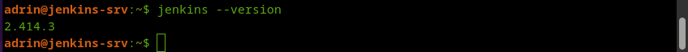

# Задание 1

## Что нужно сделать:

1. Установите себе jenkins по инструкции из лекции или любым другим способом из официальной документации. Использовать Docker в этом задании нежелательно.
2. Установите на машину с jenkins [golang](https://golang.org/doc/install).
3. Используя свой аккаунт на GitHub, сделайте себе форк [репозитория](https://github.com/netology-code/sdvps-materials.git). В этом же репозитории находится [дополнительный материал для выполнения ДЗ](https://github.com/netology-code/sdvps-materials/blob/main/CICD/8.2-hw.md).
4. Создайте в jenkins Freestyle Project, подключите получившийся репозиторий к нему и произведите запуск тестов и сборку проекта go test . и docker build ..

В качестве ответа пришлите скриншоты с настройками проекта и результатами выполнения сборки.

## Решение 1

1. Установите себе jenkins по инструкции из лекции или любым другим способом из официальной документации. Использовать Docker в этом задании нежелательно.

Устанавливаем Java
```
sudo apt install default-jre
```
Устанавливаем Jenkins из пакета для debian/ubuntu
```
curl -fsSL https://pkg.jenkins.io/debian-stable/jenkins.io-2023.key | sudo tee \
    /usr/share/keyrings/jenkins-keyring.asc > /dev/null
echo deb [signed-by=/usr/share/keyrings/jenkins-keyring.asc] \
    https://pkg.jenkins.io/debian-stable binary/ | sudo tee \
    /etc/apt/sources.list.d/jenkins.list > /dev/null
sudo apt-get update
sudo apt-get install jenkins
```



2. Установите на машину с jenkins golang.


3. Используя свой аккаунт на GitHub, сделайте себе форк репозитория. В этом же репозитории находится дополнительный материал для выполнения ДЗ.
4. Создайте в jenkins Freestyle Project, подключите получившийся репозиторий к нему и произведите запуск тестов и сборку проекта go test . и docker build ..

---

# Задание 2

## Что нужно сделать

1. Создайте новый проект pipeline.
2. Перепишите сборку из задания 1 на declarative в виде кода.

В качестве ответа пришлите скриншоты с настройками проекта и результатами выполнения сборки.

## Решение 2

1. Создайте новый проект pipeline.
2. Перепишите сборку из задания 1 на declarative в виде кода.

---

# Задание 3

## Что нужно сделать:

1. Установите на машину Nexus.
2. Создайте raw-hosted репозиторий.
3. Измените pipeline так, чтобы вместо Docker-образа собирался бинарный go-файл. Команду можно скопировать из Dockerfile.
4. Загрузите файл в репозиторий с помощью jenkins.

В качестве ответа пришлите скриншоты с настройками проекта и результатами выполнения сборки.

## Решение 3

1. Установите на машину Nexus.
2. Создайте raw-hosted репозиторий.
3. Измените pipeline так, чтобы вместо Docker-образа собирался бинарный go-файл. Команду можно скопировать из Dockerfile.
4. Загрузите файл в репозиторий с помощью jenkins.

# Задание 4*

Придумайте способ версионировать приложение, чтобы каждый следующий запуск сборки присваивал имени файла новую версию. Таким образом, в репозитории Nexus будет храниться история релизов.

Подсказка: используйте переменную BUILD_NUMBER.

В качестве ответа пришлите скриншоты с настройками проекта и результатами выполнения сборки.

# Решение 4*
