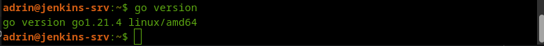
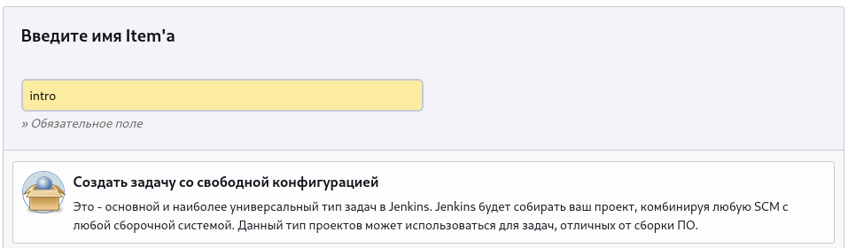
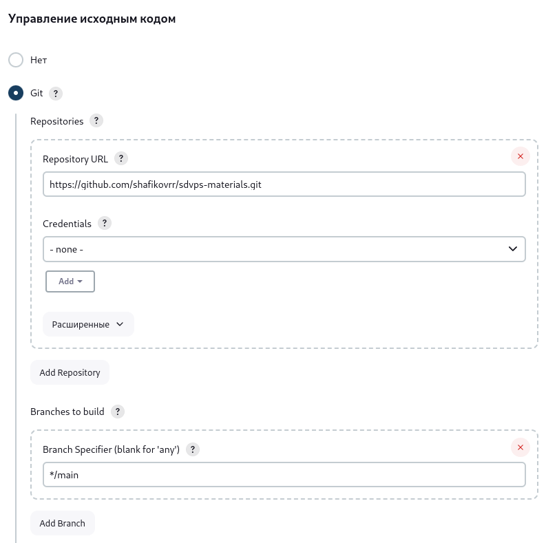
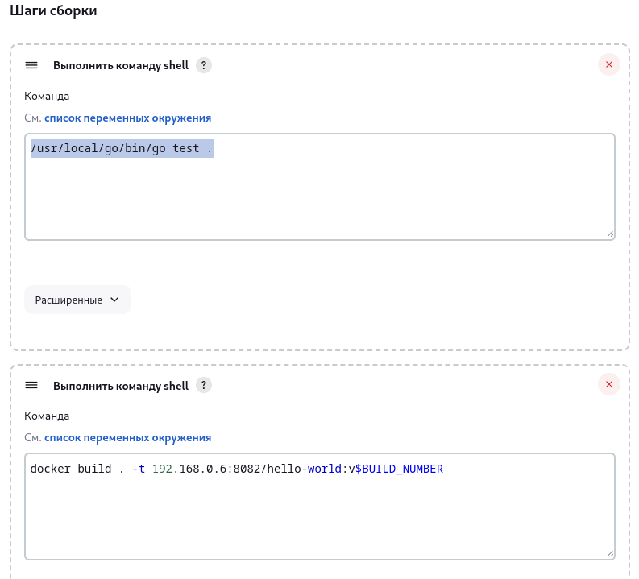
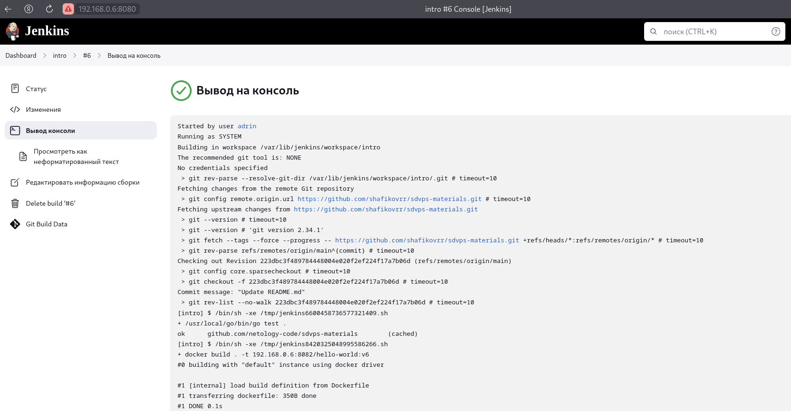
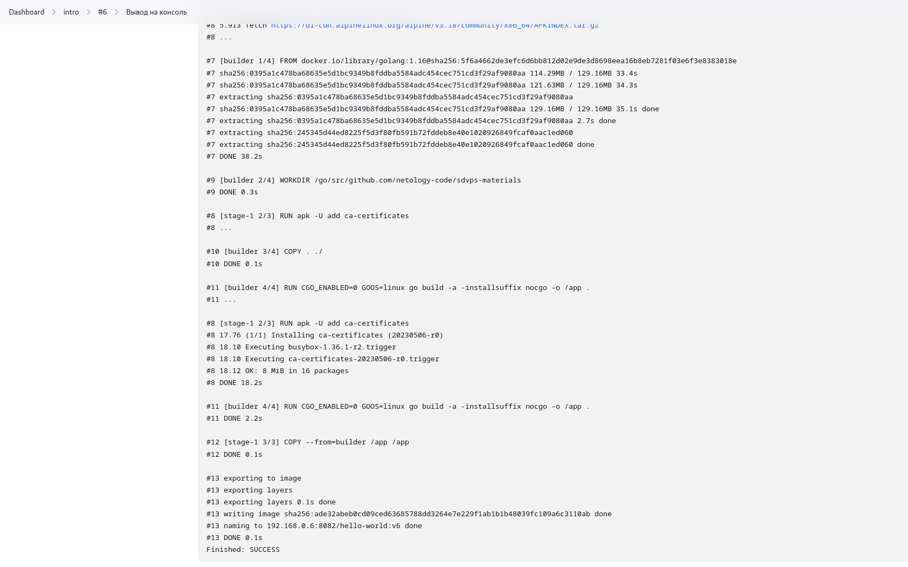

# Задание 1

## Что нужно сделать:

1. Установите себе jenkins по инструкции из лекции или любым другим способом из официальной документации. Использовать Docker в этом задании нежелательно.
2. Установите на машину с jenkins [golang](https://golang.org/doc/install).
3. Используя свой аккаунт на GitHub, сделайте себе форк [репозитория](https://github.com/netology-code/sdvps-materials.git). В этом же репозитории находится [дополнительный материал для выполнения ДЗ](https://github.com/netology-code/sdvps-materials/blob/main/CICD/8.2-hw.md).
4. Создайте в jenkins Freestyle Project, подключите получившийся репозиторий к нему и произведите запуск тестов и сборку проекта go test . и docker build ..

В качестве ответа пришлите скриншоты с настройками проекта и результатами выполнения сборки.

## Решение 1

1. Установите себе jenkins по инструкции из лекции или любым другим способом из официальной документации. Использовать Docker в этом задании нежелательно.

Устанавливаем Java
```
sudo apt install default-jre
```
Устанавливаем Jenkins из пакета для debian/ubuntu
```
curl -fsSL https://pkg.jenkins.io/debian-stable/jenkins.io-2023.key | sudo tee \
    /usr/share/keyrings/jenkins-keyring.asc > /dev/null
echo deb [signed-by=/usr/share/keyrings/jenkins-keyring.asc] \
    https://pkg.jenkins.io/debian-stable binary/ | sudo tee \
    /etc/apt/sources.list.d/jenkins.list > /dev/null
sudo apt-get update
sudo apt-get install jenkins
```


2. Установите на машину с jenkins golang.

Скачаем архив Go

```wget https://go.dev/dl/go1.21.4.linux-amd64.tar.gz```

Удаление предыдущей версии и установка GO

```rm -rf /usr/local/go && sudo tar -C /usr/local -xzf go1.21.4.linux-amd64.tar.gz```
 
 Установим переменную окружения

```
echo "export PATH=$PATH:/usr/local/go/bin" | sudo tee -a /etc/profile
sudo reboot
go version
```



3. Используя свой аккаунт на GitHub, сделайте себе форк репозитория. В этом же репозитории находится дополнительный материал для выполнения ДЗ.

```Fork```

4. Создайте в jenkins Freestyle Project, подключите получившийся репозиторий к нему и произведите запуск тестов и сборку проекта go test . и docker build ..

Вход на web gui jenkins

```http://192.168.0.6:8080/login?from=%2F```

Пароль администратора

```sudo cat /var/lib/jenkins/secrets/initialAdminPassword```

Установка плагинов по умолчанию

```Install suggested plugins```

---

Создание задачи

```Create a job```

Создать задачу со свободной конфигурацией



### Шаги сборки

Выполнить команду shell 1

```
/usr/local/go/bin/go test .
```

Выполнить команду shell 2

```
docker build . -t 192.168.0.6:8082/hello-world:v$BUILD_NUMBER
```

Установить docker и добавить jenkins в группу docker

```
sudo apt-get update
sudo apt-get install ca-certificates curl gnupg
sudo install -m 0755 -d /etc/apt/keyrings
curl -fsSL https://download.docker.com/linux/ubuntu/gpg | sudo gpg --dearmor -o /etc/apt/keyrings/docker.gpg
sudo chmod a+r /etc/apt/keyrings/docker.gpg
echo   "deb [arch="$(dpkg --print-architecture)" signed-by=/etc/apt/keyrings/docker.gpg] https://download.docker.com/linux/ubuntu \
    "$(. /etc/os-release && echo "$VERSION_CODENAME")" stable" |   sudo tee /etc/apt/sources.list.d/docker.list > /dev/null
sudo apt-get update
sudo apt-get install docker-ce docker-ce-cli containerd.io docker-buildx-plugin docker-compose-plugin
sudo usermod -a -G docker jenkins
sudo systemctl restart jenkins
```







---

# Задание 2

## Что нужно сделать

1. Создайте новый проект pipeline.
2. Перепишите сборку из задания 1 на declarative в виде кода.

В качестве ответа пришлите скриншоты с настройками проекта и результатами выполнения сборки.


## Решение 2

1. Создайте новый проект pipeline.

Установим nexus

```
sudo docker run -d -p 8081:8081 -p 8082:8082 --name nexus -e INSTALL4J_ADD_VM_PARAMS="-Xms1024m-Xmx1024m -XX:MaxDirectMemorySize=1024m" sonatype/nexus3
```

2. Перепишите сборку из задания 1 на declarative в виде кода.

Копируем файл с паролем в 

```cp my_password.txt /var/lib/jenkins/```

```
pipeline {
 agent any
 stages {
  stage('Git') {
   steps {git 'https://github.com/netology-code/sdvps-materials.git'}
  }
  stage('Test') {
   steps {
    sh '/usr/local/go/bin/go test .'
   }
  }
  stage('Build') {
   steps {
    sh 'docker build . -t ubuntu-bionic:8082/hello-world:v$BUILD_NUMBER'
   }
  }
  stage('Push') {
   steps {
    sh 'docker login ubuntu-bionic:8082 -u admin --password-stdin < ~/my_password.txt && docker push ubuntu-bionic:8082/hello-world:v$BUILD_NUMBER && docker logout'   }
  }
 }
}
```

---

# Задание 3

## Что нужно сделать:

1. Установите на машину Nexus.
2. Создайте raw-hosted репозиторий.
3. Измените pipeline так, чтобы вместо Docker-образа собирался бинарный go-файл. Команду можно скопировать из Dockerfile.
4. Загрузите файл в репозиторий с помощью jenkins.

В качестве ответа пришлите скриншоты с настройками проекта и результатами выполнения сборки.

## Решение 3

1. Установите на машину Nexus.
2. Создайте raw-hosted репозиторий.
3. Измените pipeline так, чтобы вместо Docker-образа собирался бинарный go-файл. Команду можно скопировать из Dockerfile.
4. Загрузите файл в репозиторий с помощью jenkins.

# Задание 4*

Придумайте способ версионировать приложение, чтобы каждый следующий запуск сборки присваивал имени файла новую версию. Таким образом, в репозитории Nexus будет храниться история релизов.

Подсказка: используйте переменную BUILD_NUMBER.

В качестве ответа пришлите скриншоты с настройками проекта и результатами выполнения сборки.

# Решение 4*
