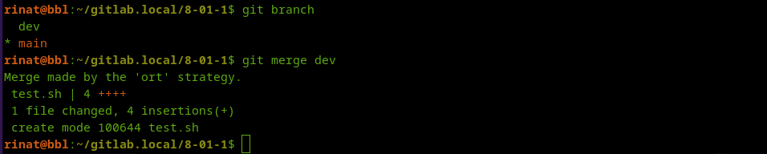

# Домашнее задание к занятию "`Git`" - `Шафиков Ринат`

## Задание 1

### Что нужно сделать:

1. `Зарегистрируйте аккаунт на GitHub.`
2. `Создайте новый отдельный публичный репозиторий. Обязательно поставьте галочку в поле «Initialize this repository with a README».`
3. `Склонируйте репозиторий, используя https протокол git clone ....`
4. `Перейдите в каталог с клоном репозитория.`
5. `Произведите первоначальную настройку Git, указав своё настоящее имя и email: git config --global user.name и git config --global user.email johndoe@example.com.`
6. `Выполните команду git status и запомните результат.`
7. `Отредактируйте файл README.md любым удобным способом, переведя файл в состояние Modified.`
8. `Ещё раз выполните git status и продолжайте проверять вывод этой команды после каждого следующего шага.`
9. `Посмотрите изменения в файле README.md, выполнив команды git diff и git diff --staged.`
10. `Переведите файл в состояние staged или, как говорят, добавьте файл в коммит, командой git add README.md.`
11. `Ещё раз выполните команды git diff и git diff --staged.`
12. `Теперь можно сделать коммит git commit -m 'First commit'.`
13. `Сделайте git push origin master.`

В качестве ответа добавьте ссылку на этот коммит в ваш md-файл с решением.

### Решение 1

1. `Зарегистрируйте аккаунт на GitHub.`
2. `Создайте новый отдельный публичный репозиторий. Обязательно поставьте галочку в поле «Initialize this repository with a README».`


3. `Склонируйте репозиторий, используя https протокол git clone ....`
```
git clone https://github.com/shafikovrr/8-01-1.git
```


4. `Перейдите в каталог с клоном репозитория.`
```
cd 8-01-1/
```
5. `Произведите первоначальную настройку Git, указав своё настоящее имя и email: git config --global user.name и git config --global user.email johndoe@example.com.`

Задаем имя

```
git config --global user.name "shafikovrr"
```
Задаем эллектронную почту

```
git config --global user.email shafikov.r.r@ya.ru
```
Проверяем конфигурационный файл

```
cat .git/config
```
 

6. `Выполните команду git status и запомните результат.`

```
git status
```


7. `Отредактируйте файл README.md любым удобным способом, переведя файл в состояние Modified.`

```
nano README.md
```


8. `Ещё раз выполните git status и продолжайте проверять вывод этой команды после каждого следующего шага.`

```
git status
```


9. `Посмотрите изменения в файле README.md, выполнив команды git diff и git diff --staged.`

```
git diff
```


```
git diff --staged
```


10. `Переведите файл в состояние staged или, как говорят, добавьте файл в коммит, командой git add README.md.`

```
git add README.md
```
11. `Ещё раз выполните команды git diff и git diff --staged.`

```
git diff
```


```
git diff --staged
```


12. `Теперь можно сделать коммит git commit -m 'First commit'.`

```
git commit -m 'first commit'
```


13. `Сделайте git push origin master.`

```
git push
```


---

## Задание 2

### Что нужно сделать

1. `Создайте файл .gitignore (обратите внимание на точку в начале файла) и проверьте его статус сразу после создания.`
2. `Добавьте файл .gitignore в следующий коммит git add....`
3. `Напишите правила в этом файле, чтобы игнорировать любые файлы .pyc, а также все файлы в директории cache.`
4. `Сделайте коммит и пуш.`

В качестве ответа добавьте ссылку на этот коммит в ваш md-файл с решением.

## Решение 2

1. `Создайте файл .gitignore (обратите внимание на точку в начале файла) и проверьте его статус сразу после создания.`

```
touch .gitignore
```

2. `Добавьте файл .gitignore в следующий коммит git add....`

```
git add .gitignore
git commit "add .gitignore"
```


3. `Напишите правила в этом файле, чтобы игнорировать любые файлы .pyc, а также все файлы в директории cache.`

```
nano .gitignore
cat .gitignore
```


4. `Сделайте коммит и пуш.`

```
git add .
git commit -m "add rules to .gitignore"
git push
```


В качестве ответа добавьте ссылку на этот коммит в ваш md-файл с решением.


---

## Задание 3

### Что нужно сделать:

1. `Создайте новую ветку dev и переключитесь на неё.`
2. `Создайте в ветке dev файл test.sh с произвольным содержимым.`
3. `Сделайте несколько коммитов и пушей в ветку dev, имитируя активную работу над файлом в процессе разработки.`
4. `Переключитесь на основную ветку.`
5. `Добавьте файл main.sh в основной ветке с произвольным содержимым, сделайте комит и пуш. Так имитируется продолжение общекомандной разработки в основной ветке во время разработки отдельного функционала в dev ветке.`
6. `Сделайте мердж dev ветки в основную с помощью git merge dev. Напишите осмысленное сообщение в появившееся окно комита.`
7. `Сделайте пуш в основной ветке.`
8. `Не удаляйте ветку dev.`

В качестве ответа прикрепите ссылку на граф коммитов https://github.com/ваш-логин/ваш-репозиторий/network в ваш md-файл с решением.

Ваш граф комитов должен выглядеть аналогично скриншоту:

скрин для Git

## Решение 3

1. `Создайте новую ветку dev и переключитесь на неё.`

Создаем ветку dev

```
git branch dev
```
Просмотим существующие ветки

```
git branch
```
Переключимся на ветку dev

```
git checkout dev
```
 


2. `Создайте в ветке dev файл test.sh с произвольным содержимым.`

```
touch test.sh
nano test.sh
```


Добавим созданный файл в commit

```
git add test.sh
git commit -m "dev, first commit"
```

3. `Сделайте несколько коммитов и пушей в ветку dev, имитируя активную работу над файлом в процессе разработки.`

Создадим записи в файле test.sh и выполним команду (повтрить 3 раза)
```
git commit -am "dev, third  commit"
```

Пуш

```
git push --set-upstream origin dev
```


4. `Переключитесь на основную ветку.`

```
git checkout main
```


5. `Добавьте файл main.sh в основной ветке с произвольным содержимым, сделайте комит и пуш. Так имитируется продолжение общекомандной разработки.  в основной ветке во время разработки отдельного функуионалав devветке`

```
touch main.sh
echo 'Netology 5' > main.sh
git add main.sh
git commit -am "main, fifth  commit"
```

6. `Сделайте мердж dev ветки в основную с помощью git merge dev. Напишите осмысленное сообщение в появившееся окно комита`

```
git branch
git merge dev
```



7. `Сделайте пуш в основной ветке.`

```
git push origin main
```


8. `Не удаляйте ветку dev.`


---

## Задание 4*

**Сэмулируем конфликт. Перед выполнением изучите документацию.**

### Что нужно сделать:

1. 'Создайте ветку conflict и переключитесь на неё.'
2. 'Внесите изменения в файл test.sh.'
3. 'Сделайте коммит и пуш.'
4. 'Переключитесь на основную ветку.'
5. 'Измените ту же самую строчку в файле test.sh.'
6. 'Сделайте коммит и пуш.'
7. 'Сделайте мердж ветки conflict в основную ветку и решите конфликт так, чтобы в результате в файле оказался код из ветки conflict.'

В качестве ответа на задание прикрепите ссылку на граф коммитов https://github.com/ваш-логин/ваш-репозиторий/network в ваш md-файл с решением.

## Решение 4*

1. 'Создайте ветку conflict и переключитесь на неё.'

```
git branch conflict
git checkout conflict
```


2. 'Внесите изменения в файл test.sh.'

```
nano test.sh
```

3. 'Сделайте коммит и пуш.'

```
git commit -am "conflict, commit 10"
git push origin conflict
```


4. 'Переключитесь на основную ветку.'

```
git checkout main
```

5. 'Измените ту же самую строчку в файле test.sh.'

```
nano test.sh
```

6. 'Сделайте коммит и пуш.'

```
git commit -am "main, commit 15"
git push origin main
```


7. 'Сделайте мердж ветки conflict в основную ветку и решите конфликт так, чтобы в результате в файле оказался код из ветки conflict.'

```
git branch
git merge conflict
nano test.sh
git commit -am "main, commit conflict Netology 11"
git push origin main
```

