# Домашнее задание к занятию "`Защита хоста`" - `Шафиков Ринат`


---

### Задание 1

1. `Установите eCryptfs.`
2. `Добавьте пользователя cryptouser.`
3. `Зашифруйте домашний каталог пользователя с помощью eCryptfs.`
   
`В качестве ответа пришлите снимки экрана домашнего каталога пользователя с исходными и зашифрованными данными.`

### Решение 1 

```
sudo apt update && sudo apt upgrade -y
sudo apt install ecryptfs-utils
sudo adduser cryptouser
su cryptouser
cd /home/cryptouser
touch cryptouser.password
ls
```

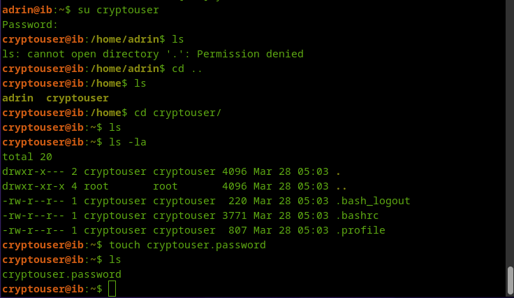

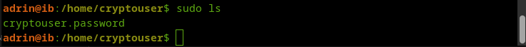

```
sudo ecryptfs-migrate-home -u cryptouser
sudo ls /home/ryptouser
```

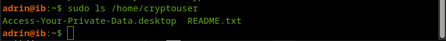

Если все команды выполнять от учетки админа, зайти в учетку cryptouser (с паролем cryptouser), затем из нее выйти через exit (автоматически переключившись на админа), то админу остается доступ к файлам. Если же произвести перезагрузку системы, то админу недоступны файлы cryptouser.

---

### Задание 2

1. `Установите поддержку LUKS.`
2. `Создайте небольшой раздел, например, 100 Мб.`
3. `Зашифруйте созданный раздел с помощью LUKS.`

`В качестве ответа пришлите снимки экрана с поэтапным выполнением задания.`

### Решение 2

```
sudo apt install gparted
```
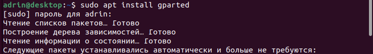

```
sudo apt install cryptsetup
```

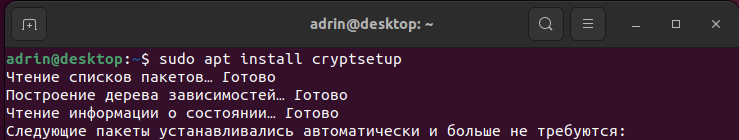

```
cryptsetup --version
```

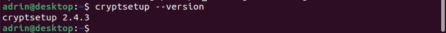

Результат создания раздела в gparted

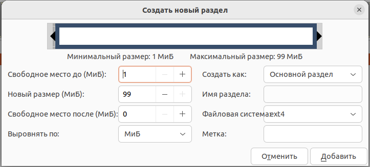

```
lsblk
```

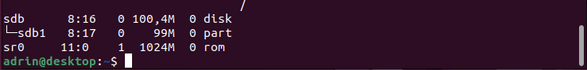

Создаем шифрованный раздел:

```
sudo cryptsetup -y -v --type luks2 luksFormat /dev/sdb1
```

Открываем только что созданный раздел

```
sudo cryptsetup luksOpen /dev/sdb1 disk
ls /dev/mapper/disk
```

Форматирование раздела и создание файловой системы:

```
sudo dd if=/dev/zero of=/dev/mapper/disk
sudo mkfs.ext4 /dev/mapper/disk
```

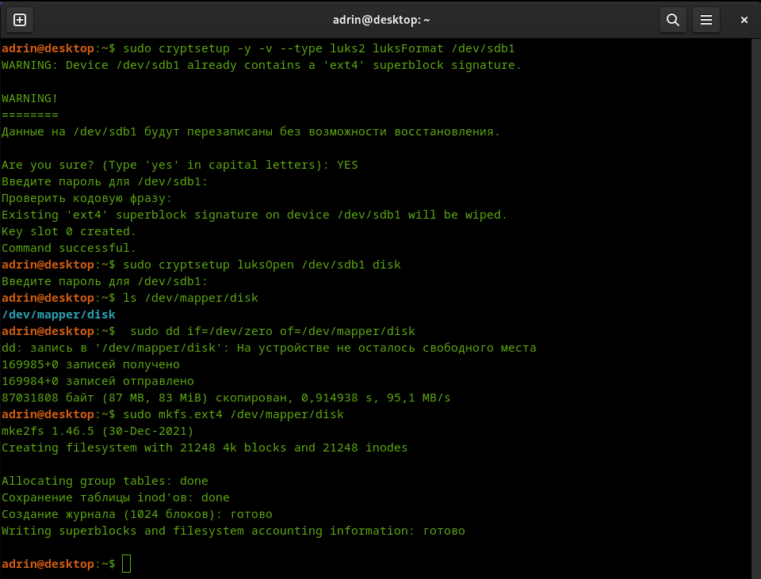


Примонтируем созданный раздел

```
mkdir .mydisk
sudo mount /dev/mapper/disk .mydisk/
ls -la .mydisk/
```

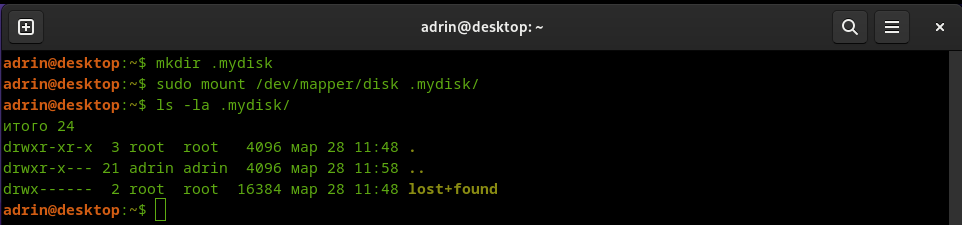

Отключение устройства

```
sudo umount .mydisk
sudo cryptsetup luksClose disk
```

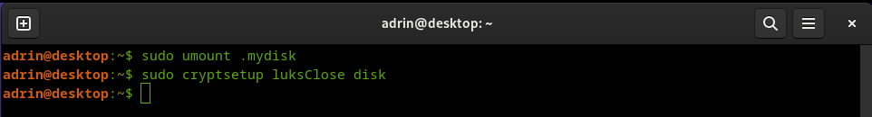

---
