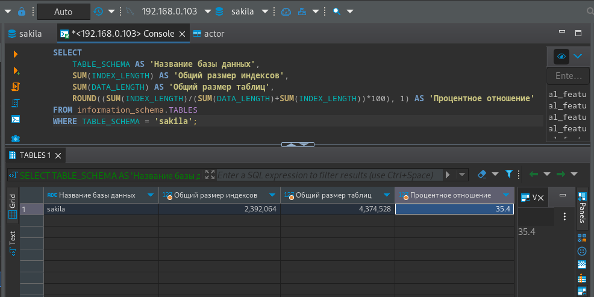

# Домашнее задание к занятию "`Индексы`" - `Шафиков Ринат`

### Задание 1

`Напишите запрос к учебной базе данных, который вернёт процентное отношение общего размера всех индексов к общему размеру всех таблиц.`

### Решение 1

```sql
SELECT 
	TABLE_SCHEMA AS 'Название базы данных', 
	SUM(INDEX_LENGTH) AS 'Общий размер индексов', 
	SUM(DATA_LENGTH) AS 'Общий размер таблиц', 
	ROUND((SUM(INDEX_LENGTH)/(SUM(DATA_LENGTH)+SUM(INDEX_LENGTH))*100), 1) AS 'Процентное отношение'
FROM information_schema.TABLES
WHERE TABLE_SCHEMA = 'sakila';
```



---

### Задание 2

`Выполните explain analyze следующего запроса:`


```sql
select distinct concat(c.last_name, ' ', c.first_name), sum(p.amount) over (partition by c.customer_id, f.title)
from payment p, rental r, customer c, inventory i, film f
where date(p.payment_date) = '2005-07-30' and p.payment_date = r.rental_date and r.customer_id = c.customer_id and i.inventory_id = r.inventory_id
```
- `перечислите узкие места;`
- `оптимизируйте запрос: внесите корректировки по использованию операторов, при необходимости добавьте индексы.`

### Решение 2

```
SELECT
	DISTINCT CONCAT(c.last_name, ' ', c.first_name),
	SUM(p.amount) OVER (PARTITION BY c.customer_id) 
FROM 
	payment p, 
	customer c 
WHERE DATE(p.payment_date) = '2005-07-30' AND p.customer_id = c.customer_id; 
```


---
