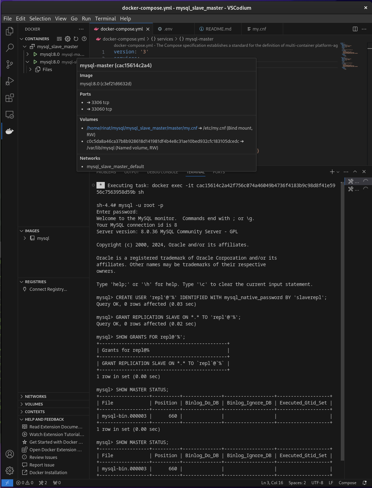
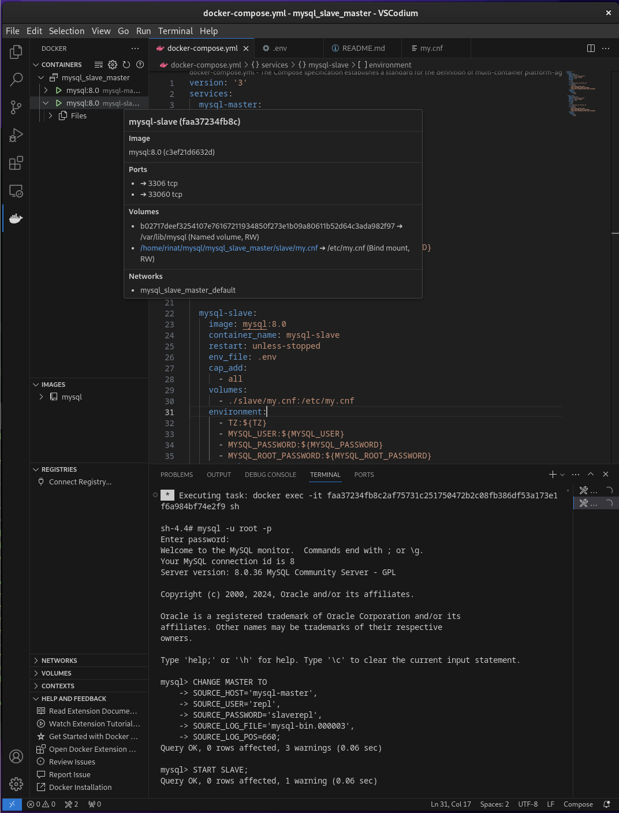
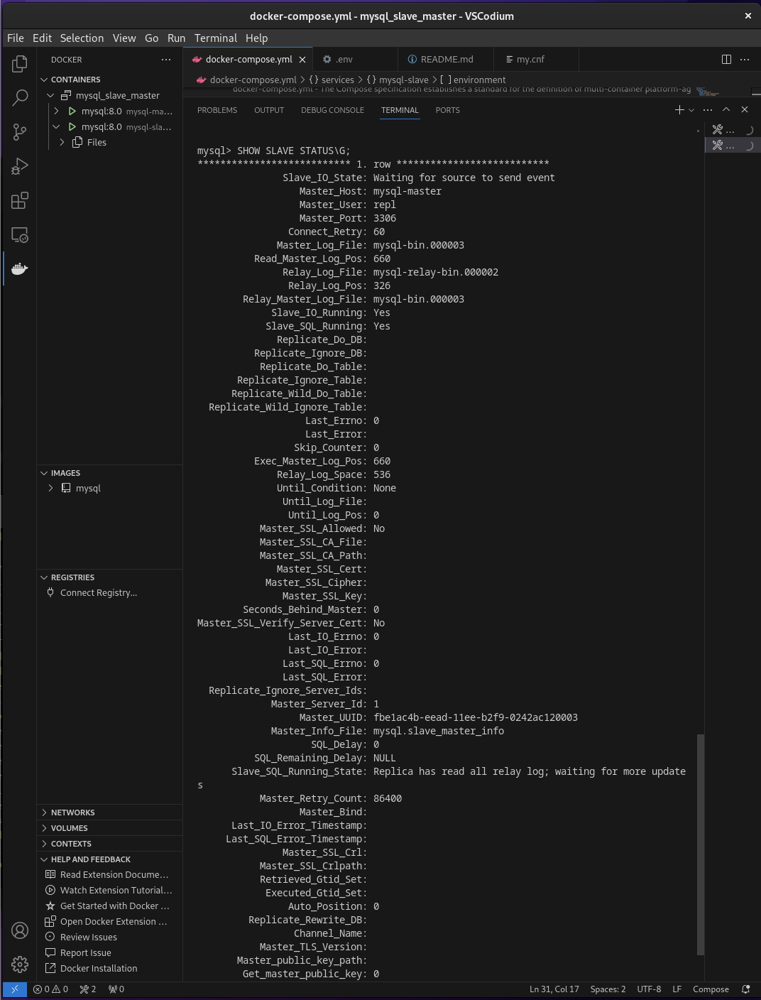
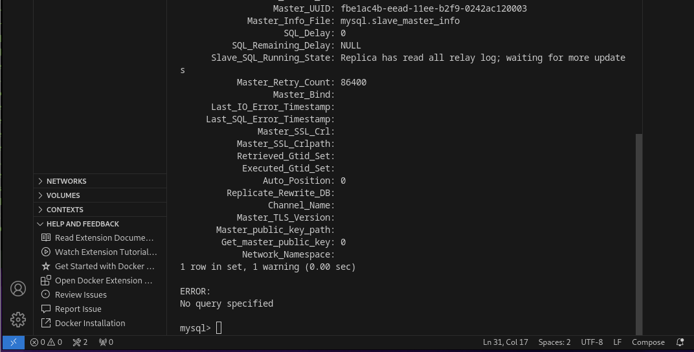
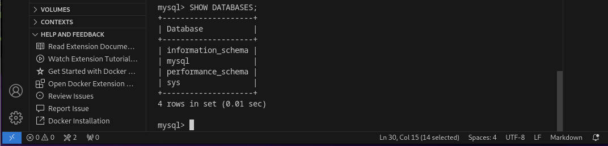
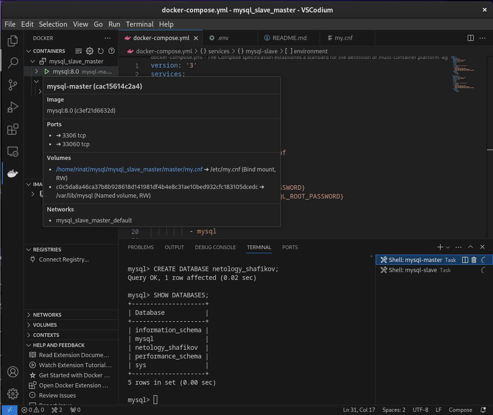
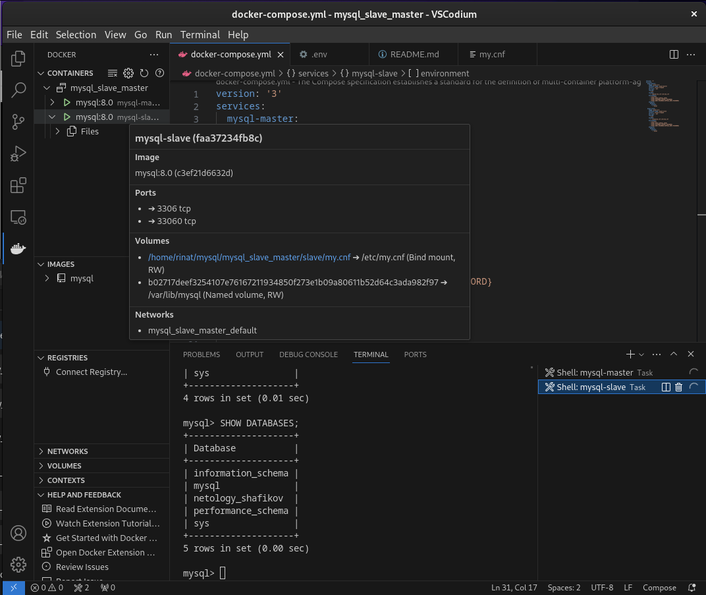
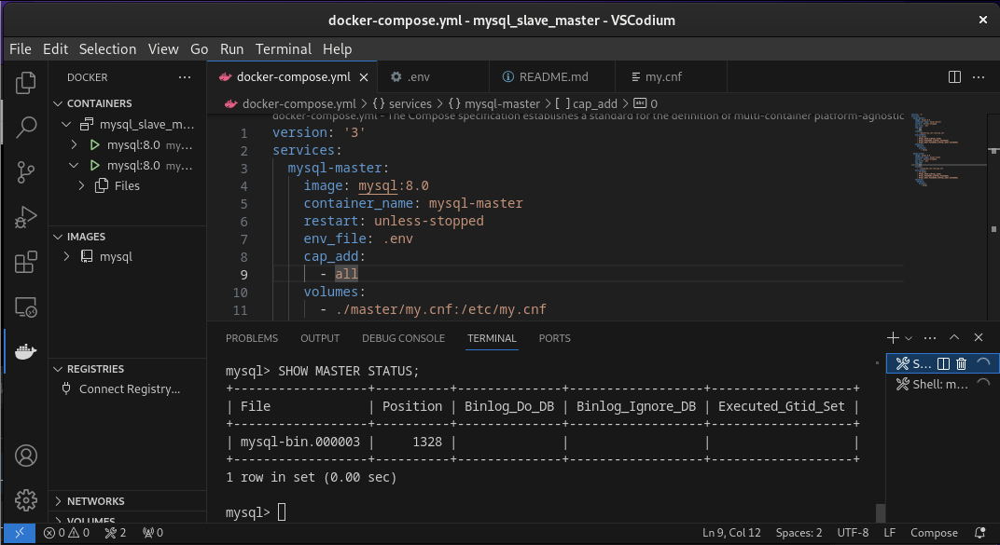
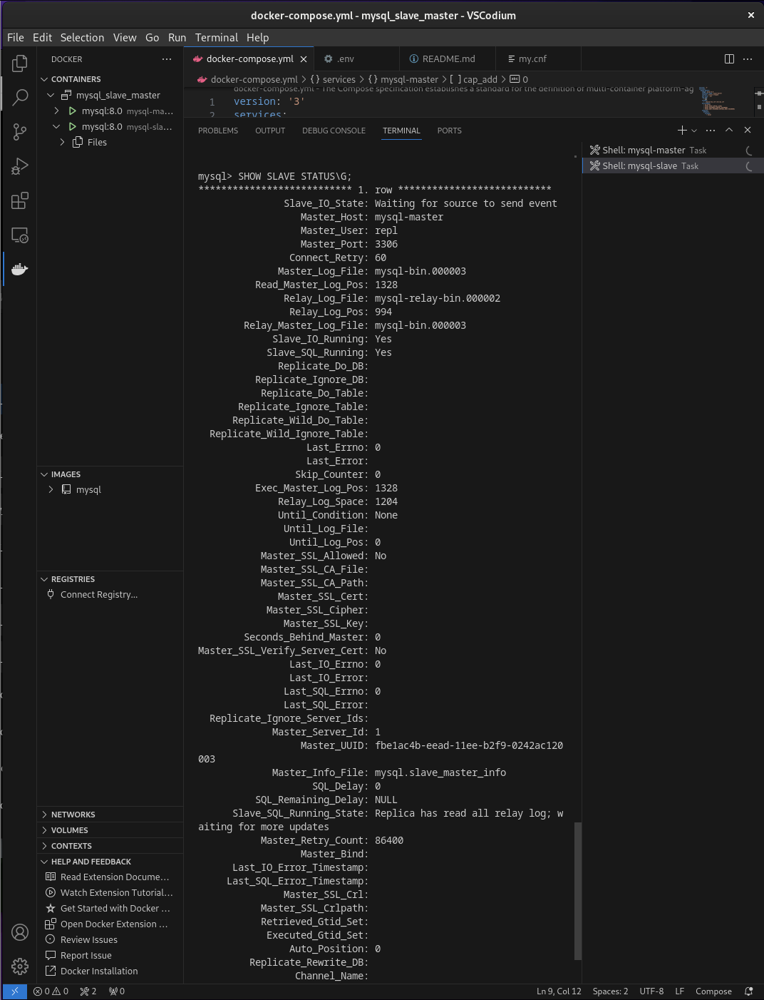

# Домашнее задание к занятию "`Репликация и масштабирование. Часть 1`" - `Шафиков Ринат`

---

### Задание 1

`На лекции рассматривались режимы репликации master-slave, master-master, опишите их различия.
Ответить в свободной форме.`

### Решение 1

```

```

---

### Задание 2

`Выполните конфигурацию master-slave репликации, примером можно пользоваться из лекции.
Приложите скриншоты конфигурации, выполнения работы: состояния и режимы работы серверов.`

### Решение 2

На мастере

```
mysql -u root -p
CREATE USER 'repl'@'%' IDENTIFIED WITH mysql_native_password BY 'slaverepl';
GRANT REPLICATION SLAVE ON *.* TO 'repl'@'%';
SHOW GRANTS FOR repl@'%';
SHOW MASTER STATUS;
```



```
SHOW DATABASES;
```


На слейве

```
mysql -u root -p
```
```
CHANGE MASTER TO
SOURCE_HOST='mysql-master',
SOURCE_USER='repl',
SOURCE_PASSWORD='slaverepl',
SOURCE_LOG_FILE='mysql-bin.000003',
SOURCE_LOG_POS=660;
```
```
START SLAVE;
SHOW SLAVE STATUS\G;
```






```
SHOW DATABASES;
```




Создадим на мастере тестовую таблицу

```
CREATE DATABASE netology_shafikov;
SHOW DATABASES;

```


На слейве

```
SHOW DATABASES;
```



На мастере

```
SHOW MASTER STATUS
```




На слейве

```
SHOW SLAVE STATUS\G;
```



---

show_status_slave_2
