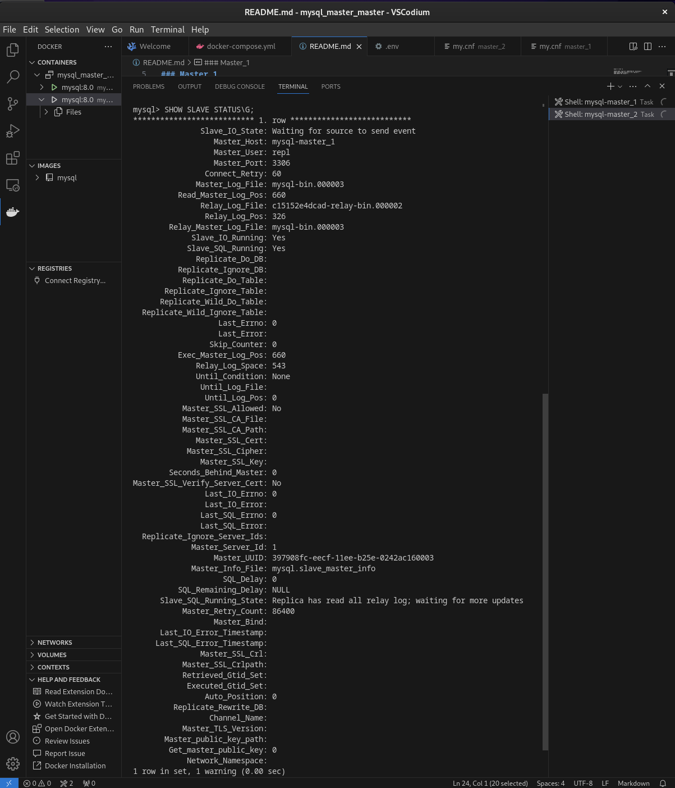
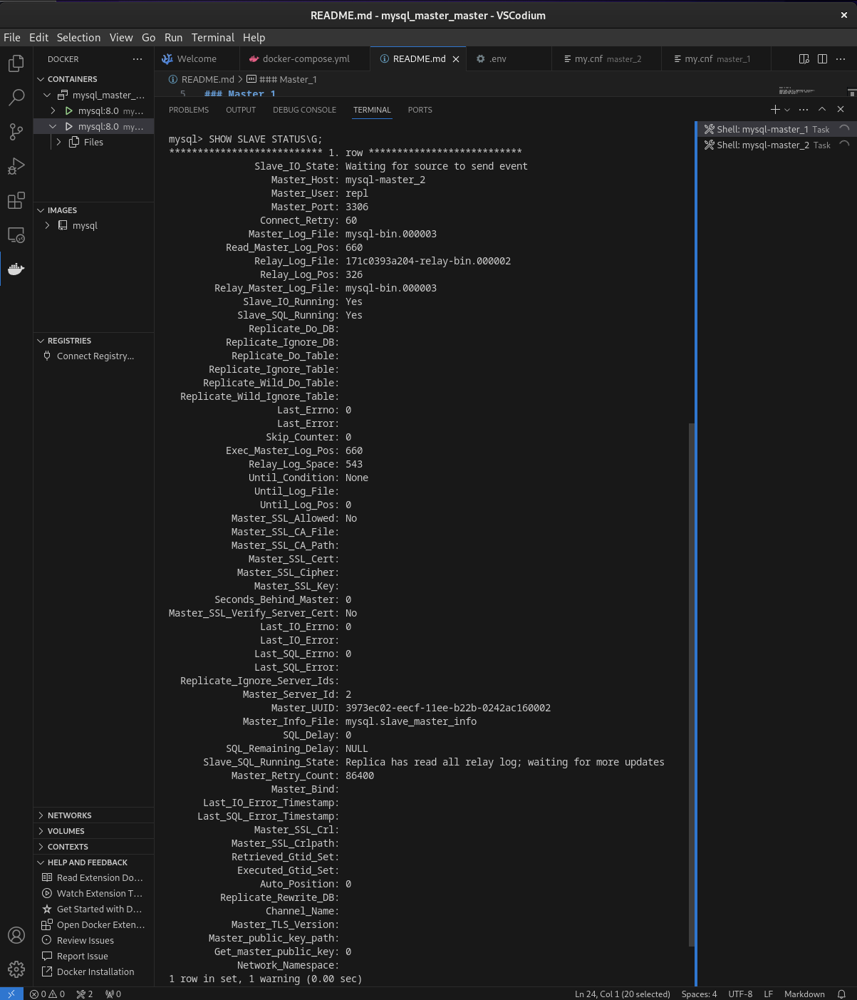
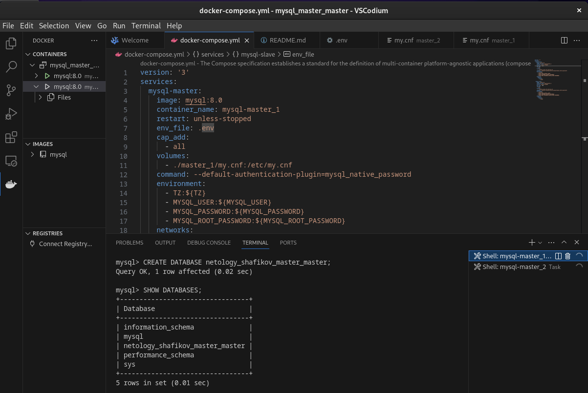
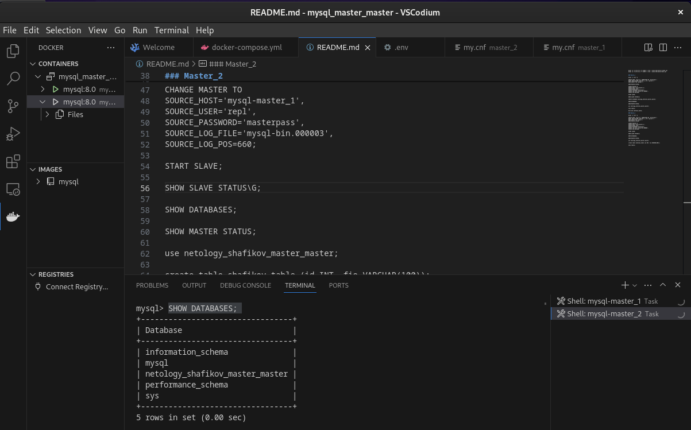
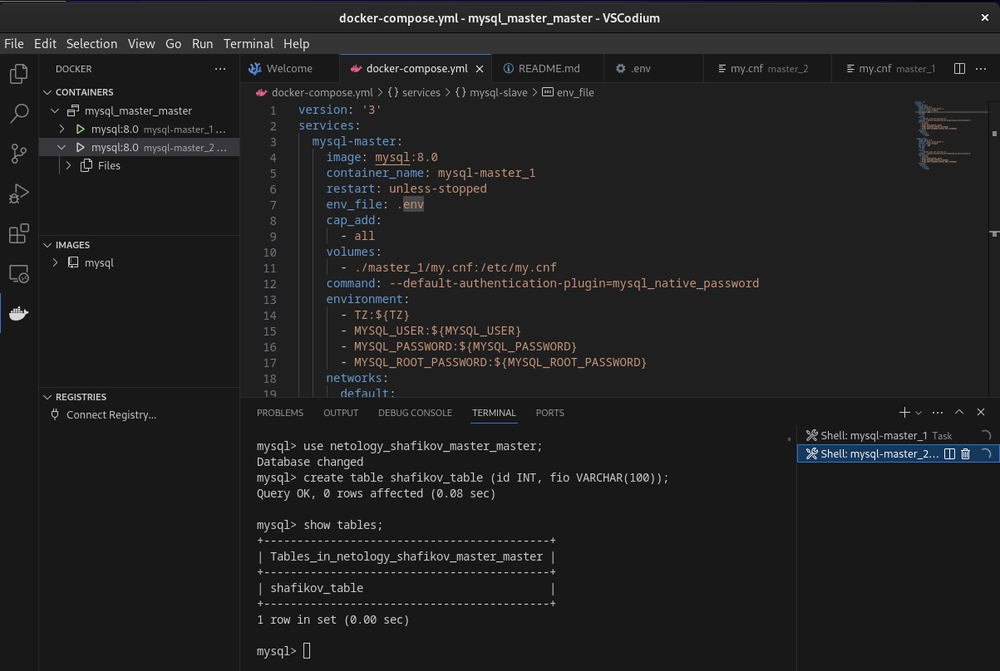
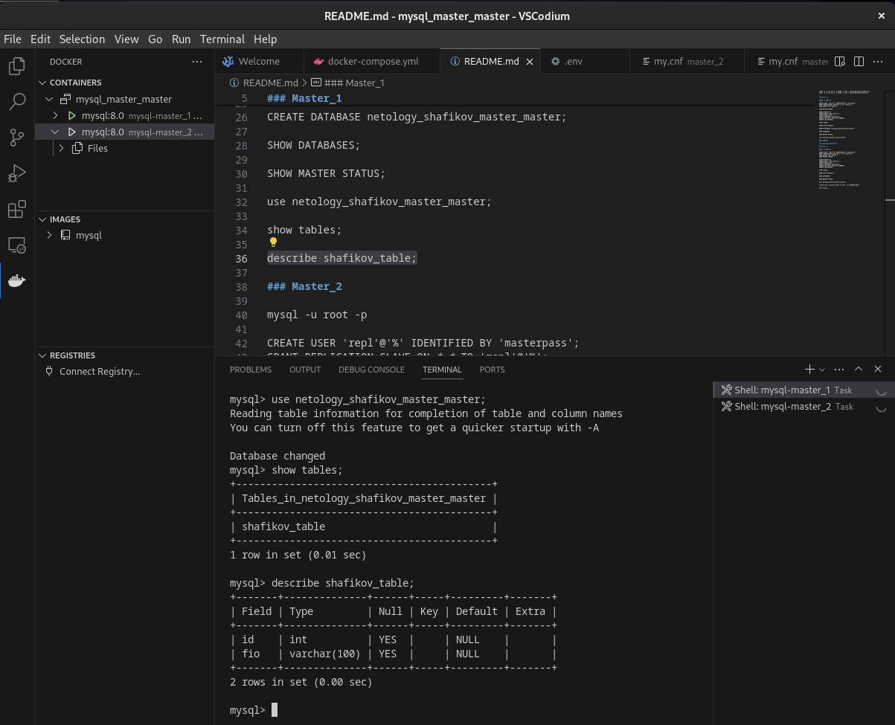

# Домашнее задание к занятию "`Репликация и масштабирование. Часть 1`" - `Шафиков Ринат`

---

### Задание 1

`На лекции рассматривались режимы репликации master-slave, master-master, опишите их различия.
Ответить в свободной форме.`

### Решение 1

`Master-slave: создаются минимум два сервера (Master - на нем производятся добавление, обновление и удаление данных. Slave - копирует данные с Master-сервера. Данные с него можно только читать). Master-Master - создаются как минимум два сервера. Оба сервера доступны на добавление, обновление и удаление данных. Между ними происходит синхронизация. Возможна балансировка нагрузки на данные сервера`

---

### Задание 2

`Выполните конфигурацию master-slave репликации, примером можно пользоваться из лекции.
Приложите скриншоты конфигурации, выполнения работы: состояния и режимы работы серверов.`

### Решение 2

На мастере

```
mysql -u root -p
CREATE USER 'repl'@'%' IDENTIFIED WITH mysql_native_password BY 'slaverepl';
GRANT REPLICATION SLAVE ON *.* TO 'repl'@'%';
SHOW GRANTS FOR repl@'%';
SHOW MASTER STATUS;
```


```
SHOW DATABASES;
```


На слейве

```
mysql -u root -p
```
```
CHANGE MASTER TO
SOURCE_HOST='mysql-master',
SOURCE_USER='repl',
SOURCE_PASSWORD='slaverepl',
SOURCE_LOG_FILE='mysql-bin.000003',
SOURCE_LOG_POS=660;
```
```
START SLAVE;
SHOW SLAVE STATUS\G;
```


```
SHOW DATABASES;
```


Создадим на мастере тестовую таблицу

```
CREATE DATABASE netology_shafikov;
SHOW DATABASES;

```


На слейве

```
SHOW DATABASES;
```


На мастере

```
SHOW MASTER STATUS;
```


На слейве

```
SHOW SLAVE STATUS\G;
```


---

### Задание 3

`Выполните конфигурацию master-master репликации. Произведите проверку.
Приложите скриншоты конфигурации, выполнения работы: состояния и режимы работы серверов.`

### Решение 3

На мастере 1

```
mysql -u root -p
CREATE USER 'repl'@'%' IDENTIFIED BY 'masterpass';
GRANT REPLICATION SLAVE ON *.* TO 'repl'@'%';
SHOW GRANTS FOR repl@'%';
SHOW MASTER STATUS;
```

На мастере 2

```
mysql -u root -p
CREATE USER 'repl'@'%' IDENTIFIED BY 'masterpass';
GRANT REPLICATION SLAVE ON *.* TO 'repl'@'%';
SHOW GRANTS FOR repl@'%';
SHOW MASTER STATUS;
```

```
CHANGE MASTER TO
SOURCE_HOST='mysql-master_1',
SOURCE_USER='repl',
SOURCE_PASSWORD='masterpass',
SOURCE_LOG_FILE='mysql-bin.000003',
SOURCE_LOG_POS=660;
```

```
START SLAVE;
SHOW SLAVE STATUS\G;
```



На мастере 1

```
CHANGE MASTER TO
SOURCE_HOST='mysql-master_2',
SOURCE_USER='repl',
SOURCE_PASSWORD='masterpass',
SOURCE_LOG_FILE='mysql-bin.000003',
SOURCE_LOG_POS=660;
```
```
START SLAVE;
SHOW SLAVE STATUS\G;
```



На мастере 1 создадим новую таблицу.

```
CREATE DATABASE netology_shafikov_master_master;
SHOW DATABASES;
```



На мастере 2 появилась созданная на мастере 1 новая база данных

```
SHOW DATABASES;
```




На мастере 2 создадим в новой базе данных таблицу

```
use netology_shafikov_master_master;
create table shafikov_table (id INT, fio VARCHAR(100));
show tables;
```




На мастере 1 база данных обновилась

```
use netology_shafikov_master_master;
show tables;
describe shafikov_table;
```



---
