# Задание 1

#### Задание 1. Создание внешней сети и настройка NAT

#### Описание задания
Перед вами стоит задача сделать подключение к интернет-провайдеру и создать для сетевых устройств доступность к “внешнему миру”

В вашем распоряжении есть две сети: 188.144.1.0/30 - интернет провайдер выделил данную сеть для подключения мини-офиса 188.144.0.0/30 - интернет провайдер выделил данную сеть для подключения главного офиса

Необходимо подключить каждую из частей офиса подключить к интернет-провайдеру (ISP).

#### Требование к результату
- Вы должны отправить файл .pkt с выполненным заданием.
- К выполненной задаче добавьте скриншоты с доступностью “внешней сети” и ответы на вопросы.

#### Процесс выполнения
1) Запустите программу Cisco Packet Tracer
2) В программе Cisco Packet Tracer загрузите файл с сетью
3) Между всеми маршрутизаторами необходимо создать сетевую связность.
4) На каждом маршрутизаторе главного и мини-офиса настройте внутренние и внешние интерфейсы (inside, outside)
5) На каждом маршрутизаторе создайте списки доступа сетей, которые будут транслироваться во “внешнюю сеть”
6) На каждом маршрутизаторе создайте NAT-трансляцию с помощью вышеуказанного access-листа.
7) Проверьте доступность с любого конечного устройства доступность роутера интернет-провайдера, командой ping.
8) Во время проверки командой ping посмотрите на каждом роутере списки трансляции адресов. Сделайте скриншот.
9) Ответ внесите в комментарии к решению задания в личном кабинете Нетологии

# Решение 1

#### Процесс выполнения

1) Запустите программу Cisco Packet Tracer 
2) В программе Cisco Packet Tracer загрузите файл с сетью 
3) Между всеми маршрутизаторами необходимо создать сетевую связность. 

Поднимаем внешний интерфейс Branch_office и задаем статический белый IP 188.144.1.2/30
Поднимаем внешний интерфейс Head_office  и задаем статический белый IP 188.144.0.2/30
Head_office

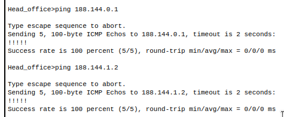

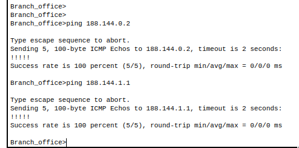

4) На каждом маршрутизаторе главного и мини-офиса настройте внутренние и внешние интерфейсы (inside, outside) 

```
Branch_office##
Branch_office##enable
Branch_office##configure terminal
Branch_office#(config)#ip route 0.0.0.0 0.0.0.0 188.144.1.1 #шлюз по умолчанию
Branch_office#(config)#end
Branch_office##wr mem
```
```
Branch_office#
Branch_office#conf t
Branch_office(config)#int Gig0/0/0
Branch_office(config-if)#ip nat outside
Branch_office(config-if)#exit
Branch_office(config)#int Gig0/0/1
Branch_office(config-if)#exit
Branch_office(config)#int Gig0/0/1.10
Branch_office(config-subif)#ip nat inside
Branch_office(config-subif)#exit
Branch_office(config)#int Gig0/0/1.20
Branch_office(config-subif)#ip nat inside
Branch_office(config-subif)#exit
Branch_office(config)#int Gig0/0/1.30
Branch_office(config-subif)#ip nat inside
Branch_office(config-subif)#exit
Branch_office(config)#end
Branch_office#
```

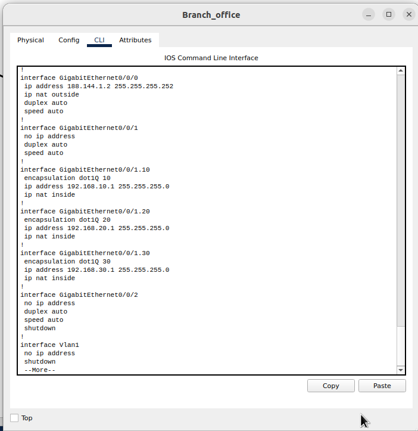

```
Head_office#
Head_office#enable
Head_office#configure terminal
Head_office(config)#ip route 0.0.0.0 0.0.0.0 188.144.0.1 #шлюз по умолчанию
Head_office(config)#end
Head_office#wr mem
```

#### Определим интерфесы НАТ как внешний и внутренний для Head_office

```
Head_office#conf t
Head_office(config)#int Gig0/0/0
Head_office(config-if)#ip nat outside
Head_office(config-if)#exit
Head_office(config)#int Gig0/0/1
Head_office(config-if)#ip nat inside
Head_office(config-if)#exit
Head_office(config)#end
Head_office#wr mem
Head_office#
```

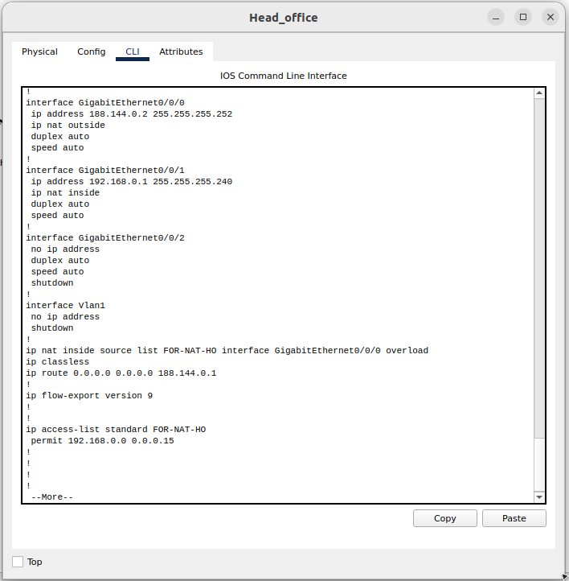

5) На каждом маршрутизаторе создайте списки доступа сетей, которые будут транслироваться во “внешнюю сеть” 

```
Branch_office#
Branch_office#conf t
Branch_office(config)#ip access-list st
Branch_office(config)#ip access-list standard FOR-NAT
Branch_office(config-std-nacl)#permit 192.168.10.0 0.0.0.255
Branch_office(config-std-nacl)#permit 192.168.20.0 0.0.0.255
Branch_office(config-std-nacl)#permit 192.168.30.0 0.0.0.255
Branch_office(config-std-nacl)#end
Branch_office#
```

```
Head_office>en
Head_office#conf t
Head_office(config)#ip access-list standard FOR-NAT-HO
Head_office(config-std-nacl)#permit 192.168.0.0 0.0.0.15
Head_office(config-std-nacl)#end
Head_office#
```

6) На каждом маршрутизаторе создайте NAT-трансляцию с помощью вышеуказанного access-листа. 

```
Branch_office#
Branch_office#conf t
Branch_office(config)#ip nat inside source list FOR-NAT interface GigabitEthernet 0/0/0 overload 
Branch_office(config)#end
Branch_office#wr mem
```

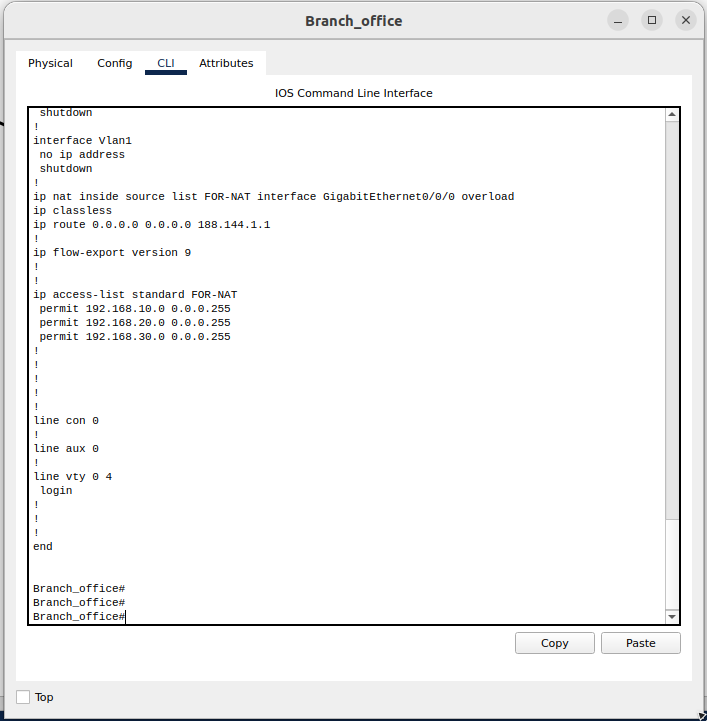

```
Head_office#conf t
Head_office(config)#ip nat inside source list FOR-NAT-HO interface GigabitEthernet 0/0/0 overload 
```

Для Head_office — на предыдущем скрине

7) Проверьте доступность с любого конечного устройства доступность роутера интернет-провайдера, командой ping. 
8) Во время проверки командой ping посмотрите на каждом роутере списки трансляции адресов. Сделайте скриншот. 

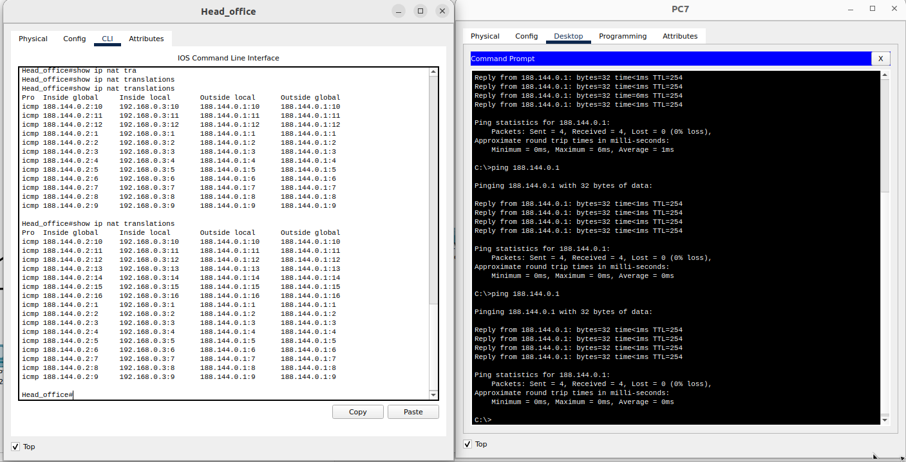

9) Ответ внесите в комментарии к решению задания в личном кабинете Нетологии

[text](files/4-05-1.pkt)

# Задание 2

#### Задание. Создание внутреннего web-сервера и доступа к нему

#### Описание задания

Перед вами стоит задача обеспечить доступность внутреннего web-сервера из “внешней сети”.

#### Требование к результату

- Вы должны отправить файл .pkt с выполненным заданием
- К выполненной задаче добавьте скриншоты с доступностью устройств и ответы на вопросы.

#### Процесс выполнения

1) Запустите программу Cisco Packet Tracer.
2) В программе Cisco Packet Tracer загрузите предыдущую практическую работу.
3) К коммутатору в мини-офисе добавьте сервер, включите на нем HTTP-сервис и назначьте ip-адрес в любой из vlan.
4) Создайте на маршрутизаторе этой сети static nat-трансляцию для web-сервера с указанием 80 порта.
5) Из сети главного офиса получите доступ к web-серверу по “внешнему ip-адресу” роутера мини-офиса. Сделайте скриншот.
6) Ответ внесите в комментарии к решению задания в личном кабинете Нетологии.

# Решение 2

#### Процесс выполнения

1. Запустите программу Cisco Packet Tracer.
2. В программе Cisco Packet Tracer загрузите предыдущую практическую работу.
3. К коммутатору в мини-офисе добавьте сервер, включите на нем HTTP-сервис и назначьте ip-адрес в любой из vlan.

Задаем на сервере:

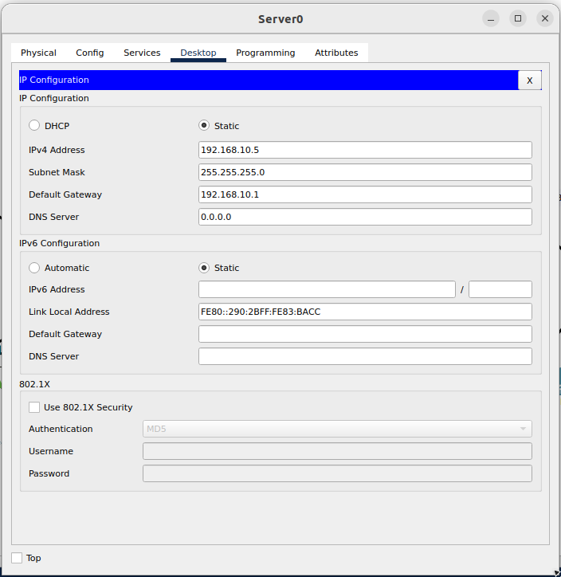

Static IP 192.168.10.5/24  #10 vlan
Default Gateway 192.168.10.1
HTTP сервис был включен.

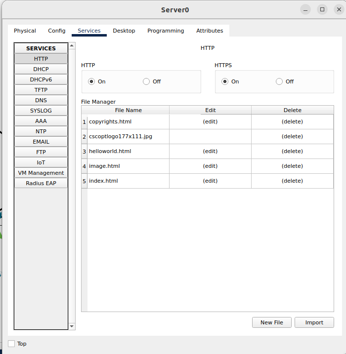

4. На Switch2 задаем на Gig0/2 VLAN 10

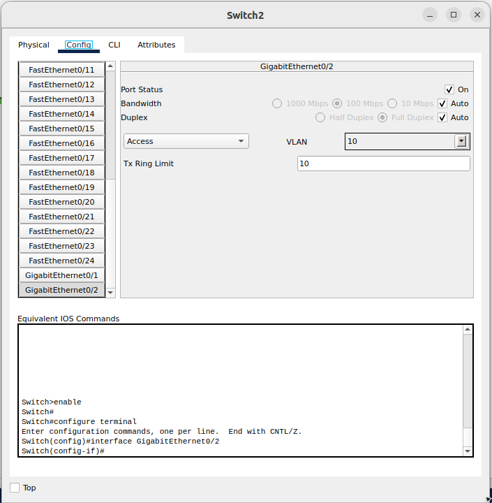

5. Создайте на маршрутизаторе этой сети static nat-трансляцию для web-сервера с указанием 80 порта.

```
Branch_office>en
Branch_office#conf t
Branch_office(config)#ip nat inside source static tcp 192.168.10.5 80 188.144.1.2 80
Branch_office(config)#end
Branch_office#
Branch_office#wr mem
Branch_office#
```

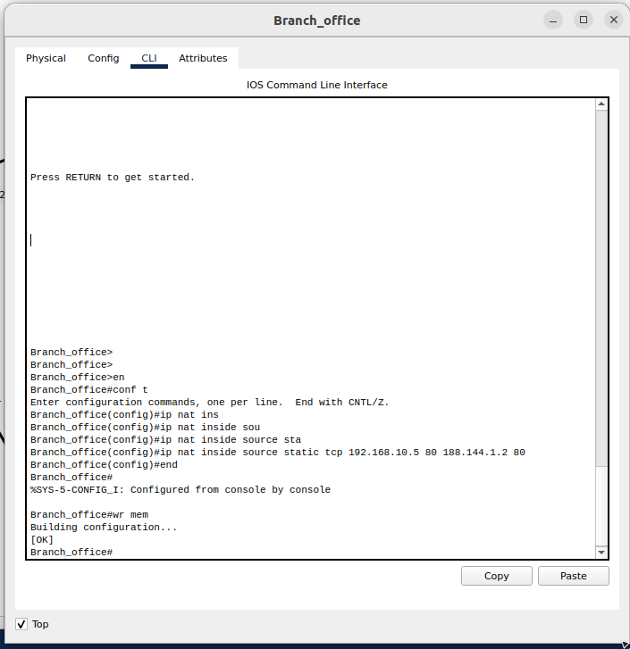

Из сети главного офиса получите доступ к web-серверу по “внешнему ip-адресу” роутера мини-офиса. Сделайте скриншот.

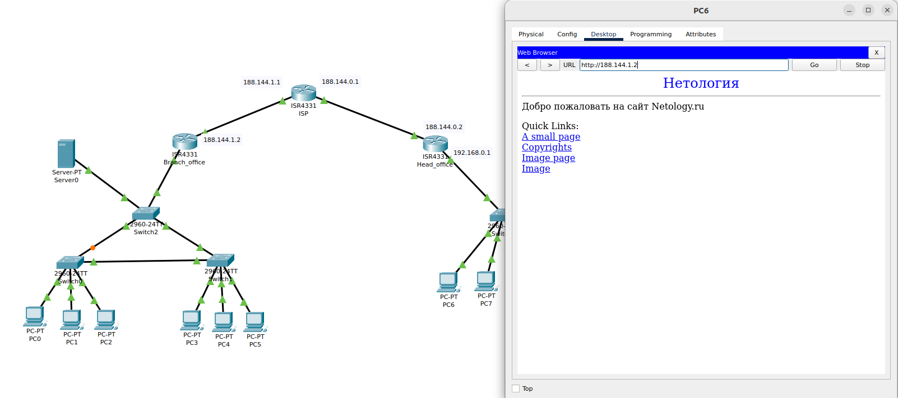

7. Ответ внесите в комментарии к решению задания в личном кабинете Нетологии.

[text](files/4-05-2.pkt)


