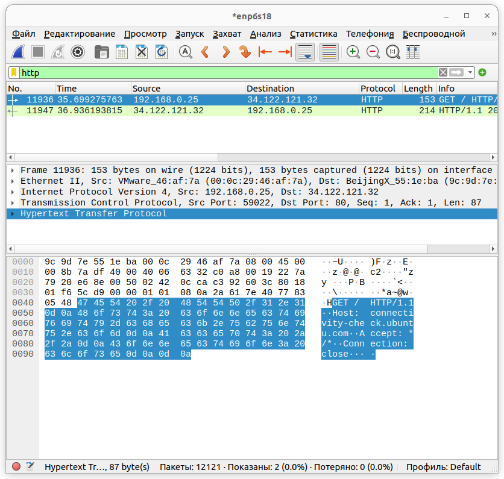
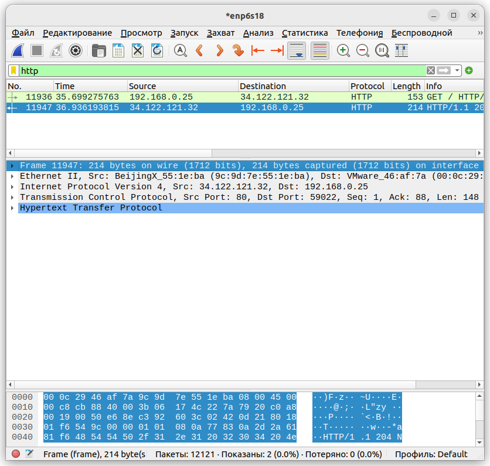
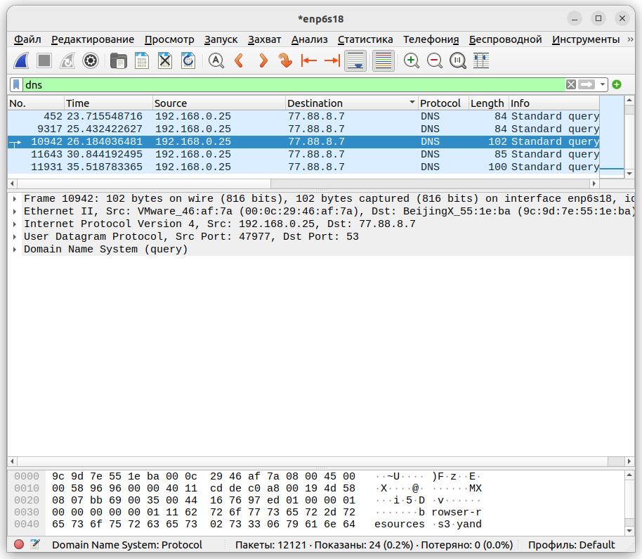

# Задание 1

#### Задание 1. Анализ захвата трафика
#### Описание задания 
Вам поставили задачу проанализировать результаты захвата трафика сетевого интерфейса. Это базовый навык при работе с сетью. В будущем он пригодится вам для того, чтобы выявлять источники проблем в сети и проверять проблемы безопасности (траблшутинг).

#### Требования к результату
- Вы должны отправить скриншоты захваченного пакета. Пример вы найдёте по ссылке.
- К скриншотам необходимо приложить комментарии с информацией, какие протоколы и уровни модели OSI вы обнаружили.
#### Процесс выполнения
1) Откройте Wireshark.
2) Запустите захват трафика с сетевого интерфейса.
3) Запустите браузер и зайдите на любой сайт.
4) Выберите какой-нибудь пакет из захваченного трафика.
5) Посмотрите разные уровни и разверните параметры при необходимости.
6) Напишите, какие протоколы и уровни модели OSI вы видите. Ответ внесите в комментарии к решению задания в личном кабинете Нетологии.

# Решение 1

Выполнение пунктов 1-4
Установка wireshark: 
```
sudo apt install wireshark
```
Запуск wireshark: 
```
sudo wireshark
```
Поставил фильтр по http



Уровни модели OSI
Frame
Ethernet II - Канальный (Ethernet)
Internet Protocol Version - Сетевой (IPv4)
Transmission Control Protocol - Транспортный (TCP)
Hypertext Transfer Protocol - Прикладной (HTTP)

# Задание 2

#### Задание 2. Инкапсуляция данных

#### Описание задания 
Вам поставили задачу найти различия в инкапсуляции данных разных протоколов и технологий. Это также базовый навык при работе с сетью. Вы сможете понимать, как одни приложения и технологии зависят от других протоколов и приложений. Это позволит эффективнее решать сетевые проблемы.

#### Требования к результату
- Вы должны отправить скриншоты захваченных пакетов.
- В комментариях к скриншоту необходимо указать, чем они различаются по уровням модели OSI.
Процесс выполнения
1) Откройте Wireshark.
2) Запустите захват трафика с сетевого интерфейса.
3) Запустите браузер и зайдите на любой сайт.
4) Сначала установите фильтр захваченного трафика по технологии DNS, затем выберите любой HTTP-поток.
5) Сравните пакеты между собой. В чём отличия с точки зрения модели OSI? Ответ внесите в комментарии к решению задания в личном кабинете Нетологии.

# Решение 2

HTTP



DNS



Frame
Ethernet II - Канальный (Ethernet)
Internet Protocol Version - Сетевой (UDP)
User Datagram Protocol - датаграмма
Domain Name System - (запрос по доменному имени и ответ о соответствии доменного имени ip адресу)